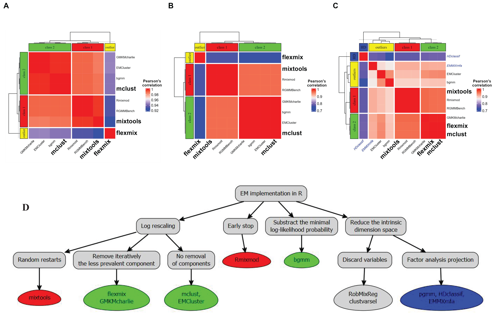

```{r setup, include=FALSE}
knitr::opts_chunk$set(
	echo = FALSE,
	warning = FALSE, 
	message = FALSE,
	fig.align = "center",
	fig.cap.pre = "Figure ",
	fig.cap.sep = ": ",
	message = FALSE,
	warning = FALSE,
	out.width = "100%",
	tab.cap.pre = "Table ",
	tab.cap.sep = ": ",
	fig.cap.pre = "Figure ",
	fig.cap.sep = ": ",
	fig.fullwidth=TRUE,
	fig.pos = "h")

library(ggplot2)
library(dplyr)
library(flextable)
library(kableExtra)
library(downlit)
library(RGMMBench)

options(dplyr.summarise.inform = FALSE) # remove the override .groups argument

# rjtools::initial_check_article(".", dic = "en_GB", ignore=c("gmms", "transcriptomic", "gaussian", "heteroscedascity", "equi", "clusterwise", "underbrace", "homoscedascity", "rebmix", "cran", "bioconductor", "mclust", "kd", "st", "th", "homoscedastic", "hyperparameters"))
```


# Introduction to Mixture modelling

Formally, let's consider a pair of random variables $(X,S)$ with $S \in \{1, \ldots, k\}$ a discrete variable and designing
the component identity of each observation. When observed, $S$ is
generally denoted as the labels of the individual observations. $k$ is
the number of mixture *components*. Then, the density distribution of
$X$ is given in Equation \@ref(eq:1):

```{=tex}
\begin{equation}
\begin{split}
f_\theta(X) &= \sum_S f_\theta (X, S) \\
&= \sum_{j=1}^k p_j f_{\zeta j}(X), \quad X\in\mathbb{R}
\end{split}
(\#eq:1)
\end{equation}
```
where $\theta = (p, \zeta) = (p_1, \ldots, p_k, \zeta_1, \ldots, \zeta_k)$
denotes the parameters of the model: $p_j$ is the proportion of
component $j$ and $\zeta_j$ represents the parameters of the density
distribution followed by component $j$. In addition, since $S$ is a categorical variable parametrized by $p$, the prior weights must enforce the unit simplex constraint (Equation \@ref(eq:2)):


```{=tex}
\begin{equation}
\begin{cases}
p_j \ge 0 \quad \forall j \in \{1, \ldots, k \}\\
\sum_{j=1}^k p_j =1
\end{cases}
(\#eq:2)
\end{equation}
```
In terms of applications, mixture models can be used to achieve the
following goals:

-   *clustering*: *Hard clustering* consists in determining a complete
    partition of the $n$ observations $x_{1:n}$ into $k$ disjoint
    non-empty subsets. In the context of *mixture model-based
    clustering*, this is done by assigning for each observation $i$ the
    cluster $\hat{s_i}=\arg \max_j \eta_{i} (j)$ which maximises the
    posterior distribution (MAP) conditioned on $x_i$ Equation
    \@ref(eq:posteriori):

```{=tex}
\begin{equation}
        \eta_{i} (j) := \mathbb{P}_{\theta} (S_i=j |X_i=x_i)
    (\#eq:posteriori)
\end{equation}
```
-   *prediction*: the purpose is to predict a response variable $Y$ from
    an explanatory variable $X$. The dependent variable $Y$ can either
    be discrete, taking values in classes $\{1, \ldots, G\}$
    (*classification* task) or continuous (*regression* task). In this
    paper we do not extensively discuss regression but refer the reader
    to @bouveyron_girard09 for mixture classification and
    @shimizu_kaneko20 for mixtures of regression models.

In section [Univariate and multivariate Gaussian distributions in the context of mixture models], we describe the most
commonly used family, the Gaussian Mixture Model (GMM). Then, we present
the MLE estimation of the parameters of a GMM, introducing the classic
EM algorithm in section [Parameter estimation in finite mixtures models]. Finally, we introduce bootstrap methods used to evaluate the
quality of the estimation and metrics used for the selection of the best
model in respectively appendices [Derivation of confidence intervals in GMMs] and [Model selection].


## Univariate and multivariate Gaussian distributions in the context of mixture models

We focus our study on the finite Gaussian mixture models (GMM) in which we
suppose that each of the $k$ components follows a Gaussian
distribution.


We recall below the definition of the Gaussian
distribution in both univariate and multivariate context. In the finite univariate Gaussian mixture model, the distribution of
each component $f_{\zeta j}(X)$ is given by the following univariate
Gaussian p.d.f. (probability density function) (Equation
\@ref(eq:gaussian-dist)):

\begin{equation}
f_{\zeta j}(X=x)=\varphi_{\zeta_j}(x | \mu_j, \sigma_j):=\frac{1}{\sqrt{2\pi} \sigma_j} \exp^{- \frac{(x - \mu_j)^2}{2 \sigma_j^2}}
(\#eq:gaussian-dist)
\end{equation} which we note: $X \sim \mathcal{N}(\mu_j, \sigma_j)$.

In the univariate case, the parameters to be inferred from each
component, $\zeta_j$, are: $\mu_j$, the *location* parameter (equal to
the mean of the distribution) and $\sigma_j$, the *scale* parameter
(equal to the standard deviation of the distribution).

Following parsimonious parametrisations with respect to univariate GMMs
are often considered: [^1]

[^1]: A rarer constraint considered implies to enforce a linear
    constraint over the clusters' means, of the following general form:
    $\sum_{j=1}^k a_j \mu_j=0$, with $\{a_1, \ldots, a_k\}$. For
    instance, the R package \pkg{epigenomix} considers a $k=3$ component
    mixture in the context of transcriptomic (differential analyses) and
    epigenetics (histone modification) to automatically identify
    undifferentiated, over and under-expressed genes between case and
    control samples. A common constraint then is to enforce the
    distribution of fold changes corresponding to the undifferentiated
    expressed genes to have a distribution centred on 0. Combining
    equality of means and equality of variances is irrelevant, as the
    model is then degenerate. Additionally, setting constraints on the
    means makes the estimation of the parameters challenging, as
    detailed in section [Appendix B: Extensions of the EM algorithm to overcome its limitations].

-   *homoscedascity*: variance is considered equal for all components,
    $\sigma_j = \sigma, \forall j \in \{1, \ldots, k \}$, as opposed to
    heteroscedascity where each sub-population has its unique
    variability.

-   *equi-proportion* among all mixtures:
    $p_j = \frac{1}{k} \quad j \in \{ 1, \ldots, k\}$ [^2]

[^2]: It is worth noting that the MAP of a homoscedastic and
    equi-balanced GMM is the MAP distribution of a *k*-means procedure
    with Euclidean distance, namely for each observation the cluster
    with the nearest mean.


In the finite multivariate Gaussian mixture model, the distribution $f_{\zeta j}(\boldsymbol{X})$ of each component $j$, where
$\boldsymbol{X} \in \mathbb{R}^D =(X_1, \ldots, X_D)^\top$ is a multivariate random variable
of dimension $D$, is given by the
following multivariate Gaussian p.d.f. (probability density function)
(Equation \@ref(eq:multivariate-distribution)):

```{=tex}
\begin{equation}
    f_{\zeta j}(\boldsymbol{X}=\boldsymbol{x})=\operatorname{det}(2\pi\boldsymbol{\Sigma}_j)^{-\frac{1}{2}} \exp\left( -\frac{1}{2} (\boldsymbol{x} - \boldsymbol{\mu}_j) \boldsymbol{\Sigma}_j^{-1} (\boldsymbol{x} - \boldsymbol{\mu}_j)^\top\right)
(\#eq:multivariate-distribution)
\end{equation}
```
which we note
$\boldsymbol{X} \sim \mathcal{N}_D(\boldsymbol{\mu}_j, \boldsymbol{\Sigma}_j)$. The parameters to be estimated for each component can be decomposed into:

-   $\boldsymbol{\mu}_j=\begin{pmatrix} \mu_{1j} \\ \vdots \\ \mu_{Dj} \end{pmatrix} \in \mathbb{R}^D$, the $D$-dimensional mean vector

-   $\boldsymbol{\Sigma}_j$, the $\mathcal{M}_D(\mathbb{R})$ positive-definite [^3]covariance matrix, whose diagonal terms are the individual variance of each feature and the off-diagonal terms the pairwise covariance terms.

[^3]: The positive-definiteness constraint can be interpreted from a probabilistic point of view as a necessary condition such that the generalised integral of the multivariate distribution is defined and sum-to-one over $\mathbb{R}$ or from the statistical definition of the covariance. A symmetric real matrix $\boldsymbol{X}$ of rank $D$ is said to be \textit{positive-definite} if for any non-zero vector
$\mathbf{v}, \in \mathbb{R}^D$, the following constraint
$\mathbf{v}^\top \boldsymbol{X} \mathbf{v} > 0$ is enforced.

Three families of multivariate GMMs are often considered:

-   the *spherical* family, $\boldsymbol{\Sigma}_j=\sigma_j^2 \boldsymbol{I}_D$, with $\sigma_j \in \mathbb{R}_{+}$, refers to GMMs whose covariance matrix is diagonal with a fixed diagonal element and the corresponding volume representation is a $D-$*hypersphere* of constant radius $\sigma_j$.
-   the *diagonal* family, $\boldsymbol{\Sigma}_j=\operatorname{diag} \left(\sigma_{1j}^2, \ldots, \sigma_{1D}^2\right)$, with $\sigma_j \in \mathbb{R}_{+}^D$, refers to GMMs whose covariance matrix is diagonal . Its associated volume representation is an ellipsoid whose main axis are aligned with the $D$ canonical basis of $\mathbb{R}^D$. Of note, the null constraint imposed over the off-diagonal terms in the spherical and diagonal families imply that the multivariate distribution can be further decomposed and analysed as the product of univariate independent Gaussian realisations.
-   the *ellipsoidal* family, also nicknamed the *general* family, refer to GMMs whose covariance matrix, $\boldsymbol{\Sigma}_j$, can be any arbitrary positive-definite $D \times D$ matrix. Thus, the corresponding clusters for each component $J$ are ellipsoidal, centred at the mean vector $\boldsymbol{\mu}_j$, and volume and orientation respectively determined by the eigenvalues and the eigenvectors of the covariance matrix $\boldsymbol{\Sigma}_j$.


In the multivariate setting, the volume, shape, and orientation of the covariances can be constrained to be equal or variable across groups, generating 14 possible models with different geometric characteristics [@banfield_raftery93, @celeux_govaert92]. We review them in Appendix ([Parameters estimation in a high-dimensional context]) and Table \@ref(tab:parameter-configuration-bivariate). Of note, the
correlation matrix can be easily obtained from the covariance
matrix after the following normalisation:
$\operatorname{cor}(\boldsymbol{X})=\left(\frac{\operatorname{cov}(x_l, x_m)}{\sqrt{\operatorname{var}(x_l)} \times \sqrt{\operatorname{var}(x_m)}}\right)_{(l,m) \in D \times D}$. Correlation if strictly included between -1 and 1, the strength of the
correlation is given by its absolute value while the type of the
interaction is returned by its sign. An absolute correlation between two features of 1 indicates a strictly linear relationship.


For the sake of simplicity and tractability, we will only consider the
fully unconstrained model in both the univariate (heteroscedastic and
unbalanced classes) and multivariate dimension (unbalanced and complete
covariance matrices for each cluster) in the remainder of our paper.


## Parameter estimation in finite mixtures models

A common way for estimating the parameters of a parametric distribution is
the *maximum likelihood estimation* (MLE) method. It consists in
estimating the distribution parameters by maximising the likelihood, or
equivalently the log-likelihood of a sample. In what follows,
$\ell(\theta|x_{1:n})=\log (f(x_{1:n}|\theta))$ is the log-likelihood of
a *n*-sample. When all observations are independent, it simplifies to
$\ell(\theta|x_{1:n}) = \sum_{i=1}^n \log (f(x_i|\theta))$. The MLE
consists in finding the parameter estimate $\hat{\theta}$ maximising the
log-likelihood $\hat{\theta} = \arg \max \ell (\theta | x_{1:n})$.

Recovering the maximum of a function is generally performed by
determining from which values its derivative cancels. The MLE in GMMs
has interesting properties, as opposed to the *moment estimation*
method: it is a consistent, asymptotically efficient and unbiased
estimator [@chen16; @mclachlan_peel00].

When $S$ is completely observed, for pairs of observations
$(x_{1:n}, s_{1:n})$, the log-likelihood of a finite mixture model is
simply given by Equation \@ref(eq:6):

```{=tex}
\begin{equation}
\ell(\theta|X_{1:n}=x_{1:n}, S_{1:n}=s_{1:n})=\sum_{i=1}^n \sum_{j=1}^k \left[\log\left(f_{\zeta_j} (x_i, s_i=j)\right) + \log(p_j) \right]_{\mathbf{1}_{s_i=j}}
(\#eq:6)
\end{equation}
```
where an analytical solution can be computed provided that a closed-form estimate exists to retrieve the parameters $\zeta_j$ for each components' parametric distribution. The MLE maximisation, in this context, amounts to estimate clusterwise each components' parameter, $\zeta_j$ while the corresponding proportions, $p_j$, is simply the ratio of the observations assigned to cluster $j$ over the total number of observations $n$.

However, when $S$ is unobserved, the log-likelihood, qualified as
incomplete with respect to the previous case, is given by Equation
\@ref(eq:7):

```{=tex}
\begin{equation}
\ell (\theta \vert x_{1:n}) = \sum_{i=1}^n  \log \left( \underbrace{\sum_{j=1}^k  p_j f_{\zeta_j}(x_i)}_{\text{sum of of logs}} \right)
(\#eq:7)
\end{equation}
```
The sum of terms embed in a log function (underbrace in Equation \@ref(eq:7)) makes it intractable in practice to derive the null values of its
corresponding derivative. Thus, no closed form of the MLE is available,
including for the basic univariate GMM model. This is why most
parameter estimation methods derive instead from the *EM algorithm*,
first described in @dempster_etal77. We detail in the next section its
main theoretical properties, the reasons of its popularity as well as
its main limitations.

## The EM algorithm

When both $S$ and the parameters of the model are unknown, no closed-form solution exists to jointly optimise the log-likelihood (Equation \@ref(eq:7)) parametrised by $({\theta}, S)$.
However, when either $S$ or $\theta$ are known, the estimation of the
other parameters is straightforward. Hence, the general principle of
EM-like algorithms is splitting this complex non-closed joint MLE
estimation of $(S, \theta)$ into the iterative estimation of $S_q$ from
$(\theta_{q-1}, X)$ (expectation phase, or *E-step* of the algorithm)
and the estimation of $\theta_q$ from $(S_q, X)$ (maximisation phase, or
*M-step*), with $\theta_{q-1}$ being the estimated parameters at the
previous step $q-1$, until we reach the convergence.


The EM algorithm sets itself apart from other commonly used methods by taking
into account all possible values taken by the latent variable $S$. To do
so, it computes the expected value of the log likelihood of $\theta$,
conditioned by the posterior distribution
$\mathbb{P}_{\hat{\theta}_{q-1}} (S|X)$, also named as the *auxiliary
function*. Making profit of the independence assumption between the
observations of a mixture model, the general formula of this proxy
function of the incomplete log-likelihood is given in finite mixture
models by Equation \@ref(eq:8).

```{=tex}
\begin{equation}
\begin{split}
Q(\theta|\theta_{q-1}) & := \mathbb{E}_{S_{1:n}| X_{1:n}, \hat{\theta}_{q-1}} \left[\ell(\theta | X_{1:n}, S_{1:n})\right] \\
&=\sum_{i=1}^n \sum_{j=1}^k \eta_{i}(j) \left( \log (p_j) +  \log (\mathbb{P}(X_i|S_i=j, \theta)) \right)
\end{split}
(\#eq:8)
\end{equation}
```
with $\hat{\theta}_{q-1}=\hat{\theta}$ the current estimated parameter
value.

In practice, the EM algorithm consists in performing alternatively E-step and M-step until convergence. We supplied below a pseudocode version:

::: {.blackbox data-latex="{\\textbf{The EM algorithm}}"}
::: {.center data-latex=""}
-   *step E*: determine the posterior probability function $\eta_i(j)$
    for each observation of $X$ for each possible discrete latent class,
    using the initial estimates $\hat{\theta}_0$ at step $q=0$, or the
    previously computed estimates $\hat{\theta}_{q-1}$. The general formula is given by Equation \@ref(eq:10):

```{=tex}
\begin{equation}
    \eta_i(j) = \frac{p_j f_{\zeta_j} (x_i)}{\sum_{j=1}^k p_j f_{\zeta_j} (x_i)}
(\#eq:10)
\end{equation}
```

-   *step M*: compute the mapping function
    $\hat{\theta}_q:=M(\theta | \hat{\theta}_{q-1})=\arg \max Q(\theta| \hat{\theta}_{q-1})$ which maximises the auxiliary function. One way of retrieving the MLE associated to the auxiliary function is to determine the roots of its derivative, namely solving Equation \@ref(eq:mapping-function-derivative)^[to ensure
that we reach a maximum, we should assert that the Hessian matrix evaluated at the MLE is indeed negative semi-definite.]:
```{=tex}
\begin{equation}
    \frac{\partial Q(\theta| \theta_{q-1})}{\partial \theta}=0
(\#eq:mapping-function-derivative)
\end{equation}
```

:::
:::

Interestingly, the decomposition of the incomplete log-likelihood
associated to a mixture model $\ell(\theta|X)$ reveals an entropy term
and the so-called auxiliary function [@dempster_etal77]. It can be used to prove that
maximising the auxiliary function at each step induces a bounded
increase of the incomplete log-likelihood. Namely, the convergence of
the EM algorithm, defined by comparisons of consecutive log-likelihood,
is guaranteed, provided the mapping function returns the maximum of the
auxiliary function. Yet, the convergence of the series of estimated
parameters
$(\theta_q)_{q \ge 0} \underset{i\to +\infty}{\longrightarrow} \hat{\theta}$
is harder to prove but is considered asserted for the probability family
of *exponential laws* (a superset of the Gaussian family)
[@dempster_etal77].

Additionally, the EM algorithm is *deterministic*, meaning that for a
given initial estimate $\theta_0$ the parameters returned by the
algorithm at a given step $q$ are fixed. Yet, it requires the user to
provide an initial guess $\theta_0$ on the estimate parameters and to
set the number of components of the mixture. We review some classic
initialisation methods in [Initialisation of the EM algorithm] and some
algorithms used to overcome the main limitations of the EM
algorithm in the Appendix [Appendix B: Extensions of the EM algorithm to overcome its limitations].

Finally, the prevalent choice of Gaussian distributions to model the distribution of random observations proceeds from a strong set of interesting properties and from their strong tractability. In particular, @geary36 has shown that the Normal distribution is the only distribution for which the Cochran's theorem [@cochran34] is guaranteed, namely for which the the mean and variance of the sample are independent of each other. Additionally, similar to any distribution proceeding from the exponential family, the MLE statistic is *sufficient*^[The Pitman–Koopman–Darmois theorem [@koopman36] states that only the exponential family provides distributions whose statistic can summarize arbitrary amounts of iid draws using a finite number of values].


## Initialisation of the EM algorithm

EM-like algorithms require an initial parameter estimate $\theta_0$ to
optimise the maximum likelihood. *Initialisation* is a crucial step, as
a bad initialisation would possibly lead to a local sub-optimal solution
or trap the algorithm in the boundary of the parameter space. The
simplest initialisation methods do not require any other initialisation
algorithm, while meta-methods include as well an initialisation step.
The commonly-used initialisation methods are:

-   The *Model-based Hierarchical Agglomerative Clustering* (MBHC) is
    an agglomerative hierarchical clustering based on MLE criteria for
    Gaussian mixture models [@scrucca_raftery15] . First, the MBHC is
    initialised by assigning each observation to its own cluster. Next,
    the pair of clusters that maximises the likelihood of the underlying
    statistical model among all possible pairs is merged. This procedure
    is repeated until all clusters are merged. The final resulting
    clusters are then simply the last $k$ cuts of the resulting
    dendrogram. In the homoscedastic univariate case, the underlying
    merging criteria reveals similar to the Ward's criterion, with the
    merged pair of clusters being the one minimising the sum of squares.
    As opposed to other initialisation methods described below, it is
    deterministic and does not require careful calibration of
    hyperparameters but the resulting partitions are generally
    suboptimal [@fraley98] .

-   The standard *random* initialisation, used classically for the
    initialisation step of the *k*-means algorithm, consists in randomly
    selecting $k$ distinct observations, referred to as *centroids* and
    then assign each observation to the closest centroid
    [@biernacki_etal03] . Doing so is close from the C-step of the CEM algorithm.
    This is the method used in this paper, unless otherwise stated.  Alternatives have since been developed: for instance, the package \pkg{mixtools} first guesses the proportions of the components drawing from a Dirichlet distribution, whose main advantage lies on respecting the unit simplex constraint (Equation \@ref(eq:2))^[Without prior knowledge favouring one component over another, the Dirichlet distribution is generally parametrised by $\alpha=\frac{1}{k}$, implicitly stating that any observation has equal chance to proceed from a given cluster. In that case, the corresponding distribution is parametrised by a single scalar value $\alpha$, called the *concentration parameter*.], but uses binning methods to guess the means and standard deviations of the components. In paper @kwedlo13, the means of the components are randomly chosen but with additional constraint of maximising the Mahalanobis distance between the selected centroids. This enables to cover a larger portion of the parameters' space.

-   **k*-means* is a CEM algorithm, in which the additional assumption of
    balanced classes and homoscedascity implies that each observation in
    the E-step is assigned to the cluster with the nearest mean (the one
    with the shortest Euclidean distance). *K*-means is initialised by
    randomly selecting $k$ points, the *centroids*. it is often chosen
    for its fast convergence and its less-greedy memory consumption.

-   The *quantile* method sorts each observation $x_i$ by increasing
    order, and split them into quantiles of size $1/k$. Then, all
    observations for a given quantile are assumed to belong to the same
    component. \footnote{This method is only available in the univariate framework,
    since it is not possible to define a unique partition of the observable space into $k$-splits. For example, in bivariate setting, a binning with $k=2$ components on each axis leads to a total of $2 \times 2=4$ binned regions, which raises the selection issue of the best $k$ hyper-squared volumes for the initial parameters estimation. More generally, $\binom{D}{k}$ binning choices are possible in the multivariate setting.}

-   The *Rough-Enhanced-Bayes mixture* (REBMIX) algorithm is implemented
    in the \CRANpkg{rebmix} [@R-rebmix] package, and the complete
    pseudo-code is described thoroughly in [@rebmix2015a; @rebmix2020b] . First, the
    observations are processed using one of the three available methods:
    *k*-nearest neighbours (KNN), Parzen kernel density estimation and finally
    binned intervals, the method we used for this paper. First, data are
    binned in $\sqrt{n}$ intervals of equal lengths. Then, the mode of
    one of the components' distribution is determined as the interval
    with the highest frequency. This interval is also used to define a
    ``rough'' parameters' estimation of its associated component. All the
    other observations and intervals are then iteratively assigned to
    the currently estimated component or to the residual components that
    were not estimated. The algorithm switches to the estimation of
    another component when at least $25\%$ of the currently non
    assigned intervals are associated to the currently estimated
    component.
    The choice between estimated or residual components is based on the
    measurement of the deviation between the observed and the expected
    frequency of the interval, a low value enforcing the algorithm to
    assign the interval to the currently estimated component. Finally,
    all intervals assigned to the estimated component are used to
    determine the parameters of the associated Gaussian distribution.
    The algorithm stops when all intervals are assigned to a cluster and
    the parameters of the several distributions' components are
    estimated. Accordingly, the rebmix algorithm can be interpreted as a natural and more general extension of the quantile method with a more rigorous statistical support. Two drawbacks of the algorithm are the need of an intensive calibration of the hyperparameters (the number of of
    binned intervals in the binning protocol) and its inadequacy for the
    estimation of highly overlapping mixture distributions (uncertainty
    of the cluster assignment is not taken into account)\footnote{The method we describe here to preprocess the observations in order to estimate the empirical density estimation, namely "the histogram method" is not well suited for high dimensional data, as the exponential growth of the volume with respect to dimensionality leads to data sparsity, related to the well-known issue of the "curse of dimensionality". Indeed, $\sqrt{n}^D$ distinct intervals will be parsed by the method and the probability with an increasing number of features and decreasing number of observations that no clear local maximum emerges converges to 1. In high-dimensional context, the Parzen window or the KNN method should be favoured, see [@rebmix2015a], p. 16.}.

-   The *meta-methods* consist generally in short runs of EM-like
    algorithms, namely CEM, SEM and EM (see [Appendix B: Extensions of the EM algorithm to overcome its limitation]), with alleviated convergence criterion. The main idea is
    to use several random initial estimates with shorter runs of the
    algorithm to explore a larger parameter space, and avoid being
    trapped in a local maximum. yet, they still depend on an initialisation
    algorithm to start the optimisation [@biernacki_etal03] .

After this theoretical introduction, we evaluate empirically the
computational and statistical performances of the R packages in relation
with the choice of the initialisation algorithm and the complexity of
the simulation in [A comprehensive benchmark comparing estimation
performance of GMMs]. The method used to compare the seven reviewed
packages is detailed in [Methods], while the key results are reported in
section [Results]. We conclude by providing a general simplified
framework to help the R user in its selection of the package and
initialisation algorithm best fitted to the distribution of its dataset.

# A comprehensive benchmark comparing estimation performance of GMMs

We searched CRAN and Bioconductor mirrors for packages that can retrieve
parameters of GMM models. Briefly, out of 54 packages dealing with GMMs
estimation, we focused on seven packages that all estimate the
MLE in  GMMs using the EM algorithm, were recently
updated and let the user to provide its own initialisation estimates:
\pkg{bgmm}, \pkg{EMCluster}, \pkg{flexmix},
\pkg{GMKMcharlie}, \pkg{mclust}, \pkg{mixtools} and \pkg{Rmixmod}. The
complete inclusion process is detailed in [Appendix C: the meta-analysis workflow for the final selection of CRAN and Bioconductor platforms]. The flowchart summarising
our choices is represented in Figure \@ref(fig:flowchart):

```{r flowchart, fig.cap="A minimal roadmap used for the selection of the packages reviewed in our benchmark.", fig.alt="From root to top, we describe schematically the filtering process used for the final selection of the reviewed packages"}
knitr::include_graphics("figs/flowchart_packages_selection.png")
```

We summarise the main features and use cases of the seven reviewed
packages in Table
`r knitr::asis_output(ifelse(knitr::is_html_output(), '\\@ref(tab:low-comparison-package-html)', '\\@ref(tab:low-comparison-package-pdf)'))`.
The three most commonly used packages are \pkg{mixtools}, \pkg{mclust} and \pkg{flexmix}. However, the \pkg{mclust} package is by far the most complete with many features provided to
visualise and evaluate the quality of the GMM estimate. \pkg{bgmm} requires
the greatest number of packages for its installation, making its upkeep
a harder task, while \pkg{mclust} only depends of base R packages
implemented by default in each new R version. Additionally, in parallel
to clustering tasks, \pkg{flexmix} and \pkg{mixtools} packages perform
regression of mixtures and implement mixture models using other
parametric distributions or non-parametric methods via kernel-density
estimation.

```{r low-comparison-package-html, layout="l-body-outset", eval = knitr::is_html_output()}
readr::read_delim("./tables/package_comparison_low_level.csv", delim=";", show_col_types = F) %>%
  mutate(Imports=stringr::str_replace(Imports, ">=", "\U2265"),
         dplyr::across(.cols = c("Regression", "Implemented models"), ~ gsub(pattern = "redcross", "./figs/red_cross.png", .x)),
         dplyr::across(.cols = c("Regression", "Implemented models"), ~ gsub(pattern = "greentick", "./figs/green_tick.png", .x)),
         across(.cols = where(is.character), stringr::str_replace_all, "\\\\n", " ")) %>%
  flextable() %>%
  flextable::mk_par(i = 1:7, j = 3, value = as_paragraph(
    flextable::as_image(src = Regression, width = 0.5, height = 0.5, unit = "cm"))) %>%
  flextable::mk_par( i = c(1, 4:7), j = 4, value = as_paragraph(
    flextable::as_image(src = "./figs/red_cross.png", width = 0.5, height = 0.5, unit = "cm"))) %>%
  set_caption(caption = "Main features of the reviewed packages, sorted by decreasing number
of daily downloads. *Downloads per day* returns the daily average number of downloads for each package on the last 2 years.
 *Recursive dependencies* column counts the complete set of non-base packages required, as first-order dependencies
                    may require as well installation of other packages.", html_escape = F) %>%
  theme_vanilla() %>% align(align = "center", part = "header") %>%   flextable::autofit()
```

```{r low-comparison-package-pdf, eval = knitr::is_latex_output()}
readr::read_delim("./tables/package_comparison_low_level.csv", delim=";", show_col_types = F) %>%
  mutate(dplyr::across(.cols = c("Regression", "Implemented models"), ~ gsub(pattern = "redcross", "$\\\\redcross$", .x)),
         dplyr::across(.cols = c("Regression", "Implemented models"), ~ gsub(pattern = "greentick", "\\\\greentick", .x)),
         Imports= gsub(pattern = ">=", "$\\\\ge$", Imports),
         across(.cols = where(is.character),kableExtra::linebreak,  linebreaker = "\\\\n")) %>%
  kbl(booktabs=T, caption = "Main features of the reviewed packages, sorted by decreasing number of daily downloads.
               \\textit{Downloads per day} returns the daily average number of downloads for each package on the last 2 years.
               \\textit{Recursive dependencies} column counts the complete set of non-base packages required,
               as first-order dependencies may require as well installation of other packages.", escape=F,
      col.names = linebreak(c("Package", "Version",
                              "Regression", "Implemented \n models", "Downloads \n per day",
                              "Last \n update", "Imports", "Recursive \n dependencies", "Language"))) %>%
  row_spec(0,bold=T, align = "c", hline_after = T) %>%
  row_spec(1:7, hline_after = T, align = "c") %>%
  column_spec(column = 1:9, latex_valign = "m") %>%
  kable_styling(latex_options=c("hold_position", "scale_down"))
```

We further detail features specifically related to GMMs in
`r knitr::asis_output(ifelse(knitr::is_html_output(), '\\@ref(tab:high-comparison-packages-html)', '\\@ref(tab:high-comparison-packages-pdf)'))`. We detail row after row the content of this Table below:

- The parametrisations used to provide parsimonious estimation of the GMMs are reviewed in [Parameter estimation in finite mixtures models] and summarised in rows 1 and 2 (Table `r knitr::asis_output(ifelse(knitr::is_html_output(), '\\@ref(tab:high-comparison-packages-html)', '\\@ref(tab:high-comparison-packages-pdf)'))`) for the univariate and multivariate setting. We refer to them as *canonical* when homoscedasticity and heteroscedasticity assumptions in the univariate setting and the 14 most common parametrisations (see Table \@ref(tab:param-multivariate-gaussian)) in the multivariate setting are implemented. Adding the additional constraint of equi-balanced clusters results in a total to $14 \times 2=28$ distinct models and $2 \times 2=4$ parametrisations respectively in the univariate and multivariate setting.

- [The EM algorithm] is the most commonly used
algorithm to retrieve the estimates parametrising the GMMs but faster or complementary extensions of the EM algorithm are reviewed in [Appendix B: Extensions of the EM algorithm to overcome its limitations] and row 3 of Table `r knitr::asis_output(ifelse(knitr::is_html_output(), '\\@ref(tab:high-comparison-packages-html)', '\\@ref(tab:high-comparison-packages-pdf)'))`. Especially, GMMs estimation is particularly impacted by the presence of outliers, justifying a specific benchmark ([A small simulation to evaluate the impact of outliers]).
We briefly review the most common initialisation algorithms in section [Initialisation of the EM algorithm] and row 4 of Table `r knitr::asis_output(ifelse(knitr::is_html_output(), '\\@ref(tab:high-comparison-packages-html)', '\\@ref(tab:high-comparison-packages-pdf)'))`, a required and painstaking task for both the EM algorithm and its variants.

- To select the best parametrisations and number of components that fit the mixture, several metrics are provided by the reviewed packages
([Model selection] and row 5). Due to the complexity of computing the true distribution of the parameters estimated, bootstrap methods are commonly used used to derive confidence intervals (see [Derivation of
confidence intervals in GMMs] and row 6 in Table `r knitr::asis_output(ifelse(knitr::is_html_output(), '\\@ref(tab:high-comparison-packages-html)', '\\@ref(tab:high-comparison-packages-pdf)'))`.

- Four packages supply several visualisations, summarised in the last row of Table `r knitr::asis_output(ifelse(knitr::is_html_output(), '\\@ref(tab:high-comparison-packages-html)', '\\@ref(tab:high-comparison-packages-pdf)'))` to display either the distributions corresponding to the estimated parameters or compare quickly the performance between the packages. However, \pkg{mclust} is by far the most complete one with performance plots to quickly set apart several parametrisations with respect to a performance metric, density plots (in the univariate setting) and isodensity plots (bi-dimensional in the bivariate setting or in higher dimensions after appropriate dimensionality reduction) with the possibility to add custom confidence intervals and critical regions and boxplot bootstrap representations to take in at a glance the distribution of the benchmarked estimated parameters.

```{r high-comparison-packages-html, layout="l-body-outset", eval = knitr::is_html_output()}
data <- readr::read_delim("./tables/package_comparison_high_level.csv", delim=";", show_col_types = F) %>%
  filter(!(Column1 %in% c("Labelled data", "Weighted implementation"))) %>%
  tibble::column_to_rownames("Column1") %>%
  mutate(dplyr::across(.cols = everything(), ~ gsub(pattern = "redcross", "./figs/red_cross.png", .x)),
         dplyr::across(.cols = everything(), ~ gsub(pattern = "greentick", "./figs/green_tick.png", .x)))

data %>% flextable() %>%
  flextable::mk_par(i = "Bootstrap Confidence Intervals", value = as_paragraph(
    flextable::as_image(src = data["Bootstrap Confidence Intervals", ] %>% unlist(), width = 0.5, height = 0.5, unit = "cm")))%>%
  flextable::mk_par( j = grep("red_cross", data["Model or Cluster selection", ]),
                     i = "Model or Cluster Selection", value = as_paragraph(
                       flextable::as_image(src = "./figs/red_cross.png", width = 0.5, height = 0.5, unit = "cm"))) %>%
  flextable::mk_par(j=grep("red_cross", data["Variants of the EM algorithm", ]) %>% unlist(),
                    i = "Variants of the EM algorithm", value = as_paragraph(
                      flextable::as_image(src = "./figs/red_cross.png", width = 0.5, height = 0.5, unit = "cm"))) %>%
  flextable::mk_par(j=grep("red_cross", data["Visualisation", ]) %>% unlist(),
                    i = "Visualisation", value = as_paragraph(
                      flextable::as_image(src = "./figs/red_cross.png", width = 0.5, height = 0.5, unit = "cm"))) %>%
  set_caption(caption = "Custom features associated to GMMs estimation for any of the benchmarked packages.",
              html_escape = F) %>%
  theme_vanilla() %>%
  align(align = "center", part = "header") %>%  # centre align header
  flextable::autofit()
```

```{r high-comparison-packages-pdf, eval = knitr::is_latex_output()}
readr::read_delim("./tables/package_comparison_high_level.csv", delim=";", show_col_types = F) %>%
  filter(!(Column1 %in% c("Labelled data", "Weighted implementation"))) %>%
  tibble::column_to_rownames("Column1") %>%
  mutate(dplyr::across(.cols = everything(), ~ gsub(pattern = "redcross", "\\\\redcross", .x)),
         dplyr::across(.cols = everything(), ~ gsub(pattern = "greentick", "\\\\greentick", .x))) %>%
  kbl(booktabs=T, caption = "Custom features associated to GMMs estimation for any of the benchmarked packages.", escape=F) %>%
  kable_styling(latex_options=c("hold_position", "scale_down")) %>%
  row_spec(0,bold=T, align = "c") %>%
  row_spec(1:7, hline_after = T) %>%
  column_spec(column = 1:8, latex_valign = "m", width = c("2.4cm", "4cm", rep("2.4cm", 6))) %>%
  column_spec(column = 1, bold=T, border_right = T)
```

## Methods

In addition to the the seven packages selected for our benchmark, we
include an additional R implementation of the EM algorithm used
as a baseline algorithm, to which we refer to by *RGMMBench* and whose code is provided in [Application of the EM algorithm to GMMs]. To compare the statistical performances of these packages, we performed *parametric bootstrap* ([Derivation of confidence intervals
in GMMs]) and built an experimental design to cover distinct mixture distributions parameter configurations, using prior user-defined parameters.


For each experiment, we assign each observation to an unique cluster by drawing $n$ labels $S_{1:n}$ from a multinomial distribution whose parameters were the prior user-defined proportions $p=(p_1, \ldots, p_k)$. Then, each observation $x_i$ assigned to hidden component $j$ is drawn respectively using the R function `r knitr::asis_output(ifelse(knitr::is_html_output(), downlit::autolink("stats::rnorm()"),   '\\code{stats::rnorm()}'))` for the univariate distribution and `r knitr::asis_output(ifelse(knitr::is_html_output(), downlit::autolink("MASS::mvrnorm"),   '\\code{MASS::mvrnorm}'))` for the multivariate distribution. The complete code used for simulating data is
available on GitHub at
[RGMMBench](https://github.com/bastienchassagnol-servier/RGMMBench). Finally, we obtain
an empirical distribution of the estimated parameters by computing the MLE
of each randomly generated sample.


For all the packages, we have used the same stopping threshold of
$10^{-6}$ which can be interpreted as a numerical proof of convergence and the same maximal number, 1000, of iterations to reach that threshold. We simulated data with $n = 200$ draws in the univariate setting and $n=500$ in the multivariate framework to both lower the probability of generating a sample without drawing any observation from one of the components in case of highly-unbalanced scenario. Unless stated explicitly, we keep the default hyper-parameters and custom global options provided by each package. For instance, the \pkg{flexmix} package has a default option, *minprior*, set by default to 0.05 and which removes any component present in the mixture with a ratio below $0.05$. Besides, we only implement the fully unconstrained model in both univariate and multivariate settings, as it is the only parametrisation implemented in all the seven packages and the most popular to perform classic GMM clustering (fewer hypothesis required).

We compared the packages' performances using five
initialisation methods: random, quantile, *k*-means, rebmix and
hierarchical clustering in the univariate framework. We benchmarked the same initialisation methods in the multivariate setting, except for the quantile method which has no multivariate equivalent (see section [Initialisation of the EM algorithm]):


  * We used the function `r knitr::asis_output(ifelse(knitr::is_html_output(), downlit::autolink("EMCluster::simple.init()"),   '\\code{EMCluster::simple.init()}'))` with 10 random restarts for the random initialisation. The method implemented by \pkg{EMCluster} is the most commonly used, described in details in @biernacki_etal03 and in section [Initialisation of the EM algorithm].

  * We used the function `r knitr::asis_output(ifelse(knitr::is_html_output(), downlit::autolink("stats::kmeans()"),   '\\code{stats::kmeans()}'))`  function with a $10^{-2}$ stopping criterion and 200 maximal number of iterations to implement the *k*-means initialisation method.
The initial centroid and covariance matrix for each component are then computed by restricting to the sample observations assigned to the corresponding component. The approach is related to that of the CEM algorithm (see [Appendix B: Extensions of the EM algorithm to overcome its limitations]), in which each observation is uniquely assigned to a component and from which supervised estimation is then performed to learn the parameters of the individual component distributions.

  * We use the `r knitr::asis_output(ifelse(knitr::is_html_output(), downlit::autolink("mclust::hcV()"),   '\\code{mclust::hcV()}'))` function for the MBHC algorithm. This method has two main limitations: just like the *k*-means implementation, it only returns a cluster assignment to each observation instead of the posterior probabilities, and the splitting process to generate the clusters results in some simulations in one or more groups composed of only one observation. In that case, we add a small epsilon to each posterior probability to avoid Dirac, point-wise distributions.

  * We used in the univariate setting `r knitr::asis_output(ifelse(knitr::is_html_output(), downlit::autolink("bgmm::init.model.params"),   '\\code{"bgmm::init.model.params"}'))` for the quantiles initialisation.

  * To implement the rebmix method, we use the `r knitr::asis_output(ifelse(knitr::is_html_output(), downlit::autolink("rebmix::REBMIX()"),   '\\code{"rebmix::REBMIX"}'))` function, using the *kernel density estimation* for the estimation of the empirical density distribution coupled with Restraints argument set to *loose* to account for overlapping distributions and *EMcontrol* fixed to one step maximal to prevent the algorithm from starting EM iterations.

  * Any of the seven packages could be used to implement the small EM method. We decided to use the `r knitr::asis_output(ifelse(knitr::is_html_output(), downlit::autolink("mixtools::normalmixEM"),   '\\code{"mixtools::normalmixEM"}'))` as it is the closest to our own implementation, setting 10 random restarts, a maximal number of iterations of 200 and with an alleviated absolute threshold of $10^{-2}$. However, preliminary experiments suggest us to discard the small EM
initialisation method, as it tends to smooth the differences between the packages and has an extensive number of hyperparameters to control compared to other methods, as illustrated in supplementary Figure \@ref(fig:heatmap-all-correlation-plots-univariate).


We sum up in Table `r knitr::asis_output(ifelse(knitr::is_html_output(), '\\@ref(tab:general-parameter-description-html)', '\\@ref(tab:general-parameter-description-pdf)'))` the general configuration used to run the scripts. Additionally, all simulations were run with the same stable R version 4.0.2 (2020-06-22) using an OS system under Linux and numerical precision of $2.22 \times 10^{-16}$.


```{r general-parameter-description-html, eval=knitr::is_html_output()}
read.table("./tables/general_simulation_parameters.csv", sep = ";", header = T, check.names = F) %>%
  flextable() %>%
  compose(j = "Criterion threshold", value = as_paragraph(as_equation(`Criterion threshold`, width = 2, height = .5))) %>%
  set_caption(caption = "Global options shared by all the benchmarked packages.", html_escape = F) %>%
  theme_vanilla() %>% align(align = "center", part = "header") %>%   flextable::autofit()
```

```{r general-parameter-description-pdf, eval=knitr::is_latex_output()}
formatted_data <- readr::read_delim("./tables/general_simulation_parameters.csv", delim=";") %>%
  dplyr::mutate(`Criterion threshold`=paste0("$", `Criterion threshold`, "$"))


formatted_data %>% kbl(booktabs=T, caption = "Global options shared by all the benchmarked packages.", escape=F, midrule="midrule", align = "c") %>%
  kable_styling(latex_options=c("hold_position", "scale_down")) %>%
  row_spec(0,bold=T) %>%
  row_spec(1, hline_after = T) %>%
  column_spec(1:ncol(formatted_data), width = "4.1cm") %>%
  kable_styling(bootstrap_options = c("striped", "hover", "condensed"))
```


Preliminary experiments suggested that the quality of the estimation of a
GMM is mostly affected by the overlap between components' distribution
and level of unbalance between components. We quantified the overlap between two components by the following overlap score (OVL) (see Equation
\@ref(eq:overlap)), with a smaller score denoting well-separated
components:

```{=tex}
\begin{equation}
       \operatorname{OVL}(i, j) = \int \min (f_{\zeta_i} (x), f_{\zeta_j} (x)) dx \quad \text{ with } i \neq j
  (\#eq:overlap)
\end{equation}
```
We may generalise this definition to $k$ components by averaging the
individual components' overlap. We use the function
`r knitr::asis_output(ifelse(knitr::is_html_output(), downlit::autolink("MixSim::overlap"),   '\\code{"MixSim::overlap()"}'))` from the \CRANpkg{MixSim} package [@R-MixSim] that approximates this quantity using a Monte-Carlo based method (see Section [An analytic formula of the overlap for univariate Gaussian mixtures]).


The level of imbalance may be evaluated with the entropy measure Equation \@ref(eq:entropy), with equi-balanced clusters having an entropy of 1:


```{=tex}
\begin{equation}
    H(S)=-\sum_{j=1}^k p_j \log_k (p_j)
(\#eq:entropy)
\end{equation}
```
with $k$ the number of components and $p_j=\mathbb{P}(S=j)$ the
frequency of class $j$.


We considered 9 distinct configuration parameters, associated with distinct values of $\operatorname{OVL}$ and entropy in the univariate setting, and to 20 scenarios in the multivariate setting. Briefly, we compute any combination, with the same components means (0, 4, 8 and 12), three sets of ratio parametrisations $\left[(0.25, 0.25, 0.25, 0.25); (0.2, 0.4, 0.2, 0.2); (0.1, 0.7, 0.1, 0.1) \right]$ and three variances: $(0.3, 1, 2)$ in the univariate setting. In the multivariate setting, we consider two sets of proportions: $\left[(0.5, 0.5); (0.9, 0.1) \right]$, two sets of coordinate centroids: $\left[(0; 20), (20, 0) \right]$ and $\left[(0; 2), (2, 0) \right]$, the same variance of 1 for each feature and for each component for illustrative purposes of the direct relation linking the correlation and the level of OVL and five correlation sets: $\left[(-0.8, -0.8); (0.8, -0.8); (-0.8, 0.8); (0.8, 0.8); (0, 0)\right]$.

The complete list of parameters used is reported respectively in Table \@ref(tab:parameter-configuration-univariate) for the univariate setting, and Table \@ref(tab:parameter-configuration-bivariate) for the multivariate setting. We benchmarked simulations where the components were alternatively very distinct or instead very overlapping, as well as of equal proportions or instead very unbalanced. In the multivariate setting, we also benchmarked strongly negative, moderate and strongly positive correlation within features.

We report the most significant results and features and the associated recommendations in next section [Results].

## Results

All the figures and performance overview tables are reported in [Supplementary Figures and Tables in the univariate simulation] for the univariate setting, and [Supplementary Figures and Tables in the multivariate simulation] for the bivariate scenario.

**Balanced and non-overlapping components**


In the univariate setting, with balanced components and low $\operatorname{OVL}$ (scenario U1 in Table
\@ref(tab:parameter-configuration-univariate)), the parameter
estimates are identical in most cases across initialisation methods and packages, notably the same estimates are returned with *k*-means or rebmix initialisation. However, the random initialisation method leads
to a higher variance and bias on the parameter estimates than other
methods (Figure \@ref(fig:four-component-balanced-separated) and Table
`r knitr::asis_output(ifelse(knitr::is_html_output(), '\\@ref(tab:balanced-well-separated-table-univariate-html)', '\\@ref(tab:balanced-well-separated-table-univariate-pdf)'))`),
with various optimisations returning only local maxima far from the
optimal estimate.
Similar scenarios in the bivariate setting (scenarios B6-B10 in Table \@ref(tab:parameter-configuration-bivariate)), with a focus on B6, B7 and B10 visualised in Supplementary Figures \@ref(fig:general-balanced-well-separated-multivariate), feature well-separated and balanced components. Consistent with conclusions from the corresponding univariate scenarios, all benchmarked packages return the same estimates across initialisation methods.

**Unbalanced and non-overlapping components**


However, with unbalanced classes and low $\operatorname{OVL}$ (scenario U7 in
\@ref(tab:parameter-configuration-univariate)), the choice of the
initialisation method is crucial, with quantiles and random
methods yielding more biased estimates and proned to fall in other local
maxima. Rebmix initialisation provides the best estimates, with the
smallest MSE and bias across packages (Figure
\@ref(fig:four-component-unbalanced-separated) and Table
`r knitr::asis_output(ifelse(knitr::is_html_output(), '\\@ref(tab:unbalanced-well-separated-table-univariate-html)', '\\@ref(tab:unbalanced-well-separated-table-univariate-pdf)'))`),
always associated with the highest likelihood. Overall, with
well-discriminated components, most of the differences on the estimation
originate from the choice of initialisation method, while the choice of
the package has only small impact.

We detail expensively in our bivariate simulations one scenario featuring both strongly unbalanced and well-separated components, similarly to scenario U3 in Table \@ref(tab:parameter-configuration-univariate):  the scenario B15 (Figure \@ref(fig:multivariate-overlapping-unbalanced-positive-correlated and Table `r knitr::asis_output(ifelse(knitr::is_html_output(), '\\@ref(tab:multivariate-overlapping-unbalanced-positive-correlated-html)', '\\@ref(tab:multivariate-overlapping-unbalanced-positive-correlated-pdf)'))`) and briefly summarise scenarios B16, B17 and B20 (Table \@ref(tab:parameter-configuration-bivariate)) with similar characteristics in supplementary Figure \@ref(fig:general-unbalanced-well-separated-multivariate). For all these scenarios, neither the initialisation method nor the package have a significant impact (same estimates returned) on the overall performance.


**Balanced and overlapping components**


When the overlap between components increases, the bias and variability of the estimates tends to increase while the choice of initialisation method becomes becomes valuable.
The least biased and variable estimations with balanced components in the univariate setting (scenario U3 in Table
\@ref(tab:parameter-configuration-univariate)) are obtained with
the *k*-means initialisation (Figure
\@ref(fig:four-component-balanced-overlapping) and Table
`r knitr::asis_output(ifelse(knitr::is_html_output(), '\\@ref(tab:balanced-overlapping-table-univariate-html)', '\\@ref(tab:balanced-overlapping-table-univariate-pdf)'))`) while
the rebmix initialisation returns the most biased and variable
estimates. Similar results are found in the bivariate setting with a balanced and highly overlapping two-components GMM (scenarios B1-B5 from Table \@ref(tab:parameter-configuration-bivariate)), with the best performance reached with the *k*-means initialisation method, followed by MBHC. This is emphasised in supplementary Figure \@ref(fig:general-balanced-overlapping-multivariate), in the top three most complex scenarios, namely B1, B2 and B5. If the shape of the covariance matrix is pretty well-recovered, no matter the package, the Hellinger distances are notably higher (and thus the estimate further away from the target distribution) with the random and rebmix methods.

**Unbalanced and overlapping components**

With unbalanced components and high $\operatorname{OVL}$ (scenario U9 in Table
\@ref(tab:parameter-configuration-univariate)), all packages, no
matter the initialisation method, are biased, with a higher variability
of the parameter estimates compared to other scenarios. The least biased
estimates are obtained with *k*-means or random initialisation, but with
a higher variability on the estimates with random initialisation (Table
`r knitr::asis_output(ifelse(knitr::is_html_output(), '\\@ref(tab:unbalanced-overlapping-table-univariate-html)', '\\@ref(tab:unbalanced-overlapping-table-univariate-pdf)'))`).
However, deepening the analysis to the individual components' parameter estimates
reveals that the least unbiased estimate is obtained with rebmix initialization
for the two most distinguishable components, namely clusters 2 and 4 (Figure \@ref(fig:four-component-unbalanced-overlapping) and
Table
`r knitr::asis_output(ifelse(knitr::is_html_output(), '\\@ref(tab:unbalanced-overlapping-table-univariate-html)', '\\@ref(tab:unbalanced-overlapping-table-univariate-pdf)'))`), consistently with this method's assumption to use modes to initialize the components [@rebmix2015a]. With highly-overlapping distributions and unbalanced components, both the choice of the initialisation algorithm and the package have a
substantial impact on the quality of the estimation of this mixture.


Four scenarios in our bivariate simulation feature distributions sharing similar characteristics to scenario U9, featuring both strong OVL and unbalanced components. Scenario B11 (Table \@ref(tab:parameter-configuration-bivariate)) has the strongest OVL overall, with notably a risk of wrongly assigning minor component 2 to major component 1 of 0.5 (a random method classifying each observation to cluster 1 or 2 would have the same performance). The component-specific covariance matrices are diagonal in Scenario B15, thus present spherical density distributions.

First, we observe that the the random and rebmix initialization methods have similar performance, significantly better than $k$-means or MBHC (Figure \@ref(fig:multivariate-overlapping-unbalanced-negative-correlated)). Specifically, the rebmix method returns the least biased estimates, while the random method is associated with the lowest MSE (respectively for scenarios B11, B12 and B15, the Tables `r knitr::asis_output(ifelse(knitr::is_html_output(), '\\@ref(tab:multivariate-overlapping-unbalanced-negative-correlated-html)', '\\@ref(tab:multivariate-overlapping-unbalanced-negative-correlated-pdf)'))`,
`r knitr::asis_output(ifelse(knitr::is_html_output(), '\\@ref(tab:multivariate-overlapping-unbalanced-opposite-correlated-html)', '\\@ref(tab:multivariate-overlapping-unbalanced-opposite-correlated-pdf)'))`
and `r knitr::asis_output(ifelse(knitr::is_html_output(), '\\@ref(tab:multivariate-overlapping-unbalanced-uncorrelated-html)', '\\@ref(tab:multivariate-overlapping-unbalanced-uncorrelated-pdf)'))`). Second, the estimates differ across packages only in these two complex scenarios, with packages \pkg{Rmixmod} and \pkg{mixtools} returning more accurate estimates than the others. For instance, the bivariate $95\%$ confidence region is spherical with the first class of packages, consistent with the parametrisation of scenario B15, while slightly ellipsoidal with the second class of packages (Panel B, Figure \@ref(fig:multivariate-overlapping-unbalanced-uncorrelated)).

**Identification of two classes of packages with distinct behaviours**

By summarizing the results obtained across all simulations, we identify two classes of packages with distinct behaviours (Figure
\@ref(fig:dichotomy-package-conclusion)):

* The first class of packages, represented by \pkg{Rmixmod} and \pkg{mixtools}, returns similar estimates to our own R implementation of the EM algorithm. Packages of this class are less biased but at the extent of a higher variability on the estimates. Additionally, with overlapping mixtures, they tend to be
slower compared to the second class, requiring additional steps to reach
convergence.

* The second class of packages, composed of the other
reviewed packages, is more sensitive to the initialisation method. This leads to more
biased but less variable estimates, especially when assumptions done by
the initialisation algorithm are not met.


The dichotomy between the two classes of packages is highlighted in Figure \@ref(fig:heatmap-all-correlation-plots-univariate).
Panels A and B show respectively in the univariate and bivariate setting the heatmap of the Pearson correlation between the parameters estimated by the evaluated packages. The correlation matrix was computed using the function
`r knitr::asis_output(ifelse(knitr::is_html_output(), downlit::autolink("stats::cor"),   '\\code{"stats::cor"}'))`, with option *complete* to remove any missing value related to a failed simulation, and the heatmap generated with the Bioconductor package \BIOpkg{Complexheatmap}. In both cases, we emphasise the differences between them by choosing the most discriminative scenario, which reveals to be the one featuring the higher imbalance and overlapping components (scenario U9, Table \@ref(tab:parameter-configuration-univariate) in the univariate setting and scenario B11, Table \@ref(tab:parameter-configuration-univariate), for the bivariate simulation), and the most discriminative initialisation method, namely the random one.


```{r prepare-data}
#################################################################
##         prepare univariate scores and distributions         ##
#################################################################
univariate_distribution_parameters <- readRDS("./tables/univariate/univariate_distributions.rds") %>%
  dplyr::group_by(ID, package, initialisation_method) %>%
  dplyr::mutate(N.bootstrap=dplyr::row_number()) %>% dplyr::ungroup()
univariate_time_computation <- readRDS("./tables/univariate/univariate_time_computation.rds")
univariate_configuration <- readRDS("./tables/univariate/univariate_configuration_scenario.rds")

formatted_univariate_distribution_parameters <- univariate_distribution_parameters %>%
  rename_with(~gsub("^sd", "sigma", .x)) %>%
  mutate(color=dplyr::if_else(package %in% c("RGMMBench", "Rmixmod", "mixtools"), 'red', 'green'),
         package=dplyr::if_else(package %in% c("flexmix", "mclust", "mixtools"),
                                glue::glue("<b style='color:{color}; font-size:22pt'>{package}</b>"),
                                glue::glue("<p style='color:{color}'>{package}</p>")))

univariate_parameters_local_scores <- readRDS("./tables/univariate/univariate_local_scores.rds") %>%
  filter(package %in% c("mixtools", "Rmixmod", "mclust", "EMCluster", "flexmix")) %>%
  mutate(package=forcats::fct_recode(package, `Rmixmod / RGMMBench`="Rmixmod", `mclust / bgmm`="mclust", `EMCluster / GMKMcharlie`="EMCluster"))

univariate_parameters_local_scores_summary <- univariate_parameters_local_scores %>% dplyr::filter(scores=="mse") %>%
  rowwise() %>% mutate(global_mse_p = sum(c(p1, p2, p3, p4)),
                       global_mse_mu = sum(c(mu1, mu2, mu3, mu4)),
                       global_mse_sigma=sum(c(sigma1, sigma2, sigma3, sigma4))) %>%
  dplyr::group_by(ID, initialisation_method, package) %>%
  dplyr::summarise(global_mse_p=mean(global_mse_p), global_mse_mu=mean(global_mse_mu), global_mse_sigma=mean(global_mse_sigma)) %>%
  dplyr::inner_join(univariate_parameters_local_scores %>% dplyr::filter(scores=="bias") %>%
                      rowwise() %>% mutate(global_bias_p = sum(abs(c(p1, p2, p3, p4))),
                                           global_bias_mu = sum(abs(c(mu1, mu2, mu3, mu4))),
                                           global_bias_sigma=sum(abs(c(sigma1, sigma2, sigma3, sigma4)))) %>%
                      dplyr::group_by(ID, initialisation_method, package) %>%
                      dplyr::summarise(global_bias_p=mean(global_bias_p), global_bias_mu=mean(global_bias_mu), global_bias_sigma=mean(global_bias_sigma))) %>%
  dplyr::arrange(ID, package, initialisation_method) %>%
  dplyr::relocate(initialisation_method, .after = package) %>%
  dplyr::rename(Package=package, `Initialisation Method`=initialisation_method) %>%
  mutate(across(where(is.numeric), ~format(.x, digits=2, nsmall=0, ) %>% as.numeric)) %>% dplyr::ungroup()


#################################################################
##        prepare multivariate scores and distributions        ##
#################################################################

multivariate_distribution_parameters <- readRDS("./tables/multivariate/bivariate_distributions.rds")%>%
  dplyr::group_by(ID, package, initialisation_method) %>%
  dplyr::mutate(N.bootstrap=dplyr::row_number()) %>% dplyr::ungroup()
multivariate_time_computations <- readRDS("./tables/multivariate/bivariate_time_computation.rds")
multivariate_configuration <- readRDS("./tables/multivariate/bivariate_configuration_scenario.rds")

formatted_multivariate_distribution_parameters <- multivariate_distribution_parameters %>%
  mutate(color=dplyr::if_else(package %in% c("RGMMBench", "Rmixmod", "mixtools"), 'red', 'green'),
         package=dplyr::if_else(package %in% c("flexmix", "mclust", "mixtools"),
                                glue::glue("<b style='color:{color}; font-size:22pt'>{package}</b>"),
                                glue::glue("<p style='color:{color}'>{package}</p>")))


multivariate_parameters_local_scores <- readRDS("./tables/multivariate/bivariate_local_scores.rds") %>%
  filter(package %in% c("mixtools", "Rmixmod", "mclust", "EMCluster", "flexmix")) %>%
  mutate(package=forcats::fct_recode(package, `Rmixmod / RGMMBench`="Rmixmod", `mclust / bgmm`="mclust", `EMCluster / GMKMcharlie`="EMCluster"))

multivariate_parameters_local_scores_summary <- multivariate_parameters_local_scores %>% dplyr::filter(scores=="mse") %>%
  rowwise() %>% mutate(global_mse_p = sum(dplyr::c_across(dplyr::matches("p[[:digit:]]+"))),
                       global_mse_mu = sum(dplyr::c_across(dplyr::matches("mu"))),
                       global_mse_sigma=sum(dplyr::c_across(dplyr::matches("sd")))) %>%
  dplyr::group_by(ID, initialisation_method, package) %>%
  dplyr::summarise(global_mse_p=mean(global_mse_p), global_mse_mu=mean(global_mse_mu), global_mse_sigma=mean(global_mse_sigma)) %>%
  dplyr::inner_join(multivariate_parameters_local_scores %>% dplyr::filter(scores=="bias") %>%
                      rowwise() %>% mutate(global_bias_p = sum(abs(dplyr::c_across(dplyr::matches("p[[:digit:]]+")))),
                                           global_bias_mu = sum(abs(dplyr::c_across(dplyr::matches("mu")))),
                                           global_bias_sigma=sum(abs(dplyr::c_across(dplyr::matches("sd"))))) %>%
                      dplyr::group_by(ID, initialisation_method, package) %>%
                      dplyr::summarise(global_bias_p=mean(global_bias_p), global_bias_mu=mean(global_bias_mu), global_bias_sigma=mean(global_bias_sigma))) %>%
  dplyr::arrange(ID, package, initialisation_method) %>%
  dplyr::relocate(initialisation_method, .after = package) %>%
  dplyr::rename(Package=package, `Initialisation Method`=initialisation_method) %>%
  mutate(across(where(is.numeric), ~format(.x, digits=2, nsmall=0, ) %>% as.numeric)) %>% ungroup()
metric_colnames <- c("global_mse_p", "global_mse_mu", "global_mse_sigma", "global_bias_p", "global_bias_mu", "global_bias_sigma")
```

<!-- ```{r generate-code-global-correlation-plot"} -->
<!-- ################################################################## -->
<!-- ##                univariate correlation heatmap                ## -->
<!-- ################################################################## -->
<!-- correlation_score_univariate_random <- RGMMBench::plot_correlation_Heatmap(univariate_distribution_parameters  %>% filter(ID=="U9")) %>% -->
<!--   magrittr::extract2("random") -->
<!-- row_labels <- colnames(correlation_score_univariate_random@matrix) -->
<!-- complex_heatmap_univariate <- ComplexHeatmap::Heatmap(correlation_score_univariate_random@matrix, -->
<!--                                                       top_annotation = ComplexHeatmap::HeatmapAnnotation(foo = ComplexHeatmap::anno_block(gp = grid::gpar(fill = c("green", "red", "yellow")), -->
<!--                                                                                                                                           labels = c("class 2", "class 1", "outlier"), -->
<!--                                                                                                                                           labels_gp = grid::gpar(col = "blue", fontsize = 10))), -->
<!--                                                       left_annotation = ComplexHeatmap::rowAnnotation(foo = ComplexHeatmap::anno_block(gp = grid::gpar(fill = c("green", "red", "yellow")), -->
<!--                                                                                                                                        labels = c("class 2", "class 1", "outlier"), -->
<!--                                                                                                                                        labels_gp = grid::gpar(col = "blue", fontsize = 10))), -->
<!--                                                       name = "mat1", heatmap_legend_param = list(title = "Pearson's \ncorrelation", title_position = "topcenter"), -->
<!--                                                       row_names_gp = grid::gpar(fontsize = 8), -->
<!--                                                       row_labels = ComplexHeatmap::gt_render(dplyr::if_else(row_labels %in% c("mixtools", "flexmix", "mclust"), -->
<!--                                                                                                             glue::glue("<span style='font-size:15pt; color:black'>**{row_labels}**</span>"), row_labels)), -->
<!--                                                       row_title_gp = grid::gpar(fontsize = 4), row_km = 3, column_km=3, -->
<!--                                                       column_names_rot = 45, cluster_columns = TRUE, column_names_gp = grid::gpar(fontsize = 8), -->
<!--                                                       column_labels = ComplexHeatmap::gt_render(dplyr::if_else(row_labels %in% c("mixtools", "flexmix", "mclust"), -->
<!--                                                                                                                glue::glue("<span style='font-size:15pt; color:black'>**{row_labels}**</span>"), row_labels)), -->
<!--                                                       width = unit(8,  "cm"), height = unit(8, "cm"), column_title = NULL, row_title = NULL) -->
<!-- # row_split = factor(c(rep("class 1", 3), rep("class 2", 4), "outlier"), levels = c("class 1", "class 2", "outlier")), -->
<!-- # column_split = factor(c(rep("class 1", 3), rep("class 2", 4), "outlier"), levels = c("class 1", "class 2", "outlier")), -->
<!-- # cluster_row_slices = FALSE, cluster_column_slices = FALSE) -->

<!-- ################################################################## -->
<!-- ##               multivariate correlation heatmap               ## -->
<!-- ################################################################## -->

<!-- correlation_score_multivariate_random <- RGMMBench::plot_correlation_Heatmap(multivariate_distribution_parameters  %>% filter(ID=="B11")) %>% -->
<!--   magrittr::extract2("random") -->
<!-- row_labels <- colnames(correlation_score_multivariate_random@matrix) -->
<!-- complex_heatmap_multivariate <- ComplexHeatmap::Heatmap(correlation_score_multivariate_random@matrix, -->
<!--                                                         top_annotation = ComplexHeatmap::HeatmapAnnotation(foo = ComplexHeatmap::anno_block(gp = grid::gpar(fill = c("yellow", "red", "green")), -->
<!--                                                                                                                                             labels = c("outlier", "class 1", "class 2"), -->
<!--                                                                                                                                             labels_gp = grid::gpar(col = "blue", fontsize = 10))), -->
<!--                                                         left_annotation = ComplexHeatmap::rowAnnotation(foo = ComplexHeatmap::anno_block(gp = grid::gpar(fill = c("yellow", "red", "green")), -->
<!--                                                                                                                                          labels = c("outlier", "class 1", "class 2"), -->
<!--                                                                                                                                          labels_gp = grid::gpar(col = "blue", fontsize = 10))), -->
<!--                                                         name = "mat1", heatmap_legend_param = list(title = "Pearson's \ncorrelation", title_position = "topcenter"), -->
<!--                                                         row_names_gp = grid::gpar(fontsize = 8), -->
<!--                                                         row_labels = ComplexHeatmap::gt_render(dplyr::if_else(row_labels %in% c("mixtools", "flexmix", "mclust"), -->
<!--                                                                                                               glue::glue("<span style='font-size:15pt; color:black'>**{row_labels}**</span>"), row_labels)), -->
<!--                                                         row_title_gp = grid::gpar(fontsize = 4), row_km = 3, column_km=3, -->
<!--                                                         column_names_rot = 45, cluster_columns = TRUE, column_names_gp = grid::gpar(fontsize = 8), -->
<!--                                                         column_labels = ComplexHeatmap::gt_render(dplyr::if_else(row_labels %in% c("mixtools", "flexmix", "mclust"), -->
<!--                                                                                                                  glue::glue("<span style='font-size:15pt; color:black'>**{row_labels}**</span>"), row_labels)), -->
<!--                                                         width = unit(8,  "cm"), height = unit(8, "cm"), column_title = NULL, row_title = NULL) -->

<!-- general_complex_heatmap <- cowplot::plot_grid(grid::grid.grabExpr(ComplexHeatmap::draw(complex_heatmap_univariate)), -->
<!--                                               grid::grid.grabExpr(ComplexHeatmap::draw(complex_heatmap_multivariate)), -->
<!--                                               axis = "tblr", ncol = 2, vjust = 6, label_size = 20, labels = c("A", "B"), hjust = -2) -->
<!-- ggsave("./figs/general_correlation_heatmap.png", general_complex_heatmap, -->
<!--        width = 12, height = 6,dpi = 300) -->

<!-- ################################################################## -->
<!-- ##               tree comparing em implementation               ## -->
<!-- ################################################################## -->
<!-- em_implementation <- Node$new("EM implementation in R") -->
<!-- # absolute <- em_implementation$AddChild("Absolute termination criteria") -->
<!-- log_rescaling <- em_implementation$AddChild("Log rescaling") -->
<!-- early_stop <- em_implementation$AddChild("Early stop") -->
<!-- Rmixmod_leaf <- early_stop$AddChild("Rmixmod") -->

<!-- random_restarts <- log_rescaling$AddChild("Random restarts") -->
<!-- mixtools_leaf <- random_restarts$AddChild("mixtools") -->
<!-- remove_components <- log_rescaling$AddChild("Remove iteratively \n the less prevalent component") -->
<!-- remove_leaf <- remove_components$AddChild("flexmix, \nGMKMcharlie") -->
<!-- early_stop_second <- log_rescaling$AddChild("No component elimination strategy.") -->
<!-- early_stop_second_leaves <- early_stop_second$AddChild("mclust, \nEMCluster") -->


<!-- # relative <- em_implementation$AddChild("Relative termination criteria") -->
<!-- substract <- em_implementation$AddChild("Subtract the minimal \n log-likelihood probability") -->
<!-- bgmm_leaf <- substract$AddChild("bgmm") -->

<!-- # custom the decision tree graph -->
<!-- SetGraphStyle(em_implementation, rankdir = "TB", fontSize = 25) -->
<!-- SetEdgeStyle(em_implementation, arrowhead = "vee", penwidth = 2) -->
<!-- SetNodeStyle(em_implementation, style = "filled,rounded", shape = "box", -->
<!--              fontname = "helvetica", tooltip = GetDefaultTooltip) -->
<!-- Do(em_implementation$leaves, function(node) SetNodeStyle(node, shape = "egg", fillcolor = "chartreuse1")) # custom the leaves -->
<!-- SetNodeStyle(Rmixmod_leaf, fillcolor = "crimson", shape = "egg"); SetNodeStyle(mixtools_leaf, fillcolor = "crimson", shape = "egg") -->


<!-- DiagrammeR::export_graph(ToDiagrammeRGraph(em_implementation), width = 4800, -->
<!--                          "./figs/em_implementation.png", file_type = "png") -->
<!-- ``` -->


```{r dichotomy-package-conclusion, fig.cap="Panels A and B show respectively the heatmap of the Pearson correlation in the univariate and in the multivariate setting between the parameters estimated across the evaluated packages. Panel C represents a tree summarising the main differences betweent the benchmarked packages in terms of the EM implementation."}


```


We further identified with this representation minor differences for the estimation of the parameters
between \pkg{Rmixmod} and \pkg{mixtools} among the first class of packages, while three subgroups can be discriminated in the second class of packages: minor differences between subset composed of packages \pkg{bgmm} and \pkg{mclust} on the one hand and \pkg{EMCluster} and \pkg{GMKMcharlie} packages on the other hand (hardly noticeable with a small number of components) while the
\pkg{flexmix} package clearly sets apart, being the most likely to be trapped in the boundaries of the parameter space. After examining the source codes of the packages, we attribute this differences to implementation choices of the EM algorithm, such as the method to deal with numerical underflow or the choice of a relative or absolute scale to compare consecutive computed log-likelihoods (detailed in [EM-implementation differences across reviewed packages]). Of note, in both the univariate and multivariate setting (Figure \@ref(fig:heatmap-all-correlation-plots-univariate)), the quantiles and *k*-means initialisation methods tend to smooth the differences between the packages and followed by the MBHC method. Conversely, the rebmix and random initialisation tend to emphasise them.


**Failed estimations**

Finally, in some cases, the package or the initialization method could not return an estimate with the expected number of components or fell into a degenerate case (e.g., with infinite or zero variances).  In that case, we considered the estimation to have failed and accordingly not include it into the visualizations and the summary metric tables. Most of the failed estimations occurred with the rebmix initialisation, as its non-optional automatic method to estimate the number of components in the mixture results in an over or under-estimation of the true number of components, see [Methods].

In most cases, this phenomenon occurs with mixtures featuring both strongly unbalanced and highly-overlapping components, with up to $20\%$ initialisations failed for the most difficult scenario B11 (Table \@ref(tab:parameter-configuration-bivariate)), $10\%$ for the second most difficult one, namely scenario B15 and on average, an over-estimation of three components in $4\%$ of the estimations.

Removing failures proceeding from the initialisation method, only the \pkg{flexmix} package failed in returning an estimate across some scenarios in the univariate and in the bivariate setting. In both cases, the strong assumption that any that a cluster with less than $5\%$ of the observations is irrelevant results in trimming one or more components^[With a two-components mixture like our bivariate scenario, this even implies an unimodal distribution of the dataset]. This constraint on component proportions led to failures in scenarios featuring strongly overlapping clusters, with up to $20\%$ failed estimations with the random initialisation method in scenario
B11 (Table \@ref(tab:parameter-configuration-bivariate)) and $80\%$ failed estimations in the univariate setting^[the gap proceeds from the stronger level of imbalance and the greater number of components] with the rebmix initialisation with scenario 9, Table \@ref(tab:parameter-configuration-univariate).


# Conclusions

There is a wide diversity of packages that implement the EM algorithm to
retrieve the parameters of GMMs. But only few are regularly updated,
implement both the unconstrained univariate and multivariate  GMM while enabling the user to provide
its own initial estimates. Hence, among the 54 packages dealing
with GMMs available on CRAN or Bioconductor repositories, we focused our
review on 7 packages implementing all these features. We believe that our in-depth review of the packages can help users to quickly find the best package for their clustering
pipeline and highlight limitations in the implementation of some
packages. Our benchmark covers a much broader range of scenarios
than the previously-published studies [@nityasuddhi_bohning03;
@lourens_etal13; @leytham84; @xu_knight10], as we studied the impact of the
level of overlap and the imbalance of the mixture proportions on the
quality of the estimation.


Interestingly, the EM algorithm sometimes tends to returns biased and
inefficient estimators when the components of the GMM under study highly overlap, confirming the experimental observations reported in papers
[@lourens_etal13,@leytham84, @xu_knight10]. This seems to contradict the theoretical findings of @leytham84, who shows
theoretically that the MLE of GMMs is locally asymptotically consistent,
efficient and unbiased. However, it is only an apparent contradiction since this property is only valid locally. Indeed, we can expect with numerous local extrema the EM algorithm to sometimes fail converging to the global maximum of the distribution.


When all components are well-separated or with a relatively small number of components (three or fewer), we found that the best
estimation (lowest MSE and bias) is reached with the newly developed
rebmix algorithm, the global maximum always being returned in our
simulations using it. Yet, with overlapping components, the least biased
and variable estimates overall are obtained with *k*-means
initialisation, enforcing the robustness of the method while the
assumptions for using it were not met. When unbalanced and with numerous components (above three) the quantiles initialisation leads to the most biased estimates while rebmix initialisation induces the highest variability. Indeed, rebmix
initialisation is not fitted for highly overlapping mixtures. Indeed, a strong assumption of the package is that each cluster mode as well as multi-dimensional squared intervals used in the generation of the empirical mixture distribution (in the histogram method) can be associated uniquely to a component. This implies that the clusters are not overlapping, as discussed in subsection [Initialisation of the EM algorithm] and p15 in @rebmix2015a.

About the remaining initialisation strategies, we observed that random initialisation yields for some of the simulations in the well-separated case highly biased estimates, far from the true
parameters. Consistent with our observations, it was shown in
@jin_etal16 that the probability for the EM algorithm to converge from
randomly initialised estimates to a local maximum is non null above two
components, increasing with the number of components. Additionally, the
local maximum of the likelihood function obtained can be arbitrarily
worse than the global maximum. Finally, hierarchical clustering does not
take into account any uncertainty on the assignment for an observation
to a given class, which explains its rather bad performances with
overlapping components. Overall, there is always an initialisation
algorithm performing better than the hierarchical clustering, whereas it
is by far the slowest and most computationally intensive initialisation
method, as best illustrated in supplementary Figure .

Our study reveals differences in the estimates obtained across different packages.
Yet,  the EM algorithm is supposed to be deterministic but we could relate distinct estimates to differences in implementations and global design.
Specifically, two classes of packages set apart, with distinct choices to deal with some limitations of the EM algorithm: the first
one, represented by \pkg{mixtools} and \pkg{Rmixmod}, tend to provide
smaller biased estimates, less sensitive to the choice of initialisation
method but with higher variability and longer running times required to
reach the convergence. The second one, composed of the remaining
packages, provide estimates with reduced MSE, but at the extent of a
higher bias on the estimates. One plausible explanation is that the first class of packages, comparing absolute iterations of the function to be maximised, tends on average to perform more iterations. The estimated results are accordingly more consistent and closer to the true MLE estimation but at the expense of an increased risk of getting trapped in a local extremum or a plateau, explaining the greater number of outliers observed. Among them, \pkg{flexmix} stands out by choosing
an unbiased but non MLE-estimate of the covariance matrix, without any clear improvement
of the overall performance in our simulations.


Based on these results, we design a decision tree indicating the best choice of package and initialisation method in relation with the shape of the distribution, displayed in Figure
\@ref(fig:decision-tree-GMMs). Interestingly, our conclusions are consistent between the univariate and multivariate settings.


```{r decision-tree-GMMs, fig.cap="A decision tree to select the best combination of package and initialisation method with respect to the main characteristics of the mixture. It's worth pointing that in both univariate and low dimension multivariate settings, the recommandations are similar."}

# decision_tree_univariate <- Node$new("Estimation of the MLE in GMMs")
# separated <- decision_tree_univariate$AddChild("Well-separated components")
# rebmix <- separated$AddChild("Rebmix initialisation")
# overlapping <- decision_tree_univariate$AddChild("Overlapping components")
# balanced <- overlapping$AddChild("Balanced mixture")
# kmeans_balanced <- balanced$AddChild("*k*-means initialisation with \n GMKMcharlie or EMCluster")
# unbalanced_numerous_components <- overlapping$AddChild("Unbalanced and number of clusters \U2265 4")
# unbalanced_variability <- unbalanced_numerous_components$AddChild("Optimise variability and MSE")
# second_class <- unbalanced_variability$AddChild("Second class of packages \n with *k*-means initialisation, \n preferentially with GMKMcharlie \n or EMCluster")
# unbalanced_bias <- unbalanced_numerous_components$AddChild("Optimise bias")
# first_class <- unbalanced_bias$AddChild("First class of packages \n with *k*-means initialization \n for proportions and variability \n estimations and random \n for centroids estimation")
# unbalanced_few_components <- overlapping$AddChild("Unbalanced and number of clusters < 4")
# decision_unbalanced_few_components <- unbalanced_few_components$AddChild("rebmix or random initialisation \n with the second class of packages.")
#
# # custom the decision tree plot
# SetGraphStyle(decision_tree_univariate, rankdir = "TB", fontSize = 25)
# SetEdgeStyle(decision_tree_univariate, arrowhead = "vee", penwidth = 2)
# SetNodeStyle(decision_tree_univariate, style = "filled,rounded", shape = "box",
#              fontname = "helvetica", tooltip = GetDefaultTooltip)
# # SetNodeStyle(separated, fillcolor = "chartreuse1")
# # SetNodeStyle(overlapping, fillcolor = "crimson")
# Do(decision_tree_univariate$leaves, function(node) SetNodeStyle(node, shape = "egg")) # custom the leaves
#
#
# DiagrammeR::export_graph(ToDiagrammeRGraph(decision_tree_univariate),
#                          "./figs/decision_tree.png", file_type = "png")


```


Comparing all these packages suggest several improvements.

1. The use of C++ code speeds up the convergence of the EM algorithm
compared to a full R implementation.

2. All packages dealing with GMMs should use *k*-means for overlapping, complex mixtures and rebmix initialisation for well-separated components. The final choice between these two could be set after a first run or visual
inspection aiming at determining roughly the level of entropy across mixture proportions and the degree of overlap between components.

3. The packages should allow the user to set their own termination criteria (either relative or absolute log-likelihood or over the estimates after normalisation)

4. With a great number of components or complex overlapping distributions, the optimal package should integrate partial information when available or a Bayesian estimation of the
estimates.

While \pkg{mclust} appeared as the most complete package to model GMMs in R, no single package reviewed features all the characteristics mentioned above.
We thus strongly believe that our observations will help users identify the most suitable packages and parameters for their analyses and guide the
development or updates of future packages.


# Bibliography

<div id="refs"></div>

\appendix


# Appendix A: In-depth statistical elements about parameters estimation in GMMs {.appendix}

## Application of the EM algorithm to GMMs {.appendix}

While solving Equation \@ref(eq:mapping-function-derivative) to retrieve the MLE estimates in the M-step of the EM algorithm, we have to enforce the non-negativity and sum-to-one constraint of the mixture models (Equation
\@ref(eq:2)). This is enabled by the \emph{Lagrange multipliers} tip, which consists in practice to add the equality constraint over the parameters to estimate, here $-\lambda (\sum_{j=1}^k p_j -1)$, to the function to be optimised [@walsh75].

Evaluating the roots of the derivative of the auxiliary function
(Equation \@ref(eq:mapping-function-derivative)) at parameter $p_j$ yields the following general
equation for any mixture model (Equation \@ref(eq:ratios-derivative)):

```{=tex}
\begin{equation}
\begin{split}
Q(\theta|\theta_{q-1}) & := \mathbb{E}_{S_{1:n}| X_{1:n}, \hat{\theta}_{q-1}} \left[\ell(\theta | X_{1:n}, S_{1:n})\right] \\
&=\sum_{i=1}^n \sum_{j=1}^k \eta_{i}(j) \left( \log (p_j) +  \log (\mathbb{P}(X_i|S_i=j, \theta)) \right)
\end{split}
(\#eq:8)
\end{equation}
```
```{=tex}
\begin{equation}
\begin{split}
\frac{\partial Q(\theta|\theta_{q-1})}{\partial p_j} &=0 \\
 \Longleftrightarrow &\\
p_j&=\frac{\sum_{i=1}^n \eta_{i}(j)}{\lambda}
\end{split}
(\#eq:ratios-derivative)
\end{equation}
```
By integrating constraint \@ref(eq:2) and using the Bayes' theorem,
$\sum_{i=1}^n \underbrace{\sum_{j=1}^k \eta_i(j)}_{\text{sum to 1}}=n$, we can readily compute the MLE estimate of the
ratios, valid formula for any mixture model (Equation \@ref(eq:ratios-estimate)):

\begin{equation}
\hat{p_j}= \frac{\sum_{i=1}^n \eta_{i}(j)}{n}
(\#eq:ratios-estimate)
\end{equation}

Additionally, in our scenarios, we restrain in both univariate and
multivariate settings to the fully *unconstrained parametrisation*, for which each
component follows its own parametric distribution. The general
derivative of the auxiliary function with respect to each
component parametric distribution $\zeta_j$, is given by (Equation
\@ref(eq:parameter-component-derivative))^[ it is equivalent to compute the MLE of a sample following distribution $f_{\zeta_j}$ weighted by the vector of posterior probabilities.]:

```{=tex}
\begin{equation}
\frac{\partial Q(\theta|\theta_{q-1})}{\partial \zeta_j}=\sum_{i=1}^n  \eta_{i}(j) \frac{\partial \log (f_{\zeta_j}(X_i|S_i=j))}{\partial \zeta_j}
(\#eq:parameter-component-derivative)
\end{equation}
```

Accordingly, if a closed form for the computation of the MLE in
supervised cases is known (and fortunately this is the case for both univariate and multivariate Gaussian), the computation of the maximum of the
auxiliary function is readily calculated.

Plug-in the corresponding parametric distribution in the auxiliary function  \@ref(eq:mapping-function-derivative) yields the following formula for the univariate GMM (Equation
\@ref(eq:univariate-auxiliary)):

```{=tex}
\begin{equation}
Q(\theta| \theta_{q-1}) = \sum_{i=1}^n \sum_{j=1}^k \eta_i(j) \left( \log (p_j) - \log (\sigma_j) - \frac{(X_i-\mu_j)^2}{2\sigma_j^2} \right) + K
(\#eq:univariate-auxiliary)
\end{equation}
```

and (Equation \@ref(eq:multivariate-auxiliary)) for the multivariate GMM:

```{=tex}
\begin{equation}
Q(\theta| \theta_{q-1}) = \sum_{i=1}^n \sum_{j=1}^k \eta_i(j) \left[] \log (p_j) - \frac{1}{2} \left( \log(\operatorname{det}(\boldsymbol{\Sigma}_j)) + (x_i - \boldsymbol{\mu}_j)^\top \boldsymbol{\Sigma}_j^{-1}(x_i - \boldsymbol{\mu}_j)\right) \right] + K
(\#eq:multivariate-auxiliary)
\end{equation}
```

with $K$ a constant, with respective values:  $\frac{-nD\log(2\pi)}{2}$ and $K=\frac{-n\log(2\pi)}{2}$.

We list in the following blocks some derivation formulas useful to deal with our optimisation task:

::: {#properties-matrix .blackbox data-latex="{\\textbf{Transpose matrix properties}}"}
::: {.cols data-latex=""}
::: {.col data-latex="{0.3\\textwidth}"}
a.  $\operatorname{det}(p\boldsymbol{A})=p^G \operatorname{det} (\boldsymbol{A})$
:::

::: {.col data-latex="{0.3\\textwidth}"}
b.  $\operatorname{det}(A^{-1})=\frac{1}{\operatorname{det}(A)}$
:::

::: {.col data-latex="{0.3\\textwidth}"}
c.  $\left(\boldsymbol{A}^{-1} \right)^\top=\boldsymbol{A}^{-1}$[^6]
:::
:::
:::

[^6]: when $\boldsymbol{A}$ is itself symmetric, as by definition,
    $\boldsymbol{A}^\top=\boldsymbol{A}$

::: {#properties-calculus .blackbox data-latex="{\\textbf{Matrix calculus}}"}
Given a symmetric matrix $\boldsymbol{A}$ of full rank $D$ and two vectors
$\boldsymbol{x}$ and $\boldsymbol{\mu}$ of size $D$, the following derivative
properties hold:

::: {.cols data-latex=""}
::: {.col data-latex="{0.3\\textwidth}"}
a.  $\frac{\partial \boldsymbol{x}^\top \boldsymbol{A} \boldsymbol{x}}{\partial \boldsymbol{A}} = \boldsymbol{x} \boldsymbol{x}^\top$
:::

::: {.col data-latex="{0.3\\textwidth}"}
b.  $\frac{\partial (\boldsymbol{x}-\boldsymbol{\mu})^\top \boldsymbol{A} (\boldsymbol{x}-\boldsymbol{\mu})}{\partial \boldsymbol{\mu}} = -2 \boldsymbol{A}(\boldsymbol{x}-\boldsymbol{\mu})$
:::

::: {.col data-latex="{0.3\\textwidth}"}
c.  $\frac{\partial \log\left(\operatorname{det}(\boldsymbol{A})\right)}{\partial \boldsymbol{A}^{-1}} = -\boldsymbol{A}$
^[Other matrix calculus formulas and notations are available on [Matrix
calculus](https://en.wikipedia.org/wiki/Matrix_calculus#Scalar-by-vector)
and demonstration details from *The Matrix Cookbook* [@Petersen2008].]
:::
:::
:::


From the explicit derivation of Equations \@ref(eq:univariate-auxiliary)-\@ref(eq:multivariate-auxiliary) and using the calculus formulas provided above, we readily compute the MLE parameters in both univariate and multivariate settings [@leytham84; @redner_walker84]. We summarise them below (`r knitr::asis_output(ifelse(knitr::is_html_output(), 'Table \\@ref(tab:summary-em-html)', 'Table \\@ref(tab:summary-em-pdf)'))`).


```{r summary-em-html, layout="l-body-outset", eval = knitr::is_html_output()}
data <- readr::read_delim("./tables/summary_em_estimation.csv", delim=";", show_col_types = F) %>%
  tibble::column_to_rownames("Column1")


data %>% flextable() %>%
  flextable::mk_par(j="Univariate GMM",
                    value = as_paragraph(as_equation(`Univariate GMM`, width = 10, height = 2, unit = "cm"))) %>%
  flextable::mk_par(j="Multivariate GMM",
                    value = as_paragraph(as_equation(`Multivariate GMM`, width = 10, height = 2, unit = "cm"))) %>%
  merge_at(i = 2, j = 1:2) %>%
  set_caption(caption = "An overview of the practical implementation of the EM algorithm in GMMs.",html_escape = F) %>%
  theme_vanilla() %>%
  align(align = "center", part = "header") %>%  # centre align header
  flextable::autofit()

```


```{r summary-em-pdf,  eval = knitr::is_latex_output()}
readr::read_delim("./tables/summary_em_estimation.csv", delim=";", show_col_types = F) %>%
  tibble::column_to_rownames("Column1") %>%
  mutate(dplyr::across(.cols = c("Univariate GMM", "Multivariate GMM"), ~ paste0("$", .x, "$"))) %>%
  kbl(booktabs=T, caption = "An overview of the practical implementation of the EM algorithm in GMMs.", escape=F) %>%
  kable_styling(latex_options=c("hold_position", "scale_down")) %>%
  row_spec(0,bold=T, align = "c") %>%
  row_spec(1:3, hline_after = T, align = "c") %>%
  column_spec(column = 1:3, width = rep("6.8cm", 3), latex_valign = "m") %>%
  column_spec(column = 1:2,  border_right = T)
```


We directly retrieve from it the individual mean and variance estimates
(Equations \@ref(eq:mean-univariate) - \@ref(eq:sigma-univariate)):

```{=tex}
\begin{equation}
 \frac{\partial Q(\theta|\theta_{q-1})}{\partial \mu_j} = 0
 \Leftrightarrow
  \mu_j = \frac{\sum_{i=1}^n \eta_i(j) X_i}{\sum_{i=1}^n \eta_i(j)}
(\#eq:mean-univariate)
\end{equation}
```
```{=tex}
\begin{equation}
 \frac{\partial Q(\theta|\theta_{q-1})}{\partial \sigma_j} = 0
 \Leftrightarrow
\sigma_j^2  =  \frac{\sum_{i=1}^n \eta_i(j) (x_i - \mu_j)^2 }{\sum_{i=1}^n \eta_i(j)}
(\#eq:sigma-univariate)
\end{equation}
```

Combined with the properties listed in Boxes above, a closed form is
available for the mean vector $\boldsymbol{\mu}_j$ and covariance estimates
$\boldsymbol{\Sigma}_j$ (Equations \@ref(eq:mean-multivariate) -
\@ref(eq:sigma-multivariate)):

```{=tex}
\begin{equation}
\frac{\partial Q(\theta|\theta_{q-1})}{\partial \boldsymbol{\mu}_j} =
\sum_{i=1}^n \eta_i(j) \boldsymbol{\Sigma}_j^{-1}(x_i - \boldsymbol{\mu}_j) =0
 \Rightarrow
  \mu_j = \frac{\sum_{i=1}^n \eta_i(j) \boldsymbol{x}_i}{\sum_{i=1}^n \eta_i(j)}
(\#eq:mean-multivariate)
\end{equation}
```
```{=tex}
\begin{equation}
 \frac{\partial Q(\theta|\theta_{q-1})}{\partial \boldsymbol{\Sigma}_j^{-1}}=\frac{1}{2} \sum_{i=1}^n \eta_i(j) \left[ \boldsymbol{\Sigma}_j  - (x_i - \boldsymbol{\mu}_j)(x_i - \boldsymbol{\mu}_j)^\top \right]= 0
 \Rightarrow
  \boldsymbol{\Sigma}_j = \frac{\sum_{i=1}^n \eta_i(j) (x_i - \boldsymbol{\mu}_j)(x_i - \boldsymbol{\mu}_j)^\top }{\sum_{i=1}^n \eta_i(j)}
(\#eq:sigma-multivariate)
\end{equation}
```


In both cases, obtaining the parameters of each component's parametric distribution
turn to be equivalent to the computation of the mean and variance of a
weighted sample, which can be computed in R with
`r downlit::autolink("stats::weighted.mean()")` and
`r downlit::autolink("stats::cov.wt()")` functions^[we set the parameter *method* to
"ML" in the last one, to get the biased but true MLE estimate of the covariance]. Importantly, the value of the mapping function only depends on the set of the observations $X$, but does not depend on the parameter to estimate $\theta$. Indeed, the statistic computed by the EM algorithm is sufficient, being one of its major advantage.


The complete code associated to our R implementation is implemented respectively
with *enmix_univariate* and *enmix_multivariate* for the univariate and multivariate setting,
available on GitHub at [RGMMBench](https://github.com/bastienchassagnol-servier/RGMMBench), as well as the
programs used to generate the several plots and tables of the article.
We made two choices not clearly set in the literature:

-   The algorithm stops when when the absolute difference between
    consecutive log-likelihoods falls below a prior defined threshold
    *epsilon*, with a maximal number of *itmax* iterations allowed to
    reach this numerically defined convergence.
-   In order to avoid numerical underflows resulting in inconsistent ratios, $0/0$, we rely on the fact that Gaussian distributions belong to the exponential family to log-rescale our observations and compute efficiently the the posterior probabilities in the E-step of the EM algorithm. First, to avoid null values for highly unlikely observations (those remote from a centroid), we use the log attribute of `r downlit::autolink("stats::dnorm()")` and `r downlit::autolink("mvtnorm::dmvnorm")` functions Equation \@ref(eq:sample-likelihood):

```{=tex}
\begin{equation}
\begin{split}
        \ell (\theta|x) &= \log (\sum_{j=1}^k p_j f{\zeta_j} (x)) \\
        & = \log \left( \exp \left[ \log(p_j) + \log(f{\zeta_j} (x)) \right]\right) \quad
\end{split}
(\#eq:sample-likelihood)
\end{equation}
```

Second, we return to our initial normalisation space by rewriting our sum of exponentials enclosed into a log formula, $\log(1+x)$, with $|x|\ll 1$, to take profit of the corresponding Taylor's series (Equation \@ref(eq:logsumexp)):

```{=tex}
\begin{equation}
\log \left( \sum_{j=1}^k e^{a_j}\right)=\log \left( \exp(a_j') \times \left[ 1+ \sum_{j\neq j'}\exp\left(\frac{a_j}{a_{j'}}\right) \right] \right) = a_{j'} + \operatorname{log1p} \left(\sum_{j\neq j'}\exp\left(\frac{a_j}{a_{j'}}\right)\right), \, j'=\arg \max_{\forall j \in \{1, \ldots, k\}} (e^{a_j})
(\#eq:logsumexp)
\end{equation}
```

where `r knitr::asis_output(ifelse(knitr::is_html_output(), downlit::autolink("base::log1p()"),   '\\code{log1p'))` is a R function dedicated for the efficient computation of functions with such format. The posterior probabilities are then given by Equation
\@ref(eq:sample-posterior-probability):

```{=tex}
\begin{equation}
\log\left(\mathbb{P}_\theta(S=j | X=x)\right)=\log(p_j) + \log(f_{\zeta_j}) - \ell (\theta |x)
(\#eq:sample-posterior-probability)
\end{equation}
```
-   We early stop the algorithm when the estimates are wedged in the
    boundary of the parameter space, typically when any component's ratio or its associated variance tends to zero, leading to the removal of one of the components (this case occurs scarcely in our simulations: once in univariate and none in multivariate).


## Parameters estimation in a high-dimensional context {.appendix}

Parsimonious parametrisation of GMMs models are provided by the following *eigenvalue* factorisation of the covariance matrix (Equation \@ref(eq:covariance-decomposition)):

```{=tex}
\begin{equation}
    \boldsymbol{\Sigma}_j=\lambda_j \boldsymbol{Q}_j \boldsymbol{D}_j \boldsymbol{Q}_j^\top
    (\#eq:covariance-decomposition)
\end{equation}
```

with $\lambda_j=\operatorname{det}\left( \boldsymbol{\Sigma}_j\right)^{\frac{1}{D}}$ a scalar proportional to the total volume of the ellipsoid (or area in bidimensional setting), $\boldsymbol{D}_j$ a diagonal matrix storing the eigenvalues normalised such that $|\boldsymbol{D}_j|=1$^[@R-Rmixmod enforces an additional but, in our opinion, superfluous constraint that the eigen values are sorted by decreasing order] and $\boldsymbol{Q}_j$ a $\mathcal{M}_D(\mathbb{R})$ *orthogonal matrix* whose
columns are $D$ linearly independent *eigenvectors* generating an orthonormal basis in $\mathbb{R}^D$ while $\boldsymbol{Q}_j^\top$ is its corresponding transpose matrix. The existence of the decomposition is guaranteed by the positive definiteness constraint over the covariance matrix. The orthogonality of $\boldsymbol{Q}_j$ results from its symmetry, implying that $\boldsymbol{Q}_j^{-1}=\boldsymbol{Q}_j^\top$. When the matrix to factorise is positive-definite and symmetric, we also refer to it as *spectral decomposition*, a special case of *eigendecomposition*.


Each of these matrices can be constrained to be equal or variable across clusters, hence this decomposition reveals 14 possible models with different geometric characteristics, namely:

- two models with the *spherical family*, for which only $\lambda_j$ is used to control the *isotropic* (same radius in any dimension) volume of each component of the corresponding distribution structure

- four models with the *diagonal family*, using $\lambda_j$ with possibly distinct diagonal elements and $\boldsymbol{D}_j$ to specify the shape of the density contours. In that context, $\boldsymbol{Q}_j$ is henceforth a permutation matrix, whose inputs are only zeros and an unique one per row.

- eight models with the *general family*, using additionally $\boldsymbol{Q}_j$ to determine the orientation of the main axes of the ellipsoids. Indeed, in the last two families described, this matrix was equal to the identity, hence the axis of the ellipsoids were aligned with the standard $\mathbb{R}^D$ basis.

We detail the main characteristics of the 14 parametrisations (28 if we add for each model the equiproportional hypothesis) in Table (\@ref(tab:parameter-configuration-bivariate)):


```{r param-multivariate-gaussian}
data <- readr::read_delim("./tables/parametrisation_multivariate_gaussian.csv", delim=",", show_col_types = F) %>%
  mutate(Representation="",
         dplyr::across(.cols = c("Notation", "Number of parameters"), ~ paste0("$", .x, "$")))
Representation <- file.path("./tables", "gaussian_param",paste0(data$Model, ".png"))


data %>% kbl(booktabs=T, caption = "The 14 canonical parametrisations of the within-group covariance matrix $\\boldsymbol{\\Sigma_j}$ with the corresponding geometric representations.", escape=F) %>%
  kable_styling(latex_options=c("scale_down"), font_size = 7) %>%
  row_spec(0,bold=T, align = "c") %>%
  row_spec(1:14, align = "c", hline_after = T) %>%
  column_spec(6, image=spec_image(Representation, 400, 235, res=600)) %>%
  column_spec(column = 1:6, width = c("2cm", "3cm", "3cm", "2cm", "4.5cm", "5cm"), latex_valign = "m")
```

The first column describes in general and understandable terms each parametrisation, with I meaning invariant (alternatively, not used in the parametrisation), E means equal and V variable while the second column matches the corresponding matrix decomposition of the covariance matrix. These 14 models are all included in one of the three super-families: spherical, diagonal and ellipsoidal listed before. As an example, the model VEI has variable volumes $\lambda_j$ in relation with the cluster, however shares same general shape (as we can note on the Representations, all isodensities are spread out along the $x$-axis) and invariant directions (in other words, the transition matrix is the identity matrix, entailing that all scatter plots are aligned with the Cartesian coordinate axes). 


Varying the volume $\lambda_j$, given a fixed $\boldsymbol{Q}$ and $\boldsymbol{D}$, amounts to an *enlargement* (when all dimensions of a figure are changed in the same scale, also referred to as *isotropic* transformation),  varying the eigenvectors $\boldsymbol{Q}_j$, given a fixed volume $\lambda_j$ and $\boldsymbol{D}$ is equivalent to a rotation and finally varying the diagonal matrix $\boldsymbol{D}_j$, given the other parameters of Equation \@ref(eq:covariance-decomposition) are fixed, results in a *distortion* of the representation.


CF means that the M-step is in closed form while IP entails that the M-step is iterative. The number of parameters enumerates the degrees of freedom, namely the number of parameters to truly estimate once the sum-to-one constraint has been guaranteed (Equation \@ref(eq:2)). In details, $k$ is the number of components of the GMM model, $D$ its dimension, $\alpha=kD + k - 1$ is the number of parameters required to identify the mean vector of each component ($kD$) and the ratios $k-1$ and $\beta=\frac{D(D+1)}{2}$ the number of covariance terms to estimate for a given component ($D$ variance diagonal terms, the remaining terms being the pairwise symmetric covariance terms between the dimensional variables). Of note, the complexity of the covariance matrix in the fully unconstrained model (Model VVV) grows linearly with the number of components and explodes squarely with the number of dimensions, while the fully constrained model (Model EII) is constant. Last column represents in an illustrative way the 14 most common GMMs parametrisations, by plotting the ellipses of isodensity of a three components bivariate GMM. For any additional detail, we refer the interested reader to the \pkg{mclust} vignette [@scrucca_etal16] and to the \pkg{Rmixmod} vignette [@R-Rmixmod] for a general introduction to GMMs and to [@banfield_raftery93; @celeux_govaert92; @browne_mcnicholas14] for a comprehensive review of the computational tips and the closed formulas, when available, to estimate each model parametrisation.


However, while parsimonious representations can largely reduce the computational burden, none of them in the general family is able to deal with degenerate cases when the dimension of the observations, $D$, exceeds their number $n$. We refer to such situations as high-dimensional, or more largely when the number of features is so important that it raises the well-known problem of the "curse of the dimensionality". Two distinct approaches have been developed in the literature for these degenerate cases:

- The most naive one aims at removing the lest informative variables by applying a strong penalty, Lasso type, over the parameters to estimate. We only came across such an approach twice among the reviewed R packages, in the highly specific context of regressions of mixtures, in packages \pkg{RobMixReg} and \pkg{fmerPack}.

- The second category includes a larger diversity of methods, all inspired from the *factor analysis* approach whose paradigm is to consider that all the $D$ features used to describe the observations can be spanned in a smaller subspace without lose of information. Precisely, factor analysis theory describes the variability among observed and correlated variables by a substantial lower number of unobserved variables called *factors* or *latent variables*. In practice, for a given component $j$, the diagonal matrix storing the eigenvalues is decomposed into two-blocks. The first upper-right diagonal block, assumed generally of dimension $d_j \ll D$, stores the largest $d_j$ eigenvalues and model the variance of the actual data of component $j$ while the lower-left diagonal block, of dimension $D-d_j$, stores an unique parameter that can be interpreted as the variance of the residual error term, constrained to be strictly inferior to the lowest variability of the informative variables. The dimension $d_j$ can be considered as the intrinsic dimension of the latent subspace of cluster $j$ spanned by the first $d_j$ eigenvectors of $\boldsymbol{Q}_j$^[Starting from eigen-decomposition described in (Equation \@ref(eq:covariance-decomposition)), this approach is equivalent to consider only the $d_j$ largest eigenvalues resulting from the decomposition and sets the others to null.].

When the sub dimension $d_j$ is known, a closed version is generally available for the M-step of the EM algorithm, however $d_j$ is itself an hyperparameter to estimate. Though, [@bouveyron_etal11] has shown that a classical Cattell’s scree-test could be used to asymptotically estimate the intrinsic dimension of each cluster. Compared to the previous approach, this method has a strong theoretical background, however the resulting latent variables obtained from the linear combination of existing features may be harder to interpret.

Taking a concrete use case from the help documentation of the package \pkg{HDclassif}, this approach enables to cluster a dataset of 10 classes with 130 observations overall and described in a 1024-dimensional space (consider the famous machine-learning digit recognition problem). Furthermore, it decreases by a factor 500 the running time used for the GMM estimation compared to a fully unconstrained approach. Variants of these approaches have been developed in the following packages: \pkg{HDclassif}, \pkg{fabMix}, \pkg{EMMIXmfa} and \pkg{pgmm}. We refer the interested reader to the educational vignette of \pkg{HDclassif}: `r knitr::asis_output(ifelse(knitr::is_html_output(), downlit::href_topic("HDclassif", "HDclassif"),  paste0('\\href{', downlit::href_topic('HDclassif', 'HDclassif'),'}{HDclassif}')))` and papers [@mcnicholas_murphy08; @mcnicholas_etal10;@mcnicholas_murphy10].


## Model selection {.appendix}

When comparing several models with several number of components or
parametrisations, the likelihood is uninformative as it can be
arbitrarily minimised by increasing the complexity of the model or
adding components. it is then necessary to penalise for complexity when
comparing them. The general form of the penalty metric, *GIC* (for
generalised information criteria), is given by Equation
\@ref(eq:GIC-score):

```{=tex}
\begin{equation}
    \operatorname{GIC} (\theta) =  \underbrace{p(\theta)}_{\text{penalty term}} - \underbrace{2 \ell (X | \theta)}_{\text{log-likelihood of the model}}
(\#eq:GIC-score)
\end{equation}
```
Among them, we set apart scores focused on selecting selecting the right
number of parameters and components, namely the *degrees of freedom*
(d.o.f.) of the model ($3k-1$ parameters for the univariate
unconstrained GMM), and those focusing on retrieving readable clusters.

In the first category, the *AIC* (Akaike information criterion)
[@schwarz78] is a *minimax-rate optimal* (score that minimises the risk
in the worst case) but inconsistent metric [@yang05] , proned to
overestimate the true number of components. *BIC* (Bayesian Information
Criterion), and CAIC (consistent AIC), accounting for both the number of
parameters and the sample size, are consistent metrics. Finally, the
*MDL*(Minimum Description Length) criterion accounts for the number of
parameters, sample size and number of components. Its core objective
differs from the others as it aims at reducing the amount of code to
encode both parameters and observations but is practically close to the
BIC metric. A thorough description of these scores, with their formulas
and theoretical properties, can be found in @fonseca08, @celeux_etal18.

In the second category, the most commonly implemented is the *ICL
(integrated complete-data likelihood)*, a BIC criterion with an
additional entropy penalty [@mclachlan_peel00] . As opposed to *BIC*,
the entropy term reduces the number of components to a well-separated
and readable clustering. Hence, it tends to underestimate their true
number when components are overlapping. Alternative similar metrics are
the *CLC* (Classification Likelihood Criterion), *AWE* (Approximate
Weight of Evidence) and *NEC* (Normalised Entropy Criterion) metrics
[@bacci_etal12]. The several metrics implemented by the reviewed
packages are listed in
`r knitr::asis_output(ifelse(knitr::is_html_output(), '\\@ref(tab:high-comparison-packages-html)', '\\@ref(tab:high-comparison-packages-pdf)'))`.

The *Likelihood-ratio test* (LRTS) can also be used to compare *nested
models*, with additional advantage to possibly derive a *p*-value
yielding the probability that a complex model (with more components)
should preferentially be used over a simpler one. Traditionally, common
process is to add one component after the other, until hypothesis $H_0$
can not be rejected anymore. Under standard regularity conditions of
Cramer's theorem, Wilk's theorem states that the Likelihood Ratio
distribution follows asymptotically a $\chi^2$ distribution, but
unfortunately these conditions are not met in mixture models
[@mclachlan_peel00] . To counterbalance it, bootstrap inference
[@mclachlan_peel00] is often used to derive an empirical distribution of
the Likelihood Ratio.

## Derivation of confidence intervals in GMMs {.appendix}

*Punctual estimation*, with a single estimate $\hat{\theta}$ for a given
*n*-sample, is not enough to evaluate the performance of a specific
method, as drawing another *n*-sample using the same parameters is
likely to lead to a different distribution and estimation of
$\hat{\theta}$. Instead, it can be interesting to retrieve the
distribution or at least the variability of the estimated parameters,
which can reveal useful to derive confidence intervals. However,
obtaining the distribution or even an asymptotic approximation of the
distribution of the parameters is not feasible in practice with mixture
models [@mclachlan_peel00] . Hence, most authors recommend to use
bootstrap methods for the generation of confidence intervals, as
suggested in [@efron_tibshirani93; @basford_etal97] .

Bootstrap distributions of the parameters are generally retrieved via
*empirical* or *parametric* bootstrap, both available in the
\pkg{mclust} package. In the *empirical* or *non-parametric* bootstrap
@jaki_etal18, we draw iteratively $N$ samples of size $n$ with
replacement from the original observed variable $x_{1:n}$. In the
*parametric* bootstrap, $N$ simulations are built from the parameter
estimated with the available observations of $X$, via the EM algorithm
or any method used for parameter estimation. In both cases, we obtain an
empiric distribution of the parameter estimate:
$\hat{\theta}_{1:N}= (\hat{\theta}^1, \ldots, \hat{\theta}^N)$. Sample
mean and standard deviation (SD) of this empirical distribution can be
used to retrieve an asymptotic estimate of the variability of the
parameter estimate $\hat{\theta}$, the bias or the MSE of the parameter
estimates. To get unbiased estimates of the true standard deviation and
mean of the estimates, it is of common practice to compute the empirical
covariance matrix of the sample
$\operatorname{cov} [\hat{\theta}]= \frac{\sum_{j=1}^N (\hat{\theta_j} - \mathbb{E} [\hat{\theta}]) (\hat{\theta_j} - \mathbb{E} [\hat{\theta}])^\mathrm{T}}{N - 1}$,
the square roots of its diagonal terms corresponding to the empiric SDs.
Symmetric $1-\alpha$ asymptotic confidence intervals using the Central
Limit Theorem (CLT) can then be simply derived Equation
\@ref(eq:confidenceinterval):

```{=tex}
\begin{equation}
  \mathbb{E} [\hat{\theta}_t] \pm \frac{1}{\sqrt{n}}z_{1 - \frac{\alpha}{2}} \sqrt{\operatorname{var}(\hat{\theta}_t}, \quad \forall t \in \{1, \ldots, 3k\}
(\#eq:confidenceinterval)
\end{equation}
```

with $z_{1 - \frac{\alpha}{2}}$ the $1 - \frac{\alpha}{2}$ quantile of
the standard Gaussian distribution.

If computing the covariance matrix is not possible analytically, it can
be approximated by the expected Fisher Information Matrix
$\mathcal{I}_{\exp}(\theta)$ (FIM), given by Equation
\@ref(eq:expected-fim):

```{=tex}
\begin{equation}
     \left[\mathcal{I}_{\exp}(\theta)\right]_{1\le i \le 3k,1 \le j \le 3k} = - \mathbb{E} \left[\frac{\partial^2}{\partial \theta_i \partial \theta_j} \ell(\theta|X)\right]
(\#eq:expected-fim)
\end{equation}
```

Indeed, the Cramér-Rao theorem states that the diagonal elements of the
inverse of the FIM are upper bounded by the variability of the
parameters:
$\operatorname{var}(\hat{\theta}) \ge \frac{1}{\mathcal{I}(\theta)}$. This
implies that the ratio between inverse of the FIM and the variance
$e(\hat{\theta})=\frac{\mathcal{I}(\hat{\theta})^{-1}}{\operatorname{var}(\hat{\theta})}$
converges to 1, using the asymptotic efficiency of the MLE estimate of
GMMs.

Unfortunately, the computation of the expected FIM is still a hard task.
Hence it is generally replaced by the observed FIM, the negative of the
Hessian matrix of the incomplete log-likelihood function:
$\mathcal{I}_\text{obs}(\theta)= -\frac{\partial^2}{\partial \theta_i \partial \theta_j} \ell(\theta|X)$.
Exact general formulas are provided for the univariate case in @louis82
and for the multivariate case in @oakes99. Yet, it has to be noted that
the expected FIM generally outperforms the observed FIM in estimating
the covariance matrix of the MLE [@cao_spall12] .

However all these methods require to compute second derivatives of the
log-likelihood leading to some disadvantages from a computational point
of view. More recently, @meng16 and @delattre_kuhn19 proposed an
accelerated algorithm requiring only computation of first order
derivatives. A similar alternative is implemented in the
\CRANpkg{mixsmsn} package [@R-mixsmsn]:
`r knitr::asis_output(ifelse(knitr::is_html_output(), downlit::autolink("mixsmsn::im.smsn()"),   '\\code{mixsmsn::im.smsn}'))`, in which the Hessian matrix is approximated by the cross-product of the
gradient of the log-likelihood Equation
\@ref(eq:approximation-fim-gradient):

```{=tex}
\begin{equation}
        \mathcal{I}_{\text{obs}}(\theta) \approx - \frac{\partial \log (\ell (\theta|X))}{\partial \theta} \frac{\partial \log (\ell (\theta|X))}{\partial \theta}^T
    (\#eq:approximation-fim-gradient)
\end{equation}
```
according to an idea developed in paper @basford_etal97. A benchmark
reviewing the main bootstrap methods used for the validation of the MLE
estimates in mixture models is proposed in @taushanov_berchtold19.

For a more general introduction to Gaussian mixtures, including other
models and parametrisations in the multivariate case, we refer the
reader to the reference book *Gaussian parsimonious clustering models*
@celeux_govaert92.

## An analytic formula of the overlap for univariate Gaussian mixtures {.appendix}

From an analytic point of view, the overlap between $k$ components of
variable $X$ is given by Equation \@ref(eq:general-overlap):

```{=tex}
\begin{equation}
    \operatorname{OVL} (X)= 1 - \int_{\mathbb{R}} \max_j (p_j \varphi_{\zeta_j} (x)) dx
(\#eq:general-overlap)
\end{equation}
```
The 1 in Equation \@ref(eq:general-overlap) corresponds to the
integration of probability $f_{\theta}(X)$ distribution over its domain.
The second part is the area under the curve of the component density
function maximised on $\mathbb{R}$, with $j$ the index of the component
maximised at that point. It should be noted that the definition used here for the overlap is closely related to the definition of the  *false clustering rate* (FCR) [@ariane2022].

Equation \@ref(eq:general-overlap) simplifies for a two component
mixture distribution to Equation \@ref(eq:two-component-overlap):

```{=tex}
\begin{equation}
    \operatorname{OVL} (X)= \int_{\mathbb{R}} \min \left(p_1 \varphi_{\zeta_1} (x), p_2 \varphi_{\zeta_2} dx (x)\right)
(\#eq:two-component-overlap)
\end{equation}
```
From a probabilistic point of view, we can rewrite Equation
\@ref(eq:two-component-overlap) as the overall probability of assigning
a wrong label to a given observation. With two components, this simply
decomposes as the sum of the probability of mistakenly assigning an
observation from component 2 to component 1 and the probability of
assigning an observation from component 1 to component 2 Equation
\@ref(eq:misclassification-prob):

```{=tex}
\begin{equation}
\begin{split}
\operatorname{OVL} (1, 2) & = \operatorname{OVL} (1 | 2) + \operatorname{OVL} (2 | 1) \\
& = \mathbb{P}\left(p_1 \varphi (X, \mu_1, \sigma_1) \le p_2 \varphi (X, \mu_2, \sigma_2) \right) + \mathbb{P}\left(p_2 \varphi (X, \mu_2, \sigma_2) \le p_1 \varphi (X, \mu_1, \sigma_1)\right) \\
& = \int_{\mathbb{R}} p_1 \varphi_{\zeta_1} (x) \mathrm{1}_{p_1 \varphi_{\zeta_1}  \le p_2 \varphi_{\zeta_2}} dx + \int_{\mathbb{R}} p_2 \varphi_{\zeta_2} (x) \mathrm{1}_{p_2 \varphi_{\zeta_2} \le p_1 \varphi_{\zeta_1}} dx
\end{split}
(\#eq:misclassification-prob)
\end{equation}
```
We illustrate the computation of the overlap in some hard-hitting cases
below, showing relation between the level of entropy and the individual
standard deviations with the overlap measured in Figure
`r knitr::asis_output(ifelse(knitr::is_html_output(), '\\@ref(fig:OVL-represention-html)', '\\@ref(fig:OVL-represention-pdf)'))`.
Means of component 1 and 2 are 5.28 and 8.45. Panels A and C correspond
to balanced classes, while in panel B and D, class 1 is more abundant
with a frequency of 0.9. Finally, in panels A and B, the variance of
component 1 is smaller than the variance of component 2 with respective
SDs of 1 and 3 and reciprocally for panels B and D. Interestingly, in
panel D, using the MAP as defined in Equation \@ref(eq:posteriori), all
observations issued from class 2 are wrongly assigned to class 1. The
red area corresponds to the probability of misclassifying component 1 as
component 2, while the green area corresponds to the probability of
misclassifying component 2 as component 1. Total overlap is since the
sum of red and green area, in Figure
`r knitr::asis_output(ifelse(knitr::is_html_output(), '\\@ref(fig:OVL-represention-html)', '\\@ref(fig:OVL-represention-pdf)'))`.

```{r generate-overlap-plot-univariate}
temp_simu <- tibble::tibble(x=seq(0, 15, length.out = 1000))
true_theta <- list(p=c(0.5, 0.5), mu=c(5.28, 8.45), sigma=c(1, 3),skew=c(0,0))
for (i in 1:2) {
  temp_simu <- temp_simu %>% tibble::add_column("component {i}" := true_theta$p[i] *
                                                  sn::dsn(temp_simu$x, xi=true_theta$mu[i], omega = true_theta$sigma[i], alpha = true_theta$skew[i], tau=0))
}
temp_simu <- temp_simu %>% dplyr::mutate(total=rowSums(dplyr::across(dplyr::starts_with("component ")))) %>%
  tidyr::pivot_longer(cols =dplyr::starts_with(c("component ", "total")), names_to = "components", values_to = "y")

roots <- compute_overlap_roots(0.5, 0.5, 5.28, 8.45, 1,3)
overlap_plot_pairwise_balanced_1 <- ggplot(temp_simu, aes(x = x, color = gsub("component ", "", components), y=y,linetype=gsub("component ", "", components))) +
  geom_line(size=1) +
  theme_bw() +
  theme(plot.title = element_blank(), legend.position = "bottom", axis.title=element_blank(),
        legend.key.width = unit(1.5, 'cm'), legend.text = element_text(size=14),
        plot.subtitle = element_blank(), legend.title = element_blank(), plot.tag = element_text(size=16, face = "bold")) +
  scale_linetype_manual(values = c(2, 3, 1)) +
  geom_vline(xintercept=roots, color="red", linetype="dashed", size=1.15) +
  geom_area(data = dplyr::filter(temp_simu, x>max(roots) & components=="component 1"), fill = '#FDC086',show.legend = F) +
  geom_area(data = dplyr::filter(temp_simu, x <min(roots) & components=="component 1"), fill = '#FDC086',show.legend = F) +
  geom_area(data = dplyr::filter(temp_simu, x<max(roots) & x >min(roots) & components=="component 2"), fill = '#7FC97F',show.legend = F) +
  labs(tag="A")


temp_simu <- tibble::tibble(x=seq(0, 15, length.out = 1000))
true_theta <- list(p=c(0.9, 0.1), mu=c(5.28, 8.45), sigma=c(1, 3),skew=c(0,0))
for (i in 1:2) {
  temp_simu <- temp_simu %>% tibble::add_column("component {i}" := true_theta$p[i] *
                                                  sn::dsn(temp_simu$x, xi=true_theta$mu[i], omega = true_theta$sigma[i], alpha = true_theta$skew[i], tau=0))
}
temp_simu <- temp_simu %>% dplyr::mutate(total=rowSums(dplyr::across(dplyr::starts_with("component ")))) %>%
  tidyr::pivot_longer(cols =dplyr::starts_with(c("component ", "total")), names_to = "components", values_to = "y")
roots <- compute_overlap_roots(0.9, 0.1, 5.28, 8.45, 1,3)
overlap_plot_pairwise_balanced_2 <- ggplot(temp_simu, aes(x = x, color = gsub("component ", "", components), y=y,linetype=gsub("component ", "", components))) +
  geom_line(size=1) +
  theme_bw() +
  theme(plot.title = element_blank(), legend.position = "bottom", axis.title=element_blank(),
        legend.key.width = unit(1.5, 'cm'), legend.text = element_text(size=14),
        plot.subtitle = element_blank(), legend.title = element_blank(), plot.tag = element_text(size=16, face = "bold")) +
  scale_linetype_manual(values = c(2, 3, 1)) +
  geom_vline(xintercept=roots, color="red", linetype="dashed", size=1.15) +
  geom_area(data = dplyr::filter(temp_simu, x>max(roots) & components=="component 1"), fill = '#FDC086',show.legend = F) +
  geom_area(data = dplyr::filter(temp_simu, x <min(roots) & components=="component 1"), fill = '#FDC086',show.legend = F) +
  geom_area(data = dplyr::filter(temp_simu, x<max(roots) & x >min(roots) & components=="component 2"), fill = '#7FC97F',show.legend = F) +
  labs(tag="B")


temp_simu <- tibble::tibble(x=seq(0, 15, length.out = 1000))
true_theta <- list(p=c(0.5, 0.5), mu=c(5.28, 8.45), sigma=c(3, 1),skew=c(0,0))
for (i in 1:2) {
  temp_simu <- temp_simu %>% tibble::add_column("component {i}" := true_theta$p[i] *
                                                  sn::dsn(temp_simu$x, xi=true_theta$mu[i], omega = true_theta$sigma[i], alpha = true_theta$skew[i], tau=0))
}
temp_simu <- temp_simu %>% dplyr::mutate(total=rowSums(dplyr::across(dplyr::starts_with("component ")))) %>%
  tidyr::pivot_longer(cols =dplyr::starts_with(c("component ", "total")), names_to = "components", values_to = "y")
roots <- compute_overlap_roots(0.5, 0.5, 5.28, 8.45, 3, 1)
overlap_plot_pairwise_balanced_3 <- ggplot(temp_simu, aes(x = x, color = gsub("component ", "", components), y=y,linetype=gsub("component ", "", components))) +
  geom_line(size=1) +
  theme_bw() +
  theme(plot.title = element_blank(), legend.position = "bottom", axis.title=element_blank(),
        legend.key.width = unit(1.5, 'cm'), legend.text = element_text(size=14),
        plot.subtitle = element_blank(), legend.title = element_blank(), plot.tag = element_text(size=16, face = "bold")) +
  scale_linetype_manual(values = c(2, 3, 1)) +
  geom_vline(xintercept=roots, color="red", linetype="dashed", size=1.15) +
  geom_area(data = dplyr::filter(temp_simu, x>max(roots) & components=="component 1"), fill = '#FDC086',show.legend = F) +
  geom_area(data = dplyr::filter(temp_simu, x <min(roots) & components=="component 1"), fill = '#FDC086',show.legend = F) +
  geom_area(data = dplyr::filter(temp_simu, x<max(roots) & x >min(roots) & components=="component 2"), fill = '#7FC97F',show.legend = F) +
  labs(tag="C")


temp_simu <- tibble::tibble(x=seq(-5, 15, length.out = 1000))
true_theta <- list(p=c(0.9, 0.1), mu=c(5.28, 8.45), sigma=c(3, 1),skew=c(0,0))
for (i in 1:2) {
  temp_simu <- temp_simu %>% tibble::add_column("component {i}" := true_theta$p[i] *
                                                  sn::dsn(temp_simu$x, xi=true_theta$mu[i], omega = true_theta$sigma[i], alpha = true_theta$skew[i], tau=0))
}
temp_simu <- temp_simu %>% dplyr::mutate(total=rowSums(dplyr::across(dplyr::starts_with("component ")))) %>%
  tidyr::pivot_longer(cols =dplyr::starts_with(c("component ", "total")), names_to = "components", values_to = "y")
# roots <- compute_overlap_roots(0.9, 0.1, 5.28, 8.45, 3, 1)
overlap_plot_pairwise_balanced_4 <- ggplot(temp_simu, aes(x = x, color = gsub("component ", "", components), y=y,linetype=gsub("component ", "", components))) +
  geom_line(size=1) +
  theme_bw() +
  theme(plot.title = element_blank(), legend.position = "bottom", axis.title=element_blank(),
        legend.key.width = unit(1.5, 'cm'), legend.text = element_text(size=14),
        plot.subtitle = element_blank(), legend.title = element_blank(), plot.tag = element_text(size=16, face = "bold"))  +
  scale_linetype_manual(values = c(2, 3, 1)) +
  geom_area(data = dplyr::filter(temp_simu, components=="component 2"), fill = '#7FC97F',show.legend = F) +
  labs(tag="D")
```

```{r OVL-represention-pdf, include=knitr::is_latex_output(), eval=knitr::is_latex_output(), fig.cap="Illustration of the overlaps between a two-components GMM. Density function of component 1 is given by the red line, its of component 2 by the green line, and total density function $f_\\theta(X)$ is represented in blue. The total overlap is given by the sum of the green and red areas."}
gridExtra::grid.arrange(grobs=list(overlap_plot_pairwise_balanced_1, overlap_plot_pairwise_balanced_2,
                                                   overlap_plot_pairwise_balanced_3, overlap_plot_pairwise_balanced_4),
                        top="", ncol=2, nrow=2)
```

```{r OVL-represention-html, include=knitr::is_html_output(), eval=knitr::is_html_output(), fig.cap="Illustration of the overlaps between a two-components GMM. Density function of component 1 is given by the red line, its of component 2 by the green line, and total density function p<sub>\U03B8</sub>(<i>X</i>) is represented in blue. The total overlap is given by the sum of the green and red areas."}
gridExtra::grid.arrange(grobs=list(overlap_plot_pairwise_balanced_1, overlap_plot_pairwise_balanced_2,
                                                   overlap_plot_pairwise_balanced_3, overlap_plot_pairwise_balanced_4),
                        top="", ncol=2, nrow=2)
```

There are two intersection points, $x_1$ and $x_2$ , with
$\mu_1 < \mu_2$ when solving equation Equation
\@ref(eq:intersection-points):

```{=tex}
\begin{equation}
p_1 \varphi(x, \mu_1, \sigma_1)  = p_2 \varphi(x, \mu_2, \sigma_2)
(\#eq:intersection-points)
\end{equation}
```
in following case: if $\sigma_2 > \sigma_1$, then we must have
$p_1 > \frac{\sigma_1}{\sigma_1 + \sigma_2}$, else if
$\sigma_2 < \sigma_1$, then
$p_1 < \frac{\sigma_1}{\sigma_1 + \sigma_2}$. In that case, they are
given by following formula Equation \@ref(eq:roots):

```{=tex}
\begin{equation}
\begin{split}
(x_1, x_2) = \left(\frac{\sigma_1^2 \mu_2 - \sigma_2^2 \mu_1 \pm \sigma_1 \sigma_2 \sqrt{(\mu_1 - \mu_2)^2 + 2(\sigma_2^2 - \sigma_1^2)\left[ \log (\frac{p1}{p2}) + \log (\frac{\sigma_2}{\sigma_1})\right]}}{\sigma_1^2 - \sigma_2^2}\right)
\end{split}
(\#eq:roots)
\end{equation}
```
Again, sign of term $A$ and order of the roots yield two several cases,
depending whether $\sigma_1$ is greater or not than $\sigma_2$. Both
situations with unbalanced classes are illustrated in panel B and D on
Figure
`r knitr::asis_output(ifelse(knitr::is_html_output(), '\\@ref(fig:OVL-represention-html)', '\\@ref(fig:OVL-represention-pdf)'))`:

-   When $\sigma_1 < \sigma_2$, then $x_2 < x_1$ and
    $p_1 \varphi(x, \mu_1, \sigma_1) < p_2 \varphi(x, \mu_2, \sigma_2)$
    on interval $[x_2, x_1]$. Hence, total overlap is given by Equation
    \@ref(eq:OVL-general-case1):

```{=tex}
\begin{equation}
\begin{split}
\operatorname{OVL} (1, 2) = p_1 \left(\Phi(x_2, \mu_1, \sigma_1) +1 - \Phi(x_1, \mu_1, \sigma_1) \right) + p_2 \left( \Phi(x_1, \mu_2, \sigma_2) -\Phi(x_2, \mu_2, \sigma_2) \right)
\end{split}
(\#eq:OVL-general-case1)
\end{equation}
```
-   When $\sigma_1 > \sigma_2$, then $x_1 < x_2$ and
    $p_1 \varphi(x, \mu_1, \sigma_1) < p_2 \varphi(x, \mu_2, \sigma_2)$
    on interval $[x_1, x_2]$. Hence, total overlap is given by Equation
    \@ref(eq:OVL-general-case2):

```{=tex}
\begin{equation}
\begin{split}
\operatorname{OVL} (1, 2) = p_2 \left(\Phi(x_1, \mu_2, \sigma_2) +1 - \Phi(x_2, \mu_2, \sigma_2) \right) + p_1 \left( \Phi(x_2, \mu_1, \sigma_1) -\Phi(x_1, \mu_1, \sigma_1) \right)
\end{split}
(\#eq:OVL-general-case2)
\end{equation}
```
An interesting result is obtained with the homoscedascity and balanced
classes' assumptions of the *k*-means algorithm. There is only one
intersection point in that case: $x_c= \frac{\mu_1 + \mu_2}{2}$, that is
simply the centre of the segment bounded by the means of the two
components. The overlap is simply then
$\operatorname{OVL} (1, 2) = 2 \Phi (- \frac{|\mu_1 - \mu_2|}{2\sigma})$.


To our knowledge, no closed formula has been determined returning the overlap generalised to more than two components (combinatorial set of inequations to solve), in the unconstrained multivariate setting (cubic equation to solve in bidimensional space). Indeed, even restraining the study to the bivariate setting (the calculation of the OVL then amounts to estimating the zone of intersection between two ellipses), the exact computation of the OVL involves multiple integration and the algebraic resolution of a quartic equation. A first step is provided by [@alberich-carraminana_etal17], stating algebraic conditions for the existence of an intersection region and computing where applicable a closed formula of the OVL between two coplanar ellipses.


Accordingly, only stochastic approximations, relying on randomised algorithms, such as the Monte-Carlo integration with a rejection technique (knowing that the total area under the curve is normalised to one, we randomly simulate observations and the ratio of the number of observations falling in the intersection area is then used as a proxy of the overlap), are available so far [@maitra_melnykov10; @pastore_calcagni19;@nowakowska_etal14].


# Appendix B: Extensions of the EM algorithm to overcome its limitations {.appendix}

Two main alternatives were developed in parallel to the EM algorithm and
are implemented in some of the reviewed packages: the CEM and the SEM
algorithm. However, they do not have its theoretical properties,
especially guarantee of the consistency of the algorithm.

The M-step of the *classification EM* (CEM) algorithm
[@biernacki_etal00] maximises a function where each observation was
assigned to the maximum a posteriori (MAP) estimate Equation
\@ref(eq:posteriori). It generalises the well-known *k*-means algorithm
making no assumption of homoscedascity or equibalanced clusters. Its
main drawback is to not take into account uncertainty of the cluster
assignment, inducing *inconsistency* of the algorithm
[@mclachlan_peel00] . EM\*, referred in @kurban_etal17 and implemented
in the \CRANpkg{DCEM} package, is a faster implementation of the CEM
algorithm, with roughly a twice smaller complexity. To do so, only the
posterior distributions associated to the lower half of the most
uncertainly assigned observations are re-computed in the E-step of the
EM-algorithm. This normally avoids to recompute data that is unlikely to
change of cluster attribution from an iteration to another. However, the
higher speed of this algorithm has not been theoretically proven, as the
gain of running time per iteration of the algorithm may be alleviated by
a greater number of steps to reach the convergence.

The *Stochastic EM* (SEM) replaces the MAP value for $S$ in the E-step
of the CEM algorithm by a random draw (or $N$ of them in the *N-*
variant of the algorithm) of the posterior distribution
$\mathbb{P}_\theta (S|X)$. As this algorithm does not converge to a
unique solution, but rather oscillates around a local maximum, the
estimation is usually performed by averaging the late estimated values
while ignoring the first estimates from the *burn-in phase*. A
theoretical description of these algorithms, with discussion on their
convergence properties, is detailed in @celeux_govaert92. SEM algorithm
has also a relatively faster convergence than EM algorithm but it is
more proned to be trapped in a local maximum or to remove a component.
Increasing the number of draws $N$ may alleviate this issue, but at the
extent of computational performances.

A wide variety of fast algorithms derived from the EM algorithm have
been developed. cwEMM (component-wise EM algorithm), described in
@celeux_etal12, is a variation of the EM algorithm aiming at speeding up
its convergence. The M-step at each iteration is only performed for one
of the components $\theta_j=(p_j, \mu_j, \sigma_j)$, implying that the
parameters of a given component are estimated sequentially rather than
simultaneously. The theory behind relies on a *Gauss-Seidel* scheme and
was first used by the SAGE algorithm. However, the constraints on the
proportions set in Equation \@ref(eq:2) are only guaranteed if the
algorithm converges. Additionally, faster convergence is not
theoretically proven for any situation. A list of general acceleration
methods for the EM algorithm, not specific to GMMs, is available on
\CRANpkg{turboEM} [@R-turboEM] .

Other EM-inspired algorithms focus on counterbalancing the main
limitations of the EM algorithm. The *Variational Bayesian EM* (VBEM)
algorithm performs a Bayesian estimation of the parameters. Indeed, the
large space of all possible parameter estimates $\Theta$ can be hard to
explore and the usual initialisation methods are uninformative, not
taking into account expert recommendations. VBEM uses these prior
assumptions on the parameters' distribution $\mathbb{P} (\theta)$ to
optimise the posterior distribution $\mathbb{P} (\theta|X)$, based on
Bayes' rule. Direct determination of the Bayesian posterior law of the
parameters is generally an intractable problem, hence Variational Bayes
only maximises an approximation of the true posterior, assuming that the
parameters can be partitioned in independent distributions. This
hypothesis is known as *mean-field approximation* [@murphy12] .

The minimum message length (MML) EM algorithm, implemented in the
\pkg{GMKMcharlie} package, is a completely unsupervised algorithm as it
does not require any prior selection of the number of components
[@figueiredo_jain02] , by dealing explicitly with the possibility of
discarding a component during the iteration. To do so, the selection
criteria for the number of components is directly included in the
optimisation procedure. However, its implementation is close from a
Bayesian estimation of the parameters of the model, setting a
non-informative Dirichlet prior distribution on the ratios and the
higher expected performances of the algorithm are not demonstrated on
real use cases [@figueiredo_jain02] .

The Expectation/Conditional Maximisation (ECM) [@meng_rubin93] is a GEM
(general EM) algorithm used when the maximisation of the auxiliary
function yields a non-closed form to solve. GEM algorithms share the
same theoretical properties of the EM algorithm, especially local
consistency of the estimates. ECM is used with GMMs when the
optimisation must satisfy a linear constraint on their means. A GEM
dealing with such constraints is available in the \pkg{mixtools}
package.

## A small simulation to evaluate the impact of outliers {.appendix}

Classical methods used for the parameters' estimation, especially the
maximum likelihood estimation (MLE), are sensitive to the presence of
outliers. A naive solution consists in assigning null weights to
observations suspected to be outliers, so that they do not contribute
[^5]. Trimming aberrant observations from the distribution is justified
theoretically by the principle of the *spurious outlier model*
[@gallegos_ritter05] . However, this method is quite stringent,
requiring human expertise or the use of general outlier detection tools
not necessarily adapted to GMM estimation.

[^5]: The use of weighted distributions has more general applications.
    It can be used to deal with a component distribution that does not
    fit exactly a Gaussian shape. For instance, to deal with heavy tail
    distributions, more weight can be given to central components and
    less weight to the tails.

Two general approaches for dealing with outliers with a well-defined
theoretical background are the *outliers mixture modelling* and the
*trimming approach*. *Outliers mixture modelling* integrate an
additional component accounting for the outliers in the distribution.
Notably, the \pkg{mclust} [@R-mclust] and \CRANpkg{otrimle} [@R-otrimle]
packages use an improper uniform distribution to model the distribution
of outliers. Unlike \pkg{mclust}, the \pkg{otrimle} package does not
require the user to set in advance the proportion of outliers in the
mixture [@otrimle2016b] . As opposed, in the *trimming approach*,
outliers are first removed before the complete estimation of parameters.
Such methods are implemented in \CRANpkg{tclust} [@R-tclust] and
\CRANpkg{oclust} [@R-oclust] packages.

\CRANpkg{tclust} [@R-tclust] uses a robust constrained clustering
method, where the user has to set an upper threshold to the ratio
between the highest and the lowest variability among all components and
a trimming ratio $\alpha$. It extends the work of
@garcia-escudero_etal08, with released constraints on the Gaussian
distribution. First, the maximal degree of affinity, defined in Equation
\@ref(eq:affinity-degree):

```{=tex}
\begin{equation}
    D(x_i|\theta)=\max_j \left(p_{j} \varphi_{\zeta_j} (x_i) \right)
(\#eq:affinity-degree)
\end{equation}
```
is computed for each observation $x_i$, and corresponds for each point
to the maximum probability to observe it in the distribution, given
parameter $\theta$. Then, $\alpha$ observations the least likely to be
observed are trimmed for the estimation of the parameters. When we reach
convergence of the estimated parameter and there is no change in the
outliers identification from one iteration to another, the iterative
algorithm stops. The use of constraints is an additional feature that
avoids building over-dispersed or unbalanced clusters, the highest
constraint of a ratio of 1 yielding clusters with equal sizes. However,
the identification of an observation as aberrant is highly dependant on
the variability constraint and the determination of these two
hyperparameters is complex and highly dependant on the shape of the
distribution. Additionally, a CEM algorithm is used to retrieve the
parameters and the proportion of outliers, for which the MLE, in
contrast to the EM algorithm, is not asymptotically consistent nor
efficient.

Unlike \pkg{tclust}, \CRANpkg{oclust} [@R-oclust] both retrieves the
proportion of outliers and identifies them. To do so, it compares the
complete log-likelihood of the mixture $\ell(\theta|X)$ with its value
removing one observation $\ell(\theta | X \setminus X_i)$, for all
observations. Observations are iteratively removed, based on the
assumption that the Kullback-Leibler divergence between the original
log-likelihood and the trimmed log-likelihood
$\text{KL}\left(\ell(\theta|X)|| \ell(\theta | X \setminus X_i)\right)$
follows a Beta distribution. At each step, the observation that
maximises the Kullback-Leibler divergence at a statistically significant
threshold is removed. The algorithm stops trimming outliers, when this
measure is not anymore statistically significant. However, the
assumption of a Beta distribution only holds asymptotically and with
non-overlapping clusters.

To integrate the impact of outliers in the estimation, we simulated a
two-components GMM with well-separated and balanced clusters. The
outliers distribution, corresponding to the additional noise component,
was retrieved by randomly selecting *prop.outliers* points out of the
total number of observations and drew their values from an uniform
distribution bounded by an interval five times as big as the 0.05 and
0.95 quantiles of $f_\theta(X)$. All estimates were obtained comparing
the five reviewed initialisation methods, except with \pkg{otrimle}
which has its own hierarchical clustering initialisation method.


```{r outliers, fig.cap="A) Execution times for the nine reviewed packages using hc initialisation, with on the left $2\\%$ of outliers in proportion and on the right, $4\\%$ of outliers.  B) and C) Boxplots of the estimated parameters with $N=200$ repetitions, $n=2000$ observations and respectively $2\\%$ and $4\\%$ of outliers. The red dashed horizontal line corresponds to the true value of the parameters."}
outliers_time_data <- readRDS("./tables/univariate/univariate_outliers_time_computations.rds")
outliers_time_computations <- cowplot::plot_grid(plot_time_computations(outliers_time_data %>% filter(ID=="O1")) +
                                                   labs(tag="A") + theme(plot.tag = element_text(size=18, face = "bold")),
                                                 plot_time_computations(outliers_time_data %>% filter(ID=="O2")) +
                                                   labs(tag="B") + theme(plot.tag = element_text(size=18, face = "bold")),
                                                 ncol = 2, align = 'h', axis="tblr")

outliers_distribution_parameters <- readRDS("./tables/univariate/univariate_outliers_distribution_parameters.rds")
outliers_plot <- gridExtra::arrangeGrob(outliers_time_computations,
                                        plot_boxplots_parameters(outliers_distribution_parameters %>% filter(ID=="O1"),
                                                                 true_theta=list(p=c(0.5, 0.5), mu=c(0, 4), sigma=c(0.3, 0.3)), size_tag=7) +
                                          labs(tag="C")+ theme(plot.tag = element_text(size=18, face = "bold")),
                                        plot_boxplots_parameters(outliers_distribution_parameters %>% filter(ID=="O2"),
                                                                 true_theta=list(p=c(0.5, 0.5), mu=c(0, 4), sigma=c(0.3, 0.3)), size_tag=7) +
                                          labs(tag="D")+ theme(plot.tag = element_text(size=18, face = "bold")),
                                        top="",nrow=3, padding = unit(1, "line"))

ggsave("figs/univariate/outliers.png", outliers_plot, width = 18, height = 24,dpi = 300)
knitr::include_graphics("figs/univariate/outliers.png", dpi = 300)

```

The slowest package is \pkg{otrimle}, most of the time being taken by
the initialisation step where proportion and identification of the
outliers is performed. Running times of the other packages are generally
not impacted by the presence of outliers.

Most of the reviewed packages, except the \pkg{bgmm} package, are not
impacted by the choice of initialisation method. Additionally, the
proportions are rather correctly estimated (related to the choice of an
uniform distribution to model outliers), but the reviewed packages tend
to overestimate the true variability of each component, with the worst
results obtained with \pkg{rebmix} initialisation. \pkg{bgmm} sets apart
from the others by its reduced bias on the means and standard deviations
estimated, a feature left undocumented. However, increasing the number
of outliers (Figure \@ref(fig:outliers), panel C) lead also to biased
estimations for \pkg{bgmm}, while \pkg{otrimle}, a dedicated package, is
still able to correctly estimate the individual parameters of the
components' distributions with a high proportion of outliers. Yet,
analysing the code used to implement the \pkg{bgmm} reveals that there
is no dedicated feature to remove outliers but rather a specific method
used to deal with numerical underflow that artificially increases the
probability of observing outlying distributions ([EM-implementation
differences across reviewed packages]).

# Appendix C: the meta-analysis workflow for the final selection of CRAN and Bioconductor platforms {.appendix}

## General workflow {.appendix}

Table `r knitr::asis_output(ifelse(knitr::is_html_output(), '\\@ref(tab:searched-packages-html)', '\\@ref(tab:searched-packages-pdf)'))`
lists the terms used in the search, the number of packages returned by
the search, the number of packages excluded from review after the
search, and the names of the packages ultimately selected for review.
Indeed, the CRAN and Bioconductor platforms are the two most popular
repositories for R packages, with a constraining review before
publication.

Most packages we excluded from review did not focus on the GMM model,
but on supplying tools for visualising and asserting the quality of a
given clustering. For instance, the search term "cluster" returned many
packages implementing other unsupervised clustering methods, such as
*k*-means, KNN or graph clustering, were specifically dedicated to
specific data, such as single cell analyses. The search term "mixture"
returned either packages dealing only with non-Gaussian components, such
as \CRANpkg{fitmix} with log-normal distributions or were dedicated to chemical mixture designs.

```{r searched-packages-html, layout="l-body-outset", eval = knitr::is_html_output()}
readr::read_delim("./tables/review_packages.csv", delim=";", show_col_types = F) %>%
  mutate(`Packages kept`=stringr::str_replace(`Packages kept`, "varnothing", "\U2205"),
         across(.cols = where(is.character), stringr::str_replace_all, "\\\\n", ", ")) %>%
  rename_with(~ stringr::str_replace_all(.x, "\\\\n", " ")) %>%
  flextable() %>%
  set_caption(caption = "Meta-analysis summary about the selection of packages implementing the estimation of GMMs,
              on CRAN and Bioconductor.", html_escape = F) %>%
  theme_vanilla() %>% align(align = "center", part = "header") %>%   flextable::autofit()
```

```{r searched-packages-pdf, eval = knitr::is_latex_output()}
data <- readr::read_delim("./tables/review_packages.csv", delim=";", show_col_types = F) %>%
  mutate(`Packages kept`=stringr::str_replace(`Packages kept`, "varnothing", "$\\\\varnothing$"),
         across(.cols = where(is.character),kableExtra::linebreak,  linebreaker = "\\\\n"))

data %>% kbl(booktabs=T,
caption = "Meta-analysis summary about the selection of packages implementing the estimation of GMMs,
              on CRAN and Bioconductor.", escape=F, col.names = linebreak(colnames(data), linebreaker = "\\\\n")) %>%
  row_spec(0,bold=T, align = "c", hline_after = T) %>%
  row_spec(1:4, hline_after = T, align = "c") %>%
  column_spec(column = 1:6, latex_valign = "m") %>%
  kable_styling(latex_options=c("hold_position", "scale_down"))
```

At this stage, too many packages for a tractable benchmark remained. We
hence perform stricter selection of them, based on the following
criteria:

-   Some of the packages did not implement the unconstrained GMM (no
    constraint of homoscedascity or equibalanced proportions). Hence,
    \BIOpkg{epigenomix} [@R-epigenomix] , \CRANpkg{EMMIXgene}
    [@R-EMMIXgene] , \CRANpkg{pcensmix} [@R-pcensmix] , \CRANpkg{mixAK}
    [@R-mixAK] (homoscedastic components), \CRANpkg{mixture}
    [@R-mixture] (multi-dimension only), \CRANpkg{AdaptGauss}
    [@R-AdaptGauss] and \CRANpkg{MMDvariance} [@R-MMDvariance] add
    constraints on the number of components, on the standard deviation
    of each component or on mean values of each population, leaving no
    choice to the user to remove such assumptions. \BIOpkg{semisup}
    [@R-semisup] restrains on mixtures with two components, for which a
    part of the observations are labelled. Additionally, it is designed
    for GWAS or differential analyses. Other packages were designed to
    deal with high-dimensional data, projecting the data on a smaller
    subspace using a factor analysis model. Hence, these packages can
    not learn a GMM for an univariate distribution, as we can not
    project on a smaller space than the unidimensional space. This led
    to the exclusion of \CRANpkg{HDclassif} [@R-HDclassif] ,
    \CRANpkg{fabMix} [@R-fabMix] , \CRANpkg{EMMIXmfa} [@R-EMMIXmfa] and
    \CRANpkg{pgmm} [@R-pgmm] packages. The \CRANpkg{sensory}
    [@R-sensory] package both imputes missing data and performs factor
    regression on a subspace up to 3 dimensions at most, but requires
    the user to provide its own initial estimates.

-   We assume that our original data is continuous. However, some
    packages are dedicated to deal with discrete data, for instance
    binned size distributions of medical patients. This led to the
    exclusion of \CRANpkg{mixdist} [@R-mixdist] .

-   We restrained our review to packages that use the classic EM
    algorithm, using maximum likelihood estimation to retrieve the
    parameters of GMMs. For instance, some packages offer a Bayesian
    estimation of the parameters of the model using MCMC methods, such
    as \CRANpkg{bmixture} @R-bmixture], \CRANpkg{bpgmm} [@R-bpgmm], \CRANpkg{DPP} [@R-DPP]
   , \CRANpkg{dppmix} [@R-dppmix], \CRANpkg{BayesCR} [@R-BayesCR] and
    \BIOpkg{Melissa} [@R-Melissa] . \CRANpkg{polySegratioMM} [@R-polySegratioMM] uses the Bayesian
    framework JAGS's interface in R. Alternatively, other algorithms
    focusing on maximising the likelihood do exist, but rely on
    different statistical methods, such as \CRANpkg{RPMM} [@R-RPMM]
    which implements a recursive algorithm, and \CRANpkg{SAGMM}
    [@R-SAGMM] offering a stochastic approximation.

We then removed the packages in which the MLE estimation of the
unconstrained GMM model was an ancillary task:

-   We removed the packages that focus on learning mixture of Gaussian
    regressions such as \BIOpkg{fmrs} [@R-fmrs] , \CRANpkg{mixreg}
    [@R-mixreg] or \CRANpkg{fmerPack} [@R-fmerPack] , an extension of
    the \CRANpkg{flexmix} package with an additional feature selection
    using the lasso method. \CRANpkg{nlsmsn} [@R-nlsmsn] implements
    regression of skewed Gaussian mixtures, but in unidimensional space
    only. \CRANpkg{RobMixReg} [@R-RobMixReg] performs robust regression
    of Gaussian mixtures using five several methods: CTLERob, a
    component-wise adaptive trimming likelihood estimation; mixbi,
    bi-square estimation; mixL, Laplacian distribution; mixt,
    t-distribution; TLE, trimmed likelihood estimation, and flexmix
    which only performs flexmix regressions with multiple random starts.

-   Some packages were built to deal with highly specific tasks.
    \CRANpkg{RMixtComp} [@R-RMixtComp] and \CRANpkg{clustMD}
    [@R-clustMD] deal with mixed data (continuous + discrete). The
    \CRANpkg{deepgmm} [@R-deepgmm] package learns deep Gaussian mixture
    models, generalising the classical GMM with multiple layers.
    \CRANpkg{IMIX} [@R-IMIX] focuses on clustering multi-omic data that
    is learnt with the \pkg{mclust} package, and \BIOpkg{coseq}
    [@R-coseq] implements RNA-Seq transcriptome clustering using the
    \CRANpkg{Rmixmod} package.

-   Some extend the EM algorithm on Gaussian distributions and overcome
    its main limitations. \CRANpkg{ManlyMix} [@R-ManlyMix] forces the
    data to resemble a Gaussian distribution by using a Manly
    transformation. The \CRANpkg{MGMM} [@R-MGMM] package deal with
    missing data, which is not relevant in unique dimension. The
    \pkg{mixsmsn} package estimates skewed GMMs. \CRANpkg{SMNCensReg}
    [@R-SMNCensReg] fit univariate right, left or interval censored
    data. Some packages offer a robust implementation of the algorithm,
    automatically trimming possible outliers. \pkg{otrimle} models the
    presence of outliers by an extra component following an improper
    uniform distribution, while \pkg{tclust} and \pkg{oclust}
    automatically removes possible outliers before the estimation step
    ([A small simulation to evaluate the impact of outliers]).

-   We also removed packages that were limited in their functionalities
    or complex to install. Indeed, \CRANpkg{ClusterR} [@R-ClusterR]
    (*k*-means), \pkg{rebmix} (REBMIX), \CRANpkg{norm1mix} (univariate
    dimension only, wrong initialisation process), \CRANpkg{MixAll}
    [@R-MixAll] (random and small EM) do not allow to perform the EM
    algorithm with its own initial estimates. The function to provide its own initial estimates for the \pkg{DCEM] package is only internal, and not supposed to be available for the common user. \CRANpkg{pmclust} [@R-pmclust] depends on
    the availability of the OpenMPI framework for its parallelised
    implementation of the EM algorithm.

-   We also removed the \CRANpkg{MixtureInf} [@R-MixtureInf] ,
    \CRANpkg{mixR} [@R-mixR] and \CRANpkg{CAMAN} [@R-CAMAN] packages
    which have not been updated in the last two years or still in beta
    version.

The popularity of the selected packages varies largely, as shown in
Figure
`r knitr::asis_output(ifelse(knitr::is_html_output(), '\\@ref(fig:trend-package-html)', '\\@ref(fig:trend-package-pdf)'))`.
Among them, \pkg{mclust} and \pkg{flexmix} are largely the most popular,
followed by \pkg{mixtools} and increasingly popular \pkg{Rmixmod}
package.

```{r generate-plot-packages-trends}
downloaded_mixture_packages <- cranlogs::cran_downloads(package = c("mclust", "flexmix","mixtools", "Rmixmod",
                                                                    "EMCluster", "bgmm", "DCEM", "GMKMcharlie"),
                                                        from = "2022-01-01", to = "2022-04-30")
nb_cols <- length(unique(downloaded_mixture_packages$package)) # store graphical parameters
my_colors <- grDevices::colorRampPalette(RColorBrewer::brewer.pal(12, "Paired"))(nb_cols)


download_trends <- ggplot(downloaded_mixture_packages, aes(x=date, y=count, shape=package, colour=package, linetype=package)) +
  geom_line(size=0.5) +
  theme_bw() +
  geom_point(size=1)+
  scale_y_log10(breaks = scales::trans_breaks("log10", function(x) 10^x),
                labels = scales::trans_format("log10", scales::math_format(10^.x))) +
  labs(title=element_blank(),
       x ="Month", y = "Number of daily downloads") +
  scale_shape_manual(values=seq(1,nb_cols)) +
  theme(legend.title = element_blank(), legend.position = "bottom", legend.text = element_text(size=14),
        axis.title=element_text(size=16,face="bold"),
        legend.key.size = unit(1, "cm"), axis.text = element_text(size=12))
```

```{r trend-package-html, fig.cap="Number of daily downloads (logarithmic scale) from the CRAN mirror from the 1<sup>st</sup> of January to the 30<sup>th</sup>, April 2022 for the seven R packages reviewed.", include=knitr::is_html_output(), eval=knitr::is_html_output()}
plotly::ggplotly(download_trends)
```

```{r trend-package-pdf, fig.height = 5, fig.cap="Number of daily downloads (logarithmic scale) from the CRAN mirror from the $1^\\text{st}$ of January to the $30^{\\text{th}}$ April 2022 for the seven R packages reviewed.", include=knitr::is_latex_output(), eval=knitr::is_latex_output()}
download_trends
```

## Practical details for the implementation of our benchmark {.appendix}

First, the number of observations ($n=200$ and $n=500$) was chosen enough high to both lower the probability of generating a sample without drawing any observation from one of the components in case of highly-unbalanced clusters and decreases the *margin of error* related to the random sampling error. Specifically, the probability of generating at least one simulation among the $N$ generated fo which less than two observations proceed from component $j$ (the minimal number of elements required to estimate both the mean and the variance of the corresponding cluster), with a two-components mixture of $n$ observations, is given by the following formula (Equation
\@ref(eq:random-sampling-risk)):

\begin{equation}
1 - \left(1 - (1-p_j)^n - n \times (1-p_j)^{n-1}\times p_j\right)^N
(\#eq:random-sampling-risk)
\end{equation}

Interestingly, the probability of generating a sample among the $N$ repetitions increases exponentially as the level of imbalance increases. For instance, considering $N=100$ repetitions, $n=200$ observations per sample and proportion for the minor component $p_j=0.1$, the probability of generating a degenerate simulation is insignificant: $1.63 \times 10^{-6}$ while the risk considerably increases, keeping the same general simulation parameters and setting minor proportion to $p_j=0.05$, with a probability of $0.04$.


Unless stated explicitly, we keep the default hyper-parameters and custom global options provided by each package. For instance, the \pkg{flexmix} package has a default option, *minprior*, set by default to 0.05 which removes any component present in the mixture with a ratio below $0.05$. Besides, we only implement the fully unconstrained model in both univariate and multivariate settings, as it is the only parametrisation implemented in all the seven packages and the most popular to perform classic GMM clustering, as no restrictive and difficult-to-test assumptions are required.

If all the seven reviewed packages accept initial estimates provided by the user, both the input and the output format differ between them, requiring an intensive processing to standardise both the initial estimates input, and the output estimates. Notably, a well-known issue with the mixture models is that they identifiable up to a permutation of the components (alternatively, changing the index of the labels do not change the likelihood of the model). Assigning one component of the mixture to a specific index is generally immaterial, as the main objective is to return the estimates. However, when it comes to compare the estimated parameters with the true estimates, we must associate unequivocally each component to a  specific index. To do so, we set a partial ordering, sorting the components by increasing order of their mean components. Actually, if the ratio or the covariance estimates can be equal for all the components, it is generally not the case for the centroids, as this would result into a degenerate distribution. The consequence and some illustrations of the non-identifiability of the mixture distributions are discussed in section [Identifiability of finite mixture models](https://stats.stackexchange.com/questions/265898/why-is-a-normal-mixture-model-not-identifiable-and-why-does-it-matter), in @dai_mukherjea01 and in Book @robert_casella10.

We detail below some additional functions we implement to both homogenise input and output of the packages and ease the user's task when comparing the performance of these packages:

+ The input observations, mean and covariance matrices have to be transposed compared to the conventional format in packages \pkg{bgmm}, \pkg{EMCluster}, \pkg{GMKMcharlie} and \pkg{Rmixmod}, namely $D \times k$ mean matrix and $D^2 \times k$ covariance array ($D^2$ matrix to store each component variance).

+ To save some storage, the \pkg{EMCluster} package reshapes the covariance matrix, benefiting from its symmetry. Hence, instead of a three-dimensional array, \pkg{EMCluster} expects a compressed $k \times \frac{D(D+1)}{2}$ matrix, each line storing the upper triangular part of the covariance. The memory gain is yet controversial, as decreasing only by a factor two the total space required for the computation. To switch from one format to another, we developed specifically two functions: *trig_mat_to_array()* and *array_to_trig_mat()* in our GitHub package *RGMMBench*, partly inspiring from *vec2sym* function [Handy R functions](https://rdrr.io/github/patr1ckm/patr1ckm/man/vec2sym.html).

+ Instead of the covariance matrix, the \pkg{mclust} package requires the lower triangular matrix resulting from its Cholesky decomposition. One of the main advantages of this input, in addition to save storage space, is that it ensures that the covariance matrix is indeed positive-definite, as the Cholesky factorisation is only defined if this condition is respected [Cholesky decomposition](https://en.wikipedia.org/wiki/Cholesky_decomposition).

+ \pkg{flexmix} starts by the M-step of the EM algorithm instead of the E-step. Hence, it expects the posterior probabilities assigned to each cluster $j$ for each observation $i$, $\eta_i(j)$ (Equation \@ref(eq:posteriori)), instead of the initial estimates. Both approaches are, however, equivalent.

In the multivariate scenario, several practical implementation reasons led us to restrain to a bivariate scenario:


* Lots of parsimonious parametrisations can be considered in multivariate dimension (Table \@ref(tab:parameter-configuration-bivariate)), but studying them thoroughly would largely go beyond the main scope of our paper. Additionally, only two packages, namely \pkg{Rmixmod} and \pkg{mclust}, implement the canonical 14 parametrisations of the covariance matrix, making a complete comparison between the 7 benchmarked packages obsolete. Performing a benchmark in a bivariate setting already extends many existing Gaussian benchmarks whose scope is the univariate setting [@nityasuddhi_bohning03; @lourens_etal13; @leytham84; @xu_knight10].

* The results in the univariate setting could be generalised to a low dimensional setting. Indeed, as detailed in [Results] section, the dichotomy observed between the behaviours of the packages related to parameters' estimation of GMMs proceed on choices over the global customisation of the EM algorithm, shared by any parametric distribution derived from the exponential family. Accordingly, customised implementations of the EM algorithm by the developers (cf .[Application of the EM algorithm to GMMs]) yield similar issues in the univariate and in the multivariate setting.

* It is much easier to represent visually and compare the distributions, isodensities and performance estimations in a bivariate setting rather than in a high-dimensional setting.

 * Univariate or low dimensional settings are still largely used in a variety of clinical studies. In addition, we can always, at the cost of losing information, restricts to a lower dimensional space using one of the many dimensionality reduction techniques imported from the machine learning field.


In addition to the scenarios listed in
Tables \@ref(tab:parameter-configuration-univariate)-\@ref(tab:parameter-configuration-bivariate), we have computed summary statistics to compare the performances of the reviewed packages:

* The *bias* measures the deviation between the sample mean value of the
estimate and the true parameter:
$\operatorname{Bias}(\hat{\theta})=\mathbb{E} [\hat{\theta}] - \theta$.

* The Mean Squared Error (MSE) summarises both the variability of the
estimator and its bias: $\operatorname{MSE} (\hat{\theta})=\mathbb{E} \left[ (\hat{\theta} - \theta)^2 \right] = \operatorname{var}(\hat{\theta}) + \operatorname{Bias}(\hat{\theta})^2$, where $\operatorname{var}(\hat{\theta})$ is the empiric variance of each
estimator given by the diagonal terms of the empiric covariance matrix.

* We enumerate the number of failed estimations (either an exception returned by a package or a non standardised parameter output). To compare
whether differences between mean running times or estimation
performances differ across packages, we used the between-subjects Anova test `r knitr::asis_output(ifelse(knitr::is_html_output(), downlit::autolink("rstatix::anova_test()"),   '\\code{rstatix::anova\\_test()}'))` to generate
the *p*-values and `r knitr::asis_output(ifelse(knitr::is_html_output(), downlit::autolink("rstatix::partial_eta_squared()"),   '\\code{rstatix::partial\\_eta\\_squared()}'))` to compute the corresponding effect sizes.

* For each scenario, we measured independently the running times taken by the
initialisation step and by the estimation of the parameters by the EM
algorithm. To do so, the \CRANpkg{microbenchmark} package
[@R-microbenchmark] was used for its higher accuracy and flexibility for
the computation of the running times in place of `r knitr::asis_output(ifelse(knitr::is_html_output(), downlit::autolink("System.time"),   '\\code{System.time}'))`.


The main differences across packages as well as performance results obtained across packages in each univariate and multivariate simulation scenario are shown in the next section.


# Appendix D: comprehensive report from the univariate and multivariate benchmark {.appendix}

## Supplementary Figures and Tables in the univariate simulation {.appendix}

Table below (\@ref(tab:parameter-configuration-univariate)) lists the complete set of parameters used to simulate the univariate Gaussian mixture distribution in our benchmark:


```{r parameter-configuration-univariate}
univariate_configuration  %>%   mutate(Proportions=purrr::map_chr(true_parameters, ~paste(.x$p, collapse = " / ")),
                                       Means=purrr::map_chr(true_parameters, ~paste(.x$mu, collapse = " / ")),
                                       Correlations=purrr::map_chr(true_parameters, ~paste(.x$sigma, collapse = " / "))) %>%
  select(-c("OVL", "prop_outliers", "true_parameters", "formatted_true_parameters", "old_OVL")) %>%
  rename(Entropy=entropy, OVL=OVL_pairwise) %>%
  kbl(booktabs=T, caption = "The 9 parameter configurations tested to generate the samples of the univariate experiment, with $k=4$ components.",
      escape=F, align = "c") %>%
  kable_styling(latex_options=c("hold_position", "scale_down")) %>%
  row_spec(0,bold=T) %>% row_spec(1:9, hline_after = T) %>%
  kable_styling(bootstrap_options = c("hover", "condensed"))
```

```{r prepare-legend-univariate}
univariate_html_ouput <- knitr::is_html_output()  # change to TRUE for larger figures

html_caption_balanced_well_separated_univariate <- "Benchmark summary plots of scenario U1 in Table \\@ref(tab:parameter-configuration-univariate) (balanced and well-separated components), organised as such:
- The panel A displays the distribution of the global mixture distribution $f_{\\theta}(X)$
(pink solid line) and of each of its constitutive components scaled by
their respective proportions (dotted lines).
- Running times are displayed in Panel B with the *k*-means initialisation. The number of observations
(x-axis) and the running time (y-axis) is in $\\log(10)$ scale, implying
that any linear relationship between the running time and the number of
observations is represented by a slope of 1. The points represent median
running time. The coloured bands represent the 5th and 95th percentiles
of the running time.
- In panel C are represented the boxplots associated with the distribution of the estimates, with one box per pair of package and initialisation method. The median is displayed with bold
black line, the mean with a yellow cross and the 0.25 and 0.95 quantiles
match the edges of the rectangular band. Solid black lines extending
past the box boundaries represent the $1.5$ IQR, estimates above these
limits considered as outliers and omitted from the plot. Finally, the
true value of the parameter is represented as a dashed red line. The bold black writing in the upper right-hand corner refers to the parameter whose distribution is shown in the corresponding facet. The first, second and third rows are the distributions of the ratios, means and variances of each component, identified by the column index."

pdf_caption_balanced_well_separated_univariate <- "Benchmark summary plots of scenario U1 in Table \\ref{tab:parameter-configuration-univariate} (balanced and well-separated components), organised as such:
\\begin{itemize}
\\item The panel A displays the distribution of the global mixture distribution $f_{\\theta}(X)$
(pink solid line) and of each of its constitutive components scaled by
their respective proportions (dotted lines).
\\item Running times are displayed in Panel B with the \\textit{k}-means initialisation. The number of observations
(x-axis) and the running time (y-axis) is in $\\log(10)$ scale, implying
that any linear relationship between the running time and the number of
observations is represented by a slope of 1. The points represent median
running time. The coloured bands represent the 5th and 95th percentiles
of the running time.
\\item In panel C are represented the boxplots associated with the distribution of the estimates, with one box per pair of package and initialisation method. The median is displayed with bold
black line, the mean with a yellow cross and the 0.25 and 0.95 quantiles
match the edges of the rectangular band. Solid black lines extending
past the box boundaries represent the $1.5$ IQR, estimates above these
limits considered as outliers and omitted from the plot. Finally, the
true value of the parameter is represented as a dashed red line. The bold black writing in the upper right-hand corner refers to the parameter whose distribution is shown in the corresponding facet. The first, second and third rows are the distributions of the ratios, means and variances of each component, identified by the column index.
\\end{itemize}"


html_caption_unbalanced_well_separated_univariate <- "Benchmark summary plots of scenario U7 in Table \\@ref(tab:parameter-configuration-univariate)( and well-separated components), with same layout as in Figure \\@ref(fig:four-component-balanced-separated)."
pdf_caption_unbalanced_well_separated_univariate <- "Benchmark summary plots of scenario U7 in Table \\ref{tab:parameter-configuration-univariate}( and well-separated components), with same layout as in Figure \\ref{fig:four-component-balanced-separated}."

html_caption_balanced_overlapping_univariate <- "Benchmark summary plots of scenario U3 in Table \\@ref(tab:parameter-configuration-univariate)(balanced and overlapping components), with same layout as in Figure \\@ref(fig:four-component-balanced-separated)."
pdf_caption_balanced_overlapping_univariate <- "Benchmark summary plots of scenario U3 in Table \\ref{tab:parameter-configuration-univariate}(balanced and overlapping components), with same layout as in Figure \\ref{fig:four-component-balanced-separated}."

html_caption_unbalanced_overlapping_univariate <- "Benchmark summary plots of scenario U9 in Table \\@ref(tab:parameter-configuration-univariate)(unbalanced and overlapping components), with same layout as in Figure \\@ref(fig:four-component-balanced-separated)."
pdf_caption_unbalanced_overlapping_univariate <- "Benchmark summary plots of scenario U9 in Table \\ref{tab:parameter-configuration-univariate}(unbalanced and overlapping components), with same layout as in Figure \\ref{fig:four-component-balanced-separated}."

html_caption_intermediate_scenario_univariate <- "Benchmark summary plots of scenarios U4 and U6 in Table \\@ref(tab:parameter-configuration-univariate) (small unbalance, with additional overlap in scenario U6). Panel A and B display the univariate GMM distributions of respectively scenarios U4 and U6, and Panel C and D the benchmarked distributions of respectively scenarios U4 and U6, built as Panel C of Figure \\@ref(fig:four-component-balanced-separated)."
pdf_caption_intermediate_scenario_univariate <- "Benchmark summary plots of scenarios U4 and U6 in Table \\ref{tab:parameter-configuration-univariate}(small unbalance, with additional overlap in scenario U6). Panel A and B display the univariate GMM distributions of respectively scenarios U4 and U6, and Panel C and D the benchmarked distributions of respectively scenarios U4 and U6, built as Panel C of Figure \\ref{fig:four-component-balanced-separated}."

html_global_heatmap_univariate <- "Correlation heatmaps of the estimated parameters extended to the four initialisation methods benchmarked, using the same configuration described in Figure \\@ref(fig:dichotomy-package-conclusion), in the bivariate setting."
pdf_global_heatmap_univariate <- "Correlation heatmaps of the estimated parameters extended to the four initialisation methods benchmarked, using the same configuration described in Figure \\ref{fig:dichotomy-package-conclusion}, in the bivariate setting."

html_univariate_init_time <- "Distribution of the running times taken by each initialisation algorithm enumerated in Table \\@ref(tab:general-parameter-description-html), across all scenarios listed in Table \\@ref(tab:parameter-configuration-univariate), sorted by increasing ID number in the lexicographical order."
pdf_univariate_init_time <- "Distribution of the running times taken by each initialisation algorithm enumerated in Table \\ref{tab:general-parameter-description-pdf}, across all scenarios listed in Table \\ref{tab:parameter-configuration-univariate}, sorted by increasing ID number in the lexicographical order."
```


Figure \@ref(fig:four-component-balanced-separated)-Figure
\@ref(fig:four-components-midbalanced) each summarise the benchmarking
results associated with one of the scenarios listed in Table
\@ref(tab:parameter-configuration-univariate):

Summary tables
`r knitr::asis_output(ifelse(knitr::is_html_output(), '\\@ref(tab:balanced-well-separated-table-univariate-html)', '\\@ref(tab:balanced-well-separated-table-univariate-pdf)'))`-
`r knitr::asis_output(ifelse(knitr::is_html_output(), '\\@ref(tab:unbalanced-overlapping-table-univariate-html)', '\\@ref(tab:unbalanced-overlapping-table-univariate-pdf)'))`
display the average performance for each package of the benchmark with
each initialisation method. The best performing pair (lowest bias or
MSE) is highlighted in green, and the worst performing in red.

The MSE and bias columns were derived by summing respectively the
estimated proportions, means and standard deviations associated with the
individual components.


```{r compute-balanced-well-separated-table-univariate-table}
univariate_parameters_local_scores_balanced_separated <- univariate_parameters_local_scores_summary %>%
  filter(ID=="U1") %>% select(-ID)
nrow_summary <- nrow(univariate_parameters_local_scores_balanced_separated)
```

```{r balanced-well-separated-table-univariate-pdf, eval=knitr::is_latex_output()}
univariate_parameters_local_scores_balanced_separated_kable <- univariate_parameters_local_scores_balanced_separated %>%
  kbl(booktabs=T, caption = "MSE and Bias associated to scenario U1, in Table \\ref{tab:parameter-configuration-univariate} (balanced and well-separated components)", escape=F,
      col.names = linebreak(c("Package", "Initialisation\nMethod",
                              "Global \n MSE $p$", "Global\nMSE $\\mu$", "Global\nMSE $\\sigma$",
                              "Global \n Bias $p$", "Global\nBias $\\mu$", "Global\nBias $\\sigma$"))) %>%
  kable_styling(latex_options=c("hold_position", "scale_down"), full_width = T) %>%
  row_spec(0,bold=T, align = "c") %>%
  column_spec(column = 1:8, latex_valign = "m") %>%
  column_spec(1, bold = T) %>% collapse_rows(columns = 1, valign = "middle")

for (metric_col in metric_colnames) {
  # define col vector
  col_vector <- rep("black", nrow_summary); metric_vector <- univariate_parameters_local_scores_balanced_separated %>% pull(metric_col)
  col_vector[which(metric_vector==min(metric_vector))] <- "green" # set minimal values to green
  col_vector[which(metric_vector==max(metric_vector))] <- "red" # set maximal values to red
  # set colours
  univariate_parameters_local_scores_balanced_separated_kable <- univariate_parameters_local_scores_balanced_separated_kable %>%
    column_spec(match(metric_col, names(univariate_parameters_local_scores_balanced_separated)),color=col_vector)
}
univariate_parameters_local_scores_balanced_separated_kable
```

```{r balanced-well-separated-table-univariate-html, eval=knitr::is_html_output(), layout = "l-body-outset"}
# latex + collapse rows + determine min and max

univariate_parameters_local_scores_balanced_separated_flex <- univariate_parameters_local_scores_balanced_separated %>% flextable() %>%
  set_caption(caption = "MSE and Bias associated to scenario U1, in Table [Table parameter in the univariate setting](#tab:parameter-configuration-univariate) (balanced and well-separated components)", html_escape = F)

for (metric_col in metric_colnames) {
  univariate_parameters_local_scores_balanced_separated_flex <- univariate_parameters_local_scores_balanced_separated_flex %>%
    flextable::color(j=metric_col, part = "body",
                     i = as.formula(paste0("~ `", metric_col, "`==min(`", metric_col, "`)")),color = "green")

  univariate_parameters_local_scores_balanced_separated_flex <- univariate_parameters_local_scores_balanced_separated_flex %>%
    flextable::color(j=metric_col, part = "body",
                     i = as.formula(paste0("~ `", metric_col, "`==max(`", metric_col, "`)")),color = "red")
}

univariate_parameters_local_scores_balanced_separated_flex %>%
  flextable::compose(j="global_mse_p", part = "header", value = as_paragraph("Global MSE \U0070")) %>%
  flextable::compose(j="global_mse_mu", part = "header", value = as_paragraph("Global MSE \U03BC")) %>%
  # flextable::compose(j="global_mse_ sigma", part = "header", value = as_paragraph("Global_mse_ ", as_equation("\\sigma"))) %>%
  flextable::compose(j="global_mse_sigma", part = "header", value = as_paragraph("Global MSE \U03C3")) %>%
  flextable::compose(j="global_bias_p", part = "header", value = as_paragraph("Global Bias \U0070")) %>%
  flextable::compose(j="global_bias_mu", part = "header", value = as_paragraph("Global Bias \U03BC")) %>%
  flextable::compose(j="global_bias_sigma", part = "header", value = as_paragraph("Global Bias \U03C3")) %>%
  set_header_labels(package= "Package", `initialisation method`="Initialisation Method") %>%
  theme_vanilla() %>% align(align = "center", part = "header") %>%  # centre align header
  merge_v(j = "Package") %>%   flextable::autofit()
```

\newpage

```{r four-component-balanced-separated, fig.cap=if (univariate_html_ouput) html_caption_balanced_well_separated_univariate else pdf_caption_balanced_well_separated_univariate}

true_theta <- univariate_configuration %>% filter(ID=="U1") %>% pull(true_parameters) %>% magrittr::extract2(1)
upper_part <- cowplot::plot_grid(plot_univariate_normal_density_distribution(true_theta) + labs(tag="A"),
                                 plot_time_computations(univariate_time_computation %>% filter(initialisation_method=="kmeans" & ID == "U1")) +
                                   theme(plot.tag = element_text(size=18, face = "bold")) + labs(tag = "B"), ncol = 2, align = 'h', axis="tblr")

univariate_balanced_separated <- gridExtra::arrangeGrob(upper_part,
                                                             plot_boxplots_parameters(formatted_univariate_distribution_parameters %>%
                                                                                        filter(ID == "U1"), true_theta) +
                                                               theme(plot.tag = element_text(size=18, face = "bold"),
                                                                     axis.text.x = ggtext::element_markdown(angle = 90, size = 12, hjust=0.5, vjust = 0.4)) +
                                                               labs(tag = "C"), top="", nrow = 2, heights = c(1.2, 2), padding = unit(1, "line"))

ggsave("./figs/univariate/univariate_balanced_separated.png", univariate_balanced_separated,
       width = 24, height = 18,dpi = 300)
knitr::include_graphics("./figs/univariate/univariate_balanced_separated.png", dpi=300)
```


\newpage


```{r compute-unbalanced-well-separated-table-univariate-table}
univariate_parameters_local_scores_unbalanced_separated <- univariate_parameters_local_scores_summary %>%
  filter(ID=="U7") %>% select(-ID)
nrow_summary <- nrow(univariate_parameters_local_scores_unbalanced_separated)
```

```{r unbalanced-well-separated-table-univariate-pdf, eval=knitr::is_latex_output()}
univariate_parameters_local_scores_unbalanced_separated_kable <- univariate_parameters_local_scores_unbalanced_separated %>%
  kbl(booktabs=T, caption = "MSE and Bias associated to scenario U7, in Table \\ref{tab:parameter-configuration-univariate} (unbalanced and well-separated components)", escape=F,
      col.names = linebreak(c("Package", "Initialisation\nMethod",
                              "Global \n MSE $p$", "Global\nMSE $\\mu$", "Global\nMSE $\\sigma$",
                              "Global \n Bias $p$", "Global\nBias $\\mu$", "Global\nBias $\\sigma$"))) %>%
  kable_styling(latex_options=c("hold_position", "scale_down"), full_width = T) %>%
  row_spec(0,bold=T, align = "c") %>%
  column_spec(column = 1:8, latex_valign = "m") %>%
  column_spec(1, bold = T) %>% collapse_rows(columns = 1, valign = "middle")

for (metric_col in metric_colnames) {
  # define col vector
  col_vector <- rep("black", nrow_summary); metric_vector <- univariate_parameters_local_scores_unbalanced_separated %>% pull(metric_col)
  col_vector[which(metric_vector==min(metric_vector))] <- "green" # set minimal values to green
  col_vector[which(metric_vector==max(metric_vector))] <- "red" # set maximal values to red
  # set colours
  univariate_parameters_local_scores_unbalanced_separated_kable <- univariate_parameters_local_scores_unbalanced_separated_kable %>%
    column_spec(match(metric_col, names(univariate_parameters_local_scores_unbalanced_separated)),color=col_vector)
}
univariate_parameters_local_scores_unbalanced_separated_kable
```

```{r unbalanced-well-separated-table-univariate-html, eval=knitr::is_html_output(), layout = "l-body-outset"}
univariate_parameters_local_scores_unbalanced_separated_flex <- univariate_parameters_local_scores_unbalanced_separated %>% flextable() %>%
  set_caption(caption = "MSE and Bias associated to scenario U7, in Table [Table parameter in the univariate setting](#tab:parameter-configuration-univariate) (unbalanced and well-separated components)", html_escape = F)

for (metric_col in metric_colnames) {
  univariate_parameters_local_scores_unbalanced_separated_flex <- univariate_parameters_local_scores_unbalanced_separated_flex %>%
    flextable::color(j=metric_col, part = "body",
                     i = as.formula(paste0("~ `", metric_col, "`==min(`", metric_col, "`)")),color = "green")

  univariate_parameters_local_scores_unbalanced_separated_flex <- univariate_parameters_local_scores_unbalanced_separated_flex %>%
    flextable::color(j=metric_col, part = "body",
                     i = as.formula(paste0("~ `", metric_col, "`==max(`", metric_col, "`)")),color = "red")
}

univariate_parameters_local_scores_unbalanced_separated_flex %>%
  flextable::compose(j="global_mse_p", part = "header", value = as_paragraph("Global MSE \U0070")) %>%
  flextable::compose(j="global_mse_mu", part = "header", value = as_paragraph("Global MSE \U03BC")) %>%
  # flextable::compose(j="global_mse_ sigma", part = "header", value = as_paragraph("Global_mse_ ", as_equation("\\sigma"))) %>%
  flextable::compose(j="global_mse_sigma", part = "header", value = as_paragraph("Global MSE \U03C3")) %>%
  flextable::compose(j="global_bias_p", part = "header", value = as_paragraph("Global Bias \U0070")) %>%
  flextable::compose(j="global_bias_mu", part = "header", value = as_paragraph("Global Bias \U03BC")) %>%
  flextable::compose(j="global_bias_sigma", part = "header", value = as_paragraph("Global Bias \U03C3")) %>%
  set_header_labels(package= "Package", `initialisation method`="Initialisation Method") %>%
  theme_vanilla() %>% align(align = "center", part = "header") %>%  # centre align header
  merge_v(j = "Package") %>%   flextable::autofit()
```

\newpage

```{r four-component-unbalanced-separated, fig.cap=if (univariate_html_ouput) html_caption_unbalanced_well_separated_univariate else pdf_caption_unbalanced_well_separated_univariate}

true_theta <- univariate_configuration %>% filter(ID=="U7") %>% pull(true_parameters) %>% magrittr::extract2(1)
upper_part <- cowplot::plot_grid(plot_univariate_normal_density_distribution(true_theta) + labs(tag="A"),
                                 plot_time_computations(univariate_time_computation %>% filter(initialisation_method=="kmeans" & ID == "U7")) +
                                   theme(plot.tag = element_text(size=18, face = "bold")) + labs(tag = "B"), ncol = 2, align = 'h', axis="tblr")

univariate_unbalanced_separated <- gridExtra::arrangeGrob(upper_part,
                                                             plot_boxplots_parameters(formatted_univariate_distribution_parameters %>%
                                                                                        filter(ID == "U7"), true_theta) +
                                                               theme(plot.tag = element_text(size=18, face = "bold"),
                                                                     axis.text.x = ggtext::element_markdown(angle = 90, size = 12, hjust=0.5, vjust = 0.4)) +
                                                               labs(tag = "C"), top="", nrow = 2, heights = c(1.2, 2), padding = unit(1, "line"))

ggsave("./figs/univariate/univariate_unbalanced_separated.png", univariate_unbalanced_separated,
       width = 24, height = 18,dpi = 300)
knitr::include_graphics("./figs/univariate/univariate_unbalanced_separated.png", dpi=300)
```


\newpage
```{r compute-balanced-overlapping-table-univariate-table}
univariate_parameters_local_scores_balanced_overlapping <- univariate_parameters_local_scores_summary %>%
  filter(ID=="U3") %>% select(-ID)
nrow_summary <- nrow(univariate_parameters_local_scores_balanced_overlapping)
```

```{r balanced-overlapping-table-univariate-pdf, eval=knitr::is_latex_output()}
univariate_parameters_local_scores_balanced_overlapping_kable <- univariate_parameters_local_scores_balanced_overlapping %>%
  kbl(booktabs=T, caption = "MSE and Bias associated to scenario U3, in Table \\ref{tab:parameter-configuration-univariate} (balanced and overlapping components)", escape=F,
      col.names = linebreak(c("Package", "Initialisation\nMethod",
                              "Global \n MSE $p$", "Global\nMSE $\\mu$", "Global\nMSE $\\sigma$",
                              "Global \n Bias $p$", "Global\nBias $\\mu$", "Global\nBias $\\sigma$"))) %>%
  kable_styling(latex_options=c("hold_position", "scale_down"), full_width = T) %>%
  row_spec(0,bold=T, align = "c") %>%
  column_spec(column = 1:8, latex_valign = "m") %>%
  column_spec(1, bold = T) %>% collapse_rows(columns = 1, valign = "middle")

for (metric_col in metric_colnames) {
  # define col vector
  col_vector <- rep("black", nrow_summary); metric_vector <- univariate_parameters_local_scores_balanced_overlapping %>% pull(metric_col)
  col_vector[which(metric_vector==min(metric_vector))] <- "green" # set minimal values to green
  col_vector[which(metric_vector==max(metric_vector))] <- "red" # set maximal values to red
  # set colours
  univariate_parameters_local_scores_balanced_overlapping_kable <- univariate_parameters_local_scores_balanced_overlapping_kable %>%
    column_spec(match(metric_col, names(univariate_parameters_local_scores_balanced_overlapping)),color=col_vector)
}
univariate_parameters_local_scores_balanced_overlapping_kable
```

```{r balanced-overlapping-table-univariate-html, eval=knitr::is_html_output(), layout = "l-body-outset"}
# latex + collapse rows + determine min and max

univariate_parameters_local_scores_balanced_overlapping_flex <- univariate_parameters_local_scores_balanced_overlapping %>% flextable() %>%
  set_caption(caption = "MSE and Bias associated to scenario U3, in Table [Table parameter in the univariate setting](#tab:parameter-configuration-univariate) (balanced and overlapping components)", html_escape = F)

for (metric_col in metric_colnames) {
  univariate_parameters_local_scores_balanced_overlapping_flex <- univariate_parameters_local_scores_balanced_overlapping_flex %>%
    flextable::color(j=metric_col, part = "body",
                     i = as.formula(paste0("~ `", metric_col, "`==min(`", metric_col, "`)")),color = "green")

  univariate_parameters_local_scores_balanced_overlapping_flex <- univariate_parameters_local_scores_balanced_overlapping_flex %>%
    flextable::color(j=metric_col, part = "body",
                     i = as.formula(paste0("~ `", metric_col, "`==max(`", metric_col, "`)")),color = "red")
}

univariate_parameters_local_scores_balanced_overlapping_flex %>%
  flextable::compose(j="global_mse_p", part = "header", value = as_paragraph("Global MSE \U0070")) %>%
  flextable::compose(j="global_mse_mu", part = "header", value = as_paragraph("Global MSE \U03BC")) %>%
  # flextable::compose(j="global_mse_ sigma", part = "header", value = as_paragraph("Global_mse_ ", as_equation("\\sigma"))) %>%
  flextable::compose(j="global_mse_sigma", part = "header", value = as_paragraph("Global MSE \U03C3")) %>%
  flextable::compose(j="global_bias_p", part = "header", value = as_paragraph("Global Bias \U0070")) %>%
  flextable::compose(j="global_bias_mu", part = "header", value = as_paragraph("Global Bias \U03BC")) %>%
  flextable::compose(j="global_bias_sigma", part = "header", value = as_paragraph("Global Bias \U03C3")) %>%
  set_header_labels(package= "Package", `initialisation method`="Initialisation Method") %>%
  theme_vanilla() %>% align(align = "center", part = "header") %>%  # centre align header
  merge_v(j = "Package") %>%   flextable::autofit()
```

\newpage

```{r four-component-balanced-overlapping, fig.cap=if (univariate_html_ouput) html_caption_balanced_overlapping_univariate else pdf_caption_balanced_overlapping_univariate}

true_theta <- univariate_configuration %>% filter(ID=="U3") %>% pull(true_parameters) %>% magrittr::extract2(1)
upper_part <- cowplot::plot_grid(plot_univariate_normal_density_distribution(true_theta) + labs(tag="A"),
                                 plot_time_computations(univariate_time_computation %>% filter(initialisation_method=="kmeans" & ID == "U3")) +
                                   theme(plot.tag = element_text(size=18, face = "bold")) + labs(tag = "B"), ncol = 2, align = 'h', axis="tblr")

univariate_balanced_overlapping <- gridExtra::arrangeGrob(upper_part,
                                                             plot_boxplots_parameters(formatted_univariate_distribution_parameters %>%
                                                                                        filter(ID == "U3"), true_theta) +
                                                               theme(plot.tag = element_text(size=18, face = "bold"),
                                                                     axis.text.x = ggtext::element_markdown(angle = 90, size = 12, hjust=0.5, vjust = 0.4)) +
                                                               labs(tag = "C"), top="", nrow = 2, heights = c(1.2, 2), padding = unit(1, "line"))

ggsave("./figs/univariate/univariate_balanced_overlapping.png", univariate_balanced_overlapping,
       width = 24, height = 18,dpi = 300)
knitr::include_graphics("./figs/univariate/univariate_balanced_overlapping.png", dpi=300)
```


\newpage
```{r compute-unbalanced-overlapping-table-univariate-table}
univariate_parameters_local_scores_unbalanced_overlapping <- univariate_parameters_local_scores_summary %>%
  filter(ID=="U9") %>% select(-ID)
nrow_summary <- nrow(univariate_parameters_local_scores_unbalanced_overlapping)
```

```{r unbalanced-overlapping-table-univariate-pdf, eval=knitr::is_latex_output()}
univariate_parameters_local_scores_unbalanced_overlapping_kable <- univariate_parameters_local_scores_unbalanced_overlapping %>%
  kbl(booktabs=T, caption = "MSE and Bias associated to scenario U9, in Table \\ref{tab:parameter-configuration-univariate} (unbalanced and overlapping components)", escape=F,
      col.names = linebreak(c("Package", "Initialisation\nMethod",
                              "Global \n MSE $p$", "Global\nMSE $\\mu$", "Global\nMSE $\\sigma$",
                              "Global \n Bias $p$", "Global\nBias $\\mu$", "Global\nBias $\\sigma$"))) %>%
  kable_styling(latex_options=c("hold_position", "scale_down"), full_width = T) %>%
  row_spec(0,bold=T, align = "c") %>%
  column_spec(column = 1:8, latex_valign = "m") %>%
  column_spec(1, bold = T) %>% collapse_rows(columns = 1, valign = "middle")

for (metric_col in metric_colnames) {
  # define col vector
  col_vector <- rep("black", nrow_summary); metric_vector <- univariate_parameters_local_scores_unbalanced_overlapping %>% pull(metric_col)
  col_vector[which(metric_vector==min(metric_vector))] <- "green" # set minimal values to green
  col_vector[which(metric_vector==max(metric_vector))] <- "red" # set maximal values to red
  # set colours
  univariate_parameters_local_scores_unbalanced_overlapping_kable <- univariate_parameters_local_scores_unbalanced_overlapping_kable %>%
    column_spec(match(metric_col, names(univariate_parameters_local_scores_unbalanced_overlapping)),color=col_vector)
}
univariate_parameters_local_scores_unbalanced_overlapping_kable
```

```{r unbalanced-overlapping-table-univariate-html, eval=knitr::is_html_output(), layout = "l-body-outset"}
# latex + collapse rows + determine min and max

univariate_parameters_local_scores_unbalanced_overlapping_flex <- univariate_parameters_local_scores_unbalanced_overlapping %>% flextable() %>%
  set_caption(caption = "MSE and Bias associated to scenario U9, in Table [Table parameter in the univariate setting](#tab:parameter-configuration-univariate) (unbalanced and overlapping components)", html_escape = F)

for (metric_col in metric_colnames) {
  univariate_parameters_local_scores_unbalanced_overlapping_flex <- univariate_parameters_local_scores_unbalanced_overlapping_flex %>%
    flextable::color(j=metric_col, part = "body",
                     i = as.formula(paste0("~ `", metric_col, "`==min(`", metric_col, "`)")),color = "green")

  univariate_parameters_local_scores_unbalanced_overlapping_flex <- univariate_parameters_local_scores_unbalanced_overlapping_flex %>%
    flextable::color(j=metric_col, part = "body",
                     i = as.formula(paste0("~ `", metric_col, "`==max(`", metric_col, "`)")),color = "red")
}

univariate_parameters_local_scores_unbalanced_overlapping_flex %>%
  flextable::compose(j="global_mse_p", part = "header", value = as_paragraph("Global MSE \U0070")) %>%
  flextable::compose(j="global_mse_mu", part = "header", value = as_paragraph("Global MSE \U03BC")) %>%
  # flextable::compose(j="global_mse_ sigma", part = "header", value = as_paragraph("Global_mse_ ", as_equation("\\sigma"))) %>%
  flextable::compose(j="global_mse_sigma", part = "header", value = as_paragraph("Global MSE \U03C3")) %>%
  flextable::compose(j="global_bias_p", part = "header", value = as_paragraph("Global Bias \U0070")) %>%
  flextable::compose(j="global_bias_mu", part = "header", value = as_paragraph("Global Bias \U03BC")) %>%
  flextable::compose(j="global_bias_sigma", part = "header", value = as_paragraph("Global Bias \U03C3")) %>%
  set_header_labels(package= "Package", `initialisation method`="Initialisation Method") %>%
  theme_vanilla() %>% align(align = "center", part = "header") %>%  # centre align header
  merge_v(j = "Package") %>%   flextable::autofit()
```

\newpage

```{r four-component-unbalanced-overlapping, fig.cap=if (univariate_html_ouput) html_caption_unbalanced_overlapping_univariate else pdf_caption_unbalanced_overlapping_univariate}

true_theta <- univariate_configuration %>% filter(ID=="U9") %>% pull(true_parameters) %>% magrittr::extract2(1)
upper_part <- cowplot::plot_grid(plot_univariate_normal_density_distribution(true_theta) + labs(tag="A"),
                                 plot_time_computations(univariate_time_computation %>% filter(initialisation_method=="kmeans" & ID == "U9")) +
                                   theme(plot.tag = element_text(size=18, face = "bold")) + labs(tag = "B"), ncol = 2, align = 'h', axis="tblr")

univariate_unbalanced_overlapping <- gridExtra::arrangeGrob(upper_part,
                                                             plot_boxplots_parameters(formatted_univariate_distribution_parameters %>%
                                                                                        filter(ID == "U9"), true_theta) +
                                                               theme(plot.tag = element_text(size=18, face = "bold"),
                                                                     axis.text.x = ggtext::element_markdown(angle = 90, size = 12, hjust=0.5, vjust = 0.4)) +
                                                               labs(tag = "C"), top="", nrow = 2, heights = c(1.2, 2), padding = unit(1, "line"))

ggsave("./figs/univariate/univariate_unbalanced_overlapping.png", univariate_unbalanced_overlapping,
       width = 24, height = 18,dpi = 300)
knitr::include_graphics("./figs/univariate/univariate_unbalanced_overlapping.png", dpi=300)
```


\newpage
```{r four-components-midbalanced, fig.cap=if (univariate_html_ouput) html_caption_intermediate_scenario_univariate else pdf_caption_intermediate_scenario_univariate}
true_theta_scenario_U4 <- univariate_configuration %>% filter(ID=="U4") %>% pull(true_parameters) %>% magrittr::extract2(1)
true_theta_scenario_U6 <- univariate_configuration %>% filter(ID=="U6") %>% pull(true_parameters) %>% magrittr::extract2(1)

four_components_midbalanced_separated <- gridExtra::arrangeGrob(plot_univariate_normal_density_distribution(true_theta_scenario_U4) + labs(tag="A") +
                                                                  theme(plot.tag = element_text(size=18, face = "bold")),
                                                                plot_univariate_normal_density_distribution(true_theta_scenario_U6) + labs(tag="B") +
                                                                  theme(plot.tag = element_text(size=18, face = "bold")),
                                                                plot_boxplots_parameters(formatted_univariate_distribution_parameters %>% filter(ID=="U4"), true_theta_scenario_U6) +
                                                                  theme(plot.tag = element_text(size=18, face = "bold"),
                                                                        axis.text.x = ggtext::element_markdown(angle = 90, size = 12, hjust=0.5, vjust = 0.4)) + labs(tag = "C"),
                                                                plot_boxplots_parameters(formatted_univariate_distribution_parameters %>% filter(ID=="U6"), true_theta_scenario_U6) +
                                                                  theme(plot.tag = element_text(size=18, face = "bold"),
                                                                        axis.text.x = ggtext::element_markdown(angle = 90, size = 12, hjust=0.5, vjust = 0.4)) + labs(tag = "D"),
                                                                top="", layout_matrix = matrix(c(1, 2, 3, 3, 4, 4), byrow = TRUE, nrow = 3), heights = c(2, 2.5, 2.5), padding = unit(1, "line"))

ggsave("figs/univariate/univariate_midbalanced.png", four_components_midbalanced_separated,
       width = 22, height = 26,dpi = 300)
knitr::include_graphics("figs/univariate/univariate_midbalanced.png", dpi=300)
```


\newpage
```{r heatmap-all-correlation-plots-univariate, fig.cap= if (univariate_html_ouput) html_global_heatmap_univariate else pdf_global_heatmap_univariate}
discriminating_data <- univariate_distribution_parameters %>% dplyr::filter(ID=="U9") %>% 
  dplyr::bind_rows(readRDS("./tables/univariate/univariate_small_EM.rds"))

univariate_correlation_heatmaps <- plot_correlation_Heatmap(discriminating_data)

univariate_correlation_heatmaps <- gridExtra::arrangeGrob(grobs=univariate_correlation_heatmaps %>% purrr::map(~grid::grid.grabExpr(ComplexHeatmap::draw(.x))),
                                                          top="", ncol = 2)
ggsave("./figs/univariate/heatmap_univariate.png", univariate_correlation_heatmaps, width = 10.5, height = 13.5,dpi = 300)

knitr::include_graphics("./figs/univariate/heatmap_univariate.png", dpi = 300)
```

```{r univariate-initialisation-time-computations, fig.cap= if (univariate_html_ouput) html_univariate_init_time else pdf_univariate_init_time}

initialisation_time_data <- readRDS("./tables/univariate/univariate_initialisation_time_computation.rds")
inialisation_plot <- plot_initialisation_time_computations(initialisation_time_data, size=4, x = 2.6)
ggsave("./figs/univariate_initialisation_time_computations.png", inialisation_plot, dpi = 300)

knitr::include_graphics("./figs/univariate_initialisation_time_computations.png", dpi = 300)
```


The running times displayed in Panel B, from Figure
\@ref(fig:four-component-balanced-separated) to Figure
\@ref(fig:four-components-midbalanced), display the average, 0.05 and 0.95 quantiles of the time distribution
taken for the estimation of the parameters described in Table
\@ref(tab:parameter-configuration-univariate), with initial
estimated provided with the *k*-means method.


First, we note that the execution time increases asymptotically and
linearly with the number of observations, confirming empirically the
expected linear complexity of the EM algorithm. The most important
factor playing on the differences observed is related to the complexity
of the distribution, and especially the degree of overlap between the
components.

When components are well-separated (scenarios 1 and 3 in Table \@ref(tab:parameter-configuration-univariate)), the estimation of
the parameters is simple, leading to a reduced number of iterations
required to reach the convergence and shorter running times. Indeed, the
time taken by the slowest package for the estimation of the parameters
increases by a hundred fold between the easiest scenario, experiment 1
in Table \@ref(tab:parameter-configuration-univariate) (displayed in
Figure \@ref(fig:four-component-balanced-separated)), and the most
complex scenario, experiment 9 in Table
\@ref(tab:parameter-configuration-univariate) (shown in in Figure
\@ref(fig:four-component-unbalanced-overlapping)), going from 0.215
seconds to 10.8 seconds on average per simulation.


To better understand the running times' differences observed between the
packages for a given scenario, we perform a three-way anova, taking into
account the choice of initialisation method, the programming language
and the class of packages. With well-separated components (Scenarios 1
and 7 in Table \@ref(tab:parameter-configuration-univariate)), the class
of packages (namely the choice of the convergence criterion) has a negligible
impact compared to the choice of initialisation algorithm or the programming
language. The effect sizes associated to the programming language and
the initialisation method are respectively $1.688 \times 10^{-2}$
(*p*-value of $3 \times 10^{-60}$) and $13 \times 10^{-5}$ (*p*-value of
$3 \times 10^{-60}$), while the choice of the termination criteria did
not significantly impact the execution time, with an effect size of
$8.119 \times 10^{-4}$( *p*-value of $0.35$). Faster running times with
packages natively encoded in Fortran or C compared to those encoded in R
only were expected, as R is a high-level programming language known to
be slower. Indeed, the \pkg{flexmix} package is the slowest, preceded by
our custom R implementation. Additionally,
\pkg{mclust}, followed by \pkg{mixtools}, \pkg{Rmixmod} and \pkg{bgmm}
are the fastest.


In contrast, with overlapping components (scenarios 3 and 9 in Table
\@ref(tab:parameter-configuration-univariate)), the class of the
package and the programming language have a significant statistical impact on the average running
times (the effect sizes associated to the
choice of the termination criteria and the programming language are
respectively $0.111$ (numerical null *p*-value) and $0.0852$ (*p*-value of
$8 \times 10^{-307}$)) while the design of the initialisation method has no key impact (effect size of
$2.967 \times 10^{-4}$ and *p*-value of $0.32$). In case of hard-to-estimate packages, the fastest ones are \pkg{mclust} and \pkg{GMKMcharlie}, benefiting from both using
relative ratios and a fast programming language, while our
custom R implementation, preceded by \pkg{Rmixmod} and \pkg{mixtools},
are on average a hundred times slower.

\newpage
## Supplementary Figures and Tables in the multivariate simulation {.appendix}


Table below (\@ref(tab:parameter-configuration-bivariate)) lists the complete set of parameters used to simulate the multivariate Gaussian mixture distribution in our benchmark:


```{r parameter-configuration-bivariate}
multivariate_configuration  %>% mutate(Proportions=purrr::map_chr(true_parameters, ~paste(.x$p, collapse = " / ")),
                                       Means=purrr::map_chr(true_parameters, ~paste0("(", paste0(.x$mu[,1], collapse = ","), ");(", paste0(.x$mu[,2], collapse = ","), ")")),
                                       Correlations=purrr::map_chr(true_parameters, ~paste(c(.x$sigma[1, 2, 1], .x$sigma[1, 2, 2]), collapse = " / "))) %>%
  select(-c("OVL", "nobservations", "prop_outliers", "true_parameters", "formatted_true_parameters", "true_parameters_factor")) %>%
  rename(Entropy=entropy, OVL=OVL_pairwise) %>%
  kbl(booktabs=T, caption = "The 20 parameter configurations tested to generate the samples of the bivariate experiment.",
      escape=F, align = "c") %>%
  kable_styling(latex_options=c("hold_position", "scale_down")) %>%
  row_spec(0,bold=T) %>% row_spec(1:20, hline_after = T) %>%
  kable_styling(bootstrap_options = c("hover", "condensed"))
```

```{r prepare-legend-multivariate}
multivariate_html_ouput <- knitr::is_html_output()  # change to TRUE for larger figures

html_caption_unbalanced_negative_correlated_multivariate <- "Benchmark plots of scenario B11 in Table \\@ref(tab:parameter-configuration-bivariate) (unbalanced, overlapping and negative correlated components), organised as such:

 - The panel A displays the bivariate contour maps associated to the two-components multivariate Gaussian distribution corresponding to the parametrisation described by the scenario, warmer colours corresponding to regions of higher densities. The two centroids, whose coordinates are given by the mean components' elements, are represented with distinct shaped and coloured point estimates.

  - In both Panels A and B, the ellipsoids correspond to the $95\\%$ confidence region associated to each component's distribution. To generate them, we largely inspired from the `r downlit::autolink('mixtools::ellipse()')` and website [How to draw ellipses](https://cookierobotics.com/007/). To generate them, we retain for each individual parameter its mean (similar results with the median) over the $N=100$ sampling experiments, restrained to the random initialisation method.

- The running times are displayed in Panel C with the *k*-means initialisation. The number of observations
(x-axis) and the running time (y-axis) is in $\\log(10)$ scale. The points represent median
running time. The coloured bands represent the $5^{\\text{th}}$ and $95^{\\text{th}}$ percentiles
of the running time.

- The distributions of the Hellinger distances (a closed form is only available for the Gaussian multivariate distribution, not the mixture) are computed for each component, each initialisation method and each package with respect to the true Gaussian distribution expected for each component. The more dissimilar are the distributions, the higher is the Hellinger distance, knowing it is normalised between 0 and 1^[More on the Hellinger distance as a quantifier of the similarity between two probability distributions in [Hellinger distance](https://en.wikipedia.org/wiki/Hellinger_distance)]. We represent them using boxplot representations in Panel D.

- In panel E we represent the boxplots associated with the distribution of the estimates, with one box per pair of package and initialisation method, using the same convenstions detailed in [Supplementary Figures and Tables in the univariate simulation]. As the correlation is a symmetric operator, we only represent the distribution of the lower part of the lower matrix. Each column is associated to the parameters of a component. First row represents the distribution of the estimated ratios, second and third respectively the distributions of the mean vector on the x-axis and on the y-axis, third and four the distributions of the individual variances of each feature and finally the fifth row shows the distribution of the correlation between dimension 1 and 2."


pdf_caption_unbalanced_negative_correlated_multivariate <- "Benchmark plots of scenario B11 in Table \\ref{tab:parameter-configuration-bivariate} (unbalanced, overlapping and negative correlated components),  organised as such:
\\begin{itemize}
\\item The panel A displays the bivariate contour maps associated to the two-components multivariate Gaussian distribution corresponding to the parametrisation described by the scenario, warmer colours corresponding to regions of higher densities. The two centroids, whose coordinates are given by the mean components' elements, are represented with distinct shaped and coloured point estimates.
\\item In both Panels A and B, the ellipsoids correspond to the $95\\%$ confidence region associated to each component's distribution. To generate them, we largely inspired from the \\code{mixtools::ellipse()} and website \\href{https://cookierobotics.com/007/}{How to draw ellipses}. To generate them, we retain for each individual parameter its mean (similar results with the median) over the $N=100$ sampling experiments, restrained to the random initialisation method.
\\item The running times are displayed in Panel C with the \\textit{k}-means initialisation. The number of observations
(x-axis) and the running time (y-axis) is in $\\log(10)$ scale. The points represent median
running time. The coloured bands represent the $5^{\\text{th}}$ and $95^{\\text{th}}$ percentiles
of the running time.
\\item The distributions of the Hellinger distances (a closed form is only available for the Gaussian multivariate distribution, not the mixture) are computed for each component, each initialisation method and each package with respect to the true Gaussian distribution expected for each component. The more dissimilar are the distributions, the higher is the Hellinger distance, knowing it is normalised between 0 and 1 \\footnote{More on the Hellinger distance as a quantifier of the similarity between two probability distributions in \\href{https://en.wikipedia.org/wiki/Hellinger_distance}{Hellinger distance}}. We represent them using boxplot representations in Panel D.
\\item In panel E we represent the boxplots associated with the distribution of the estimates, with one box per pair of package and initialisation method, using the same conventions detailed in \\nameref{Supplementary Figures and Tables in the univariate simulation}. As the correlation is a symmetric operator, we only represent the distribution of the lower part of the lower matrix. Each column is associated to the parameters of a component. First row represents the distribution of the estimated ratios, second and third respectively the distributions of the mean vector on the x-axis and on the y-axis, third and four the distributions of the individual variances of each feature and finally the fifth row shows the distribution of the correlation between dimension 1 and 2.
\\end{itemize}"


html_caption_unbalanced_opposite_correlated_multivariate <- "Benchmark plots of scenario B12 in Table \\@ref(tab:parameter-configuration-bivariate)  (unbalanced, overlapping and opposite correlated components), with the same layout as Figure \\@ref(fig:multivariate-overlapping-unbalanced-negative-correlated)."
pdf_caption_unbalanced_opposite_correlated_multivariate <- "Benchmark plots of scenario B12 in Table \\ref{tab:parameter-configuration-bivariate} (unbalanced, overlapping and opposite correlated components), with the same layout as Figure \\ref{fig:multivariate-overlapping-unbalanced-negative-correlated}."

html_caption_unbalanced_positive_correlated_multivariate <- "Benchmark plots of scenario B14 in Table \\@ref(tab:parameter-configuration-bivariate) (unbalanced, overlapping and positive correlated components), with the same layout as Figure \\@ref(fig:multivariate-overlapping-unbalanced-negative-correlated)."
pdf_caption_unbalanced_positive_correlated_multivariate <- "Benchmark plots of scenario B14 in Table \\ref{tab:parameter-configuration-bivariate} (unbalanced, overlapping and positive correlated components), with the same layout as Figure \\ref{fig:multivariate-overlapping-unbalanced-negative-correlated}."

html_caption_unbalanced_uncorrelated_multivariate <- "Benchmark plots of scenario B15 in Table \\@ref(tab:parameter-configuration-bivariate) (unbalanced, overlapping and uncorrelated components), with the same layout as Figure \\@ref(fig:multivariate-overlapping-unbalanced-negative-correlated)."
pdf_caption_unbalanced_uncorrelated_multivariate <- "Benchmark plots of scenario B15 in Table \\ref{tab:parameter-configuration-bivariate} (unbalanced, overlapping and uncorrelated components), with the same layout as Figure \\ref{fig:multivariate-overlapping-unbalanced-negative-correlated}."


html_balanced_overlapping_general_multivariate <- "Benchmark summary plots of scenarios B1, B2 and B5 in Table \\@ref(tab:parameter-configuration-bivariate) featuring balanced and overlapping clusters. Summary plots of B1, B2 and B5 are represented in this order on each row, with the left column displaying the 95% confidence ellipsoidal regions associated to the mean estimated parameters across each package and the right column the distribution of the Hellinger distances."
pdf_balanced_overlapping_general_multivariate <- "Benchmark summary plots of respectively scenarios B1, B2 and B5 in Table \\ref{tab:parameter-configuration-bivariate} featuring balanced and overlapping clusters. Summary plots of B1, B2 and B5 are represented in this order on each row, with the left column displaying the $95\\%$ confidence ellipsoidal regions associated to the mean estimated parameters across each package and the right column the distribution of the Hellinger distances."

html_balanced_well_separated_general_multivariate <- "Benchmark summary plots of respectively scenarios B6, B7 and B10 in Table \\@ref(tab:parameter-configuration-bivariate) featuring balanced and well-separated clusters, with the same layout as Figure @\\ref(fig:general-balanced-overlapping-multivariate)."
pdf_balanced_well_separated_general_multivariate <- "Benchmark summary plots of respectively scenarios B6, B7 and B10 in Table \\ref{tab:parameter-configuration-bivariate} featuring balanced and well-separated clusters, with the same layout as Figure \\ref{fig:general-balanced-overlapping-multivariate}."

html_unbalanced_well_separated_general_multivariate <- "Benchmark summary plots of respectively scenarios B16, B17 and B20 in Table \\@ref(tab:parameter-configuration-bivariate) featuring unbalanced and well-separated clusters, with the same layout as Figure @\\ref(fig:general-balanced-overlapping-multivariate).."
pdf_unbalanced_well_separated_general_multivariate <- "Benchmark summary plots of respectively scenarios B16, B17 and B20 in Table \\ref{tab:parameter-configuration-bivariate} featuring unbalanced and well-separated clusters, with the same layout as Figure \\ref{fig:general-balanced-overlapping-multivariate}."

html_global_heatmap_multivariate <- "Correlation heatmaps of the estimated parameters in the bivariate setting extended to the four initialisation methods benchmarked, with the most discriminating scenario B11, using the same process described in Figure \\@ref(fig:dichotomy-package-conclusion)."
pdf_global_heatmap_multivariate <- "Correlation heatmaps of the estimated parameters in the bivariate setting extended to the four initialisation methods benchmarked, with the most discriminating scenario B11, using the same process described in Figure \\ref{fig:dichotomy-package-conclusion}."
```

Figures \@ref(fig:multivariate-overlapping-unbalanced-negative-correlated)-
\@ref(fig:multivariate-overlapping-unbalanced-uncorrelated) are associated to scenarios B11-B15 of Table \@ref(tab:parameter-configuration-bivariate). Summary tables
`r knitr::asis_output(ifelse(knitr::is_html_output(), '\\@ref(tab:multivariate-overlapping-unbalanced-negative-correlated-html)', '\\@ref(tab:multivariate-overlapping-unbalanced-negative-correlated-pdf)'))`-
`r knitr::asis_output(ifelse(knitr::is_html_output(), '\\@ref(tab:multivariate-overlapping-unbalanced-uncorrelated-html)', '\\@ref(tab:multivariate-overlapping-unbalanced-uncorrelated-pdf)'))`
display the average performance for each package of the benchmark with
each initialisation method with the same conventions discussed in [Supplementary Figures and Tables in the univariate simulation].


First, we can directly observe that the OVL increases as the individual variance of each component, the proximity of the centroids of the clusters and the level of imbalance is increased. We demonstrate this statement formally in section [An analytic formula of the overlap for univariate Gaussian mixtures]. Nonetheless, the influence of the correlation between the x and the y-axis (the off-diagonal term of the covariance matrix) is not so conclusive, notably independent features does not automatically imply a lower OVL or simpler estimation.


From our experiments, we deduce that the highest OVL is obtained when the main axis of the two respective components aligns with the line joining the two centroids. For instance, in our scenario, the lowest OVL is obtained when the correlation term is positive for both clusters (scenario 14, Table \@ref(tab:parameter-configuration-bivariate)), as illustrated by the panel A, Figure \@ref(fig:multivariate-overlapping-unbalanced-positive-correlated)), whereas the highest OVL is obtained with a negative correlation (scenario 11, Table \@ref(tab:parameter-configuration-bivariate), as illustrated by the panel A, (Figure \@ref(fig:multivariate-overlapping-unbalanced-negative-correlated)). Indeed, the slope joining the two centroids of the two-components across all our simulated distributions is always strongly negative.


```{r compute-multivariate-overlapping-unbalanced-negative-correlated}
specific_multivariate_parameters_local_scores <- multivariate_parameters_local_scores_summary %>%
  dplyr::filter(ID=="B11") %>% select(-ID)
nrow_summary <- nrow(specific_multivariate_parameters_local_scores)
```

```{r multivariate-overlapping-unbalanced-negative-correlated-pdf, eval=knitr::is_latex_output()}
specific_multivariate_parameters_local_scores_kable <- specific_multivariate_parameters_local_scores %>%
  kbl(booktabs=T, caption = "MSE and Bias associated to scenario B11, in Table \\ref{tab:parameter-configuration-bivariate} (unbalanced, overlapping and negative correlated components).", escape=F,
      col.names = linebreak(c("Package", "Initialisation\nMethod",
                              "Global \n MSE $p$", "Global\nMSE $\\mu$", "Global\nMSE $\\sigma$",
                              "Global \n Bias $p$", "Global\nBias $\\mu$", "Global\nBias $\\sigma$"))) %>%
  kable_styling(latex_options=c("hold_position", "scale_down"), full_width = T) %>%
  row_spec(0,bold=T, align = "c") %>%
  column_spec(column = 1:8, latex_valign = "m") %>%
  column_spec(1, bold = T) %>% collapse_rows(columns = 1, valign = "middle")


for (metric_col in metric_colnames) {
  # define col vector
  col_vector <- rep("black", nrow_summary); metric_vector <- specific_multivariate_parameters_local_scores %>% pull(metric_col)
  col_vector[which(metric_vector==min(metric_vector))] <- "green" # set minimal values to green
  col_vector[which(metric_vector==max(metric_vector))] <- "red" # set maximal values to red
  # set colours
  specific_multivariate_parameters_local_scores_kable <- specific_multivariate_parameters_local_scores_kable %>%
    column_spec(match(metric_col, names(specific_multivariate_parameters_local_scores)),color=col_vector)
}
specific_multivariate_parameters_local_scores_kable
```

```{r multivariate-overlapping-unbalanced-negative-correlated-html, eval=knitr::is_html_output(), layout = "l-body-outset"}
specific_multivariate_parameters_local_scores_flex <- specific_multivariate_parameters_local_scores %>% flextable() %>%
  set_caption(caption = "MSE and Bias associated to scenario B11, in Table [Table parameter in the bivariate setting](#tab:parameter-configuration-bivariate) (unbalanced, overlapping and negative correlated components.)", html_escape = F)

for (metric_col in metric_colnames) {
  specific_multivariate_parameters_local_scores_flex <- specific_multivariate_parameters_local_scores_flex %>%
    flextable::color(j=metric_col, part = "body",
                     i = as.formula(paste0("~ `", metric_col, "`==min(`", metric_col, "`)")),color = "green")

  specific_multivariate_parameters_local_scores_flex <- specific_multivariate_parameters_local_scores_flex %>%
    flextable::color(j=metric_col, part = "body",
                     i = as.formula(paste0("~ `", metric_col, "`==max(`", metric_col, "`)")),color = "red")
}

specific_multivariate_parameters_local_scores_flex %>%
  flextable::compose(j="global_mse_p", part = "header", value = as_paragraph("Global MSE \U0070")) %>%
  flextable::compose(j="global_mse_mu", part = "header", value = as_paragraph("Global MSE \U03BC")) %>%
  # flextable::compose(j="global_mse_ sigma", part = "header", value = as_paragraph("Global_mse_ ", as_equation("\\sigma"))) %>%
  flextable::compose(j="global_mse_sigma", part = "header", value = as_paragraph("Global MSE \U03C3")) %>%
  flextable::compose(j="global_bias_p", part = "header", value = as_paragraph("Global Bias \U0070")) %>%
  flextable::compose(j="global_bias_mu", part = "header", value = as_paragraph("Global Bias \U03BC")) %>%
  flextable::compose(j="global_bias_sigma", part = "header", value = as_paragraph("Global Bias \U03C3")) %>%
  set_header_labels(package= "Package", `initialisation method`="Initialisation Method") %>%
  theme_vanilla() %>% align(align = "center", part = "header") %>%  # centre align header
  merge_v(j = "Package") %>%   flextable::autofit()

```

\newpage

```{r multivariate-overlapping-unbalanced-negative-correlated, fig.cap=if (multivariate_html_ouput) html_caption_unbalanced_negative_correlated_multivariate else pdf_caption_unbalanced_negative_correlated_multivariate, out.width="80%"}
true_theta <- multivariate_configuration %>% filter(ID=="B11") %>% pull(true_parameters) %>% magrittr::extract2(1)

# generate plots
bivariate_density <- plot_bivariate_normal_density_distribution(true_theta=true_theta, n = 2000)
computation_time <- plot_time_computations(multivariate_time_computations %>% filter(ID == "B11"))
ellipse <- plot_ellipses_bivariate(multivariate_distribution_parameters %>% filter(ID == "B11"), true_theta)
hellinger <- plot_Hellinger(formatted_multivariate_distribution_parameters %>% filter(ID == "B11"), true_theta) +
  theme(axis.text.x = ggtext::element_markdown(angle = 90, size = 12, hjust=0.5, vjust = 0.4))
boxplot_parameter_bivariate <- plot_boxplots_parameters(formatted_multivariate_distribution_parameters %>% filter(ID == "B11"), true_theta) + theme(axis.text.x = ggtext::element_markdown(angle = 90, size = 12, hjust=0.5, vjust = 0.4))


# concatenate plots together
upper_part <- cowplot::plot_grid(bivariate_density + labs(tag="A") + theme(plot.tag = element_text(size=24, face = "bold")),
                                 ellipse + labs(tag="B") + theme(plot.tag = element_text(size=24, face = "bold"), legend.title = element_blank()),
                                 computation_time + labs(tag="C") + theme(plot.tag = element_text(size=24, face = "bold")),
                                 hellinger + labs(tag = "D") + theme(plot.tag = element_text(size=24, face = "bold")) ,
                                 ncol = 2, align = 'h', axis="tblr", nrow=2)
global_figure <- gridExtra::arrangeGrob(upper_part,
                                        boxplot_parameter_bivariate +
                                          theme(plot.tag = element_text(size=24, face = "bold")) + labs(tag = "E"),
                                        top="", nrow = 2, heights = c(1.5, 1), padding = unit(1, "line"))
ggsave("figs/multivariate/multivariate_unbalanced_overlapping_negatively_correlated.png",
       global_figure, width = 20, height = 24, dpi=300)

knitr::include_graphics("figs/multivariate/multivariate_unbalanced_overlapping_negatively_correlated.png", dpi=300)
```


\newpage
```{r compute-multivariate-overlapping-unbalanced-opposite-correlated}
specific_multivariate_parameters_local_scores <- multivariate_parameters_local_scores_summary %>%
  dplyr::filter(ID=="B12") %>% select(-ID)
nrow_summary <- nrow(specific_multivariate_parameters_local_scores)
```

```{r multivariate-overlapping-unbalanced-opposite-correlated-pdf, eval=knitr::is_latex_output()}
specific_multivariate_parameters_local_scores_kable <- specific_multivariate_parameters_local_scores %>%
  kbl(booktabs=T, caption = "MSE and Bias associated to scenario B12, in Table \\ref{tab:parameter-configuration-bivariate} (unbalanced, overlapping and opposite correlated components).", escape=F,
      col.names = linebreak(c("Package", "Initialisation\nMethod",
                              "Global \n MSE $p$", "Global\nMSE $\\mu$", "Global\nMSE $\\sigma$",
                              "Global \n Bias $p$", "Global\nBias $\\mu$", "Global\nBias $\\sigma$"))) %>%
  kable_styling(latex_options=c("hold_position", "scale_down"), full_width = T) %>%
  row_spec(0,bold=T, align = "c") %>%
  column_spec(column = 1:8, latex_valign = "m") %>%
  column_spec(1, bold = T) %>% collapse_rows(columns = 1, valign = "middle")


for (metric_col in metric_colnames) {
  # define col vector
  col_vector <- rep("black", nrow_summary); metric_vector <- specific_multivariate_parameters_local_scores %>% pull(metric_col)
  col_vector[which(metric_vector==min(metric_vector))] <- "green" # set minimal values to green
  col_vector[which(metric_vector==max(metric_vector))] <- "red" # set maximal values to red
  # set colours
  specific_multivariate_parameters_local_scores_kable <- specific_multivariate_parameters_local_scores_kable %>%
    column_spec(match(metric_col, names(specific_multivariate_parameters_local_scores)),color=col_vector)
}
specific_multivariate_parameters_local_scores_kable
```

```{r multivariate-overlapping-unbalanced-opposite-correlated-html, eval=knitr::is_html_output(), layout = "l-body-outset"}
specific_multivariate_parameters_local_scores_flex <- specific_multivariate_parameters_local_scores %>% flextable() %>%
  set_caption(caption = "MSE and Bias associated to scenario B12, in Table [Table parameter in the bivariate setting](#tab:parameter-configuration-bivariate)(unbalanced, overlapping and opposite correlated components.)", html_escape = F)

for (metric_col in metric_colnames) {
  specific_multivariate_parameters_local_scores_flex <- specific_multivariate_parameters_local_scores_flex %>%
    flextable::color(j=metric_col, part = "body",
                     i = as.formula(paste0("~ `", metric_col, "`==min(`", metric_col, "`)")),color = "green")

  specific_multivariate_parameters_local_scores_flex <- specific_multivariate_parameters_local_scores_flex %>%
    flextable::color(j=metric_col, part = "body",
                     i = as.formula(paste0("~ `", metric_col, "`==max(`", metric_col, "`)")),color = "red")
}

specific_multivariate_parameters_local_scores_flex %>%
  flextable::compose(j="global_mse_p", part = "header", value = as_paragraph("Global MSE \U0070")) %>%
  flextable::compose(j="global_mse_mu", part = "header", value = as_paragraph("Global MSE \U03BC")) %>%
  # flextable::compose(j="global_mse_ sigma", part = "header", value = as_paragraph("Global_mse_ ", as_equation("\\sigma"))) %>%
  flextable::compose(j="global_mse_sigma", part = "header", value = as_paragraph("Global MSE \U03C3")) %>%
  flextable::compose(j="global_bias_p", part = "header", value = as_paragraph("Global Bias \U0070")) %>%
  flextable::compose(j="global_bias_mu", part = "header", value = as_paragraph("Global Bias \U03BC")) %>%
  flextable::compose(j="global_bias_sigma", part = "header", value = as_paragraph("Global Bias \U03C3")) %>%
  set_header_labels(package= "Package", `initialisation method`="Initialisation Method") %>%
  theme_vanilla() %>% align(align = "center", part = "header") %>%  # centre align header
  merge_v(j = "Package") %>%   flextable::autofit()

```

\newpage

```{r multivariate-overlapping-unbalanced-opposite-correlated, fig.cap=if (multivariate_html_ouput) html_caption_unbalanced_opposite_correlated_multivariate else pdf_caption_unbalanced_opposite_correlated_multivariate}
true_theta <- multivariate_configuration %>% filter(ID=="B12") %>% pull(true_parameters) %>% magrittr::extract2(1)

# generate plots
bivariate_density <- plot_bivariate_normal_density_distribution(true_theta=true_theta, n = 2000)
computation_time <- plot_time_computations(multivariate_time_computations %>% filter(ID == "B13"))
ellipse <- plot_ellipses_bivariate(multivariate_distribution_parameters %>% filter(ID == "B13"), true_theta)
hellinger <- plot_Hellinger(formatted_multivariate_distribution_parameters%>% filter(ID == "B13"), true_theta) +
  theme(axis.text.x = ggtext::element_markdown(angle = 90, size = 12, hjust=0.5, vjust = 0.4))
boxplot_parameter_bivariate <- plot_boxplots_parameters(formatted_multivariate_distribution_parameters %>% filter(ID == "B13"), true_theta) +
  theme(axis.text.x = ggtext::element_markdown(angle = 90, size = 12, hjust=0.5, vjust = 0.4))


# concatenate plots together
upper_part <- cowplot::plot_grid(bivariate_density + labs(tag="A") + theme(plot.tag = element_text(size=24, face = "bold")),
                                 ellipse + labs(tag="B") + theme(plot.tag = element_text(size=24, face = "bold"), legend.title = element_blank()),
                                 computation_time + labs(tag="C") + theme(plot.tag = element_text(size=24, face = "bold")),
                                 hellinger + labs(tag = "D") + theme(plot.tag = element_text(size=24, face = "bold")) ,
                                 ncol = 2, align = 'h', axis="tblr", nrow=2)
global_figure <- gridExtra::arrangeGrob(upper_part,
                                        boxplot_parameter_bivariate +
                                          theme(plot.tag = element_text(size=24, face = "bold")) + labs(tag = "E"),
                                        top="", nrow = 2, heights = c(1.5, 1), padding = unit(1, "line"))
ggsave("figs/multivariate/multivariate_unbalanced_overlapping_opposite_correlated.png",
       global_figure, width = 20, height = 24, dpi=300)

knitr::include_graphics("figs/multivariate/multivariate_unbalanced_overlapping_opposite_correlated.png", dpi=300)
```


\newpage


```{r compute-multivariate-overlapping-unbalanced-positive-correlated}
specific_multivariate_parameters_local_scores <- multivariate_parameters_local_scores_summary %>%
  dplyr::filter(ID=="B14") %>% select(-ID)
nrow_summary <- nrow(specific_multivariate_parameters_local_scores)
```

```{r multivariate-overlapping-unbalanced-positive-correlated-pdf, eval=knitr::is_latex_output()}
specific_multivariate_parameters_local_scores_kable <- specific_multivariate_parameters_local_scores %>%
  kbl(booktabs=T, caption = "MSE and Bias associated to scenario B14, in Table \\ref{tab:parameter-configuration-bivariate}  (unbalanced, overlapping and positive correlated components).", escape=F,
      col.names = linebreak(c("Package", "Initialisation\nMethod",
                              "Global \n MSE $p$", "Global\nMSE $\\mu$", "Global\nMSE $\\sigma$",
                              "Global \n Bias $p$", "Global\nBias $\\mu$", "Global\nBias $\\sigma$"))) %>%
  kable_styling(latex_options=c("hold_position", "scale_down"), full_width = T) %>%
  row_spec(0,bold=T, align = "c") %>%
  column_spec(column = 1:8, latex_valign = "m") %>%
  column_spec(1, bold = T) %>% collapse_rows(columns = 1, valign = "middle")


for (metric_col in metric_colnames) {
  # define col vector
  col_vector <- rep("black", nrow_summary); metric_vector <- specific_multivariate_parameters_local_scores %>% pull(metric_col)
  col_vector[which(metric_vector==min(metric_vector))] <- "green" # set minimal values to green
  col_vector[which(metric_vector==max(metric_vector))] <- "red" # set maximal values to red
  # set colours
  specific_multivariate_parameters_local_scores_kable <- specific_multivariate_parameters_local_scores_kable %>%
    column_spec(match(metric_col, names(specific_multivariate_parameters_local_scores)),color=col_vector)
}
specific_multivariate_parameters_local_scores_kable
```

```{r multivariate-overlapping-unbalanced-positive-correlated-html, eval=knitr::is_html_output(), layout = "l-body-outset"}
specific_multivariate_parameters_local_scores_flex <- specific_multivariate_parameters_local_scores %>% flextable() %>%
  set_caption(caption = "MSE and Bias associated to scenario B14, in Table [Table parameter in the bivariate setting](#tab:parameter-configuration-bivariate) (unbalanced, overlapping and positive correlated components.)", html_escape = F)

for (metric_col in metric_colnames) {
  specific_multivariate_parameters_local_scores_flex <- specific_multivariate_parameters_local_scores_flex %>%
    flextable::color(j=metric_col, part = "body",
                     i = as.formula(paste0("~ `", metric_col, "`==min(`", metric_col, "`)")),color = "green")

  specific_multivariate_parameters_local_scores_flex <- specific_multivariate_parameters_local_scores_flex %>%
    flextable::color(j=metric_col, part = "body",
                     i = as.formula(paste0("~ `", metric_col, "`==max(`", metric_col, "`)")),color = "red")
}

specific_multivariate_parameters_local_scores_flex %>%
  flextable::compose(j="global_mse_p", part = "header", value = as_paragraph("Global MSE \U0070")) %>%
  flextable::compose(j="global_mse_mu", part = "header", value = as_paragraph("Global MSE \U03BC")) %>%
  # flextable::compose(j="global_mse_ sigma", part = "header", value = as_paragraph("Global_mse_ ", as_equation("\\sigma"))) %>%
  flextable::compose(j="global_mse_sigma", part = "header", value = as_paragraph("Global MSE \U03C3")) %>%
  flextable::compose(j="global_bias_p", part = "header", value = as_paragraph("Global Bias \U0070")) %>%
  flextable::compose(j="global_bias_mu", part = "header", value = as_paragraph("Global Bias \U03BC")) %>%
  flextable::compose(j="global_bias_sigma", part = "header", value = as_paragraph("Global Bias \U03C3")) %>%
  set_header_labels(package= "Package", `initialisation method`="Initialisation Method") %>%
  theme_vanilla() %>% align(align = "center", part = "header") %>%  # centre align header
  merge_v(j = "Package") %>%   flextable::autofit()

```

\newpage

```{r multivariate-overlapping-unbalanced-positive-correlated, fig.cap=if (multivariate_html_ouput) html_caption_unbalanced_positive_correlated_multivariate else pdf_caption_unbalanced_positive_correlated_multivariate}
true_theta <- multivariate_configuration %>% filter(ID=="B14") %>% pull(true_parameters) %>% magrittr::extract2(1)

# generate plots
bivariate_density <- plot_bivariate_normal_density_distribution(true_theta=true_theta, n = 2000)
computation_time <- plot_time_computations(multivariate_time_computations %>% filter(ID == "B14"))
ellipse <- plot_ellipses_bivariate(multivariate_distribution_parameters %>% filter(ID == "B14"), true_theta)
hellinger <- plot_Hellinger(formatted_multivariate_distribution_parameters %>% filter(ID == "B14"), true_theta) +
  theme(axis.text.x = ggtext::element_markdown(angle = 90, size = 12, hjust=0.5, vjust = 0.4))
boxplot_parameter_bivariate <- plot_boxplots_parameters(formatted_multivariate_distribution_parameters %>% filter(ID == "B14"), true_theta) +
  theme(axis.text.x = ggtext::element_markdown(angle = 90, size = 12, hjust=0.5, vjust = 0.4))


# concatenate plots together
upper_part <- cowplot::plot_grid(bivariate_density + labs(tag="A") + theme(plot.tag = element_text(size=24, face = "bold")),
                                 ellipse + labs(tag="B") + theme(plot.tag = element_text(size=24, face = "bold"), legend.title = element_blank()),
                                 computation_time + labs(tag="C") + theme(plot.tag = element_text(size=24, face = "bold")),
                                 hellinger + labs(tag = "D") + theme(plot.tag = element_text(size=24, face = "bold")) ,
                                 ncol = 2, align = 'h', axis="tblr", nrow=2)
global_figure <- gridExtra::arrangeGrob(upper_part,
                                        boxplot_parameter_bivariate +
                                          theme(plot.tag = element_text(size=24, face = "bold")) + labs(tag = "E"),
                                        top="", nrow = 2, heights = c(1.5, 1), padding = unit(1, "line"))
ggsave("figs/multivariate/multivariate_unbalanced_overlapping_positive_correlated.png",
       global_figure, width = 20, height = 24, dpi=300)

knitr::include_graphics("figs/multivariate/multivariate_unbalanced_overlapping_positive_correlated.png", dpi=300)
```


\newpage

```{r compute-multivariate-overlapping-unbalanced-uncorrelated}
specific_multivariate_parameters_local_scores <- multivariate_parameters_local_scores_summary %>%
  dplyr::filter(ID=="B15") %>% select(-ID)
nrow_summary <- nrow(specific_multivariate_parameters_local_scores)
```

```{r multivariate-overlapping-unbalanced-uncorrelated-pdf, eval=knitr::is_latex_output()}
specific_multivariate_parameters_local_scores_kable <- specific_multivariate_parameters_local_scores %>%
  kbl(booktabs=T, caption = "MSE and Bias associated to scenario B15, in Table \\ref{tab:parameter-configuration-bivariate}   (unbalanced, overlapping and uncorrelated components).", escape=F,
      col.names = linebreak(c("Package", "Initialisation\nMethod",
                              "Global \n MSE $p$", "Global\nMSE $\\mu$", "Global\nMSE $\\sigma$",
                              "Global \n Bias $p$", "Global\nBias $\\mu$", "Global\nBias $\\sigma$"))) %>%
  kable_styling(latex_options=c("hold_position", "scale_down"), full_width = T) %>%
  row_spec(0,bold=T, align = "c") %>%
  column_spec(column = 1:8, latex_valign = "m") %>%
  column_spec(1, bold = T) %>% collapse_rows(columns = 1, valign = "middle")


for (metric_col in metric_colnames) {
  # define col vector
  col_vector <- rep("black", nrow_summary); metric_vector <- specific_multivariate_parameters_local_scores %>% pull(metric_col)
  col_vector[which(metric_vector==min(metric_vector))] <- "green" # set minimal values to green
  col_vector[which(metric_vector==max(metric_vector))] <- "red" # set maximal values to red
  # set colours
  specific_multivariate_parameters_local_scores_kable <- specific_multivariate_parameters_local_scores_kable %>%
    column_spec(match(metric_col, names(specific_multivariate_parameters_local_scores)),color=col_vector)
}
specific_multivariate_parameters_local_scores_kable
```

```{r multivariate-overlapping-unbalanced-uncorrelated-html, eval=knitr::is_html_output(), layout = "l-body-outset"}
specific_multivariate_parameters_local_scores_flex <- specific_multivariate_parameters_local_scores %>% flextable() %>%
  set_caption(caption = "MSE and Bias associated to scenario B15, in Table [Table parameter in the bivariate setting](#tab:parameter-configuration-bivariate) (unbalanced, overlapping and uncorrelated components.)", html_escape = F)

for (metric_col in metric_colnames) {
  specific_multivariate_parameters_local_scores_flex <- specific_multivariate_parameters_local_scores_flex %>%
    flextable::color(j=metric_col, part = "body",
                     i = as.formula(paste0("~ `", metric_col, "`==min(`", metric_col, "`)")),color = "green")

  specific_multivariate_parameters_local_scores_flex <- specific_multivariate_parameters_local_scores_flex %>%
    flextable::color(j=metric_col, part = "body",
                     i = as.formula(paste0("~ `", metric_col, "`==max(`", metric_col, "`)")),color = "red")
}

specific_multivariate_parameters_local_scores_flex %>%
  flextable::compose(j="global_mse_p", part = "header", value = as_paragraph("Global MSE \U0070")) %>%
  flextable::compose(j="global_mse_mu", part = "header", value = as_paragraph("Global MSE \U03BC")) %>%
  # flextable::compose(j="global_mse_ sigma", part = "header", value = as_paragraph("Global_mse_ ", as_equation("\\sigma"))) %>%
  flextable::compose(j="global_mse_sigma", part = "header", value = as_paragraph("Global MSE \U03C3")) %>%
  flextable::compose(j="global_bias_p", part = "header", value = as_paragraph("Global Bias \U0070")) %>%
  flextable::compose(j="global_bias_mu", part = "header", value = as_paragraph("Global Bias \U03BC")) %>%
  flextable::compose(j="global_bias_sigma", part = "header", value = as_paragraph("Global Bias \U03C3")) %>%
  set_header_labels(package= "Package", `initialisation method`="Initialisation Method") %>%
  theme_vanilla() %>% align(align = "center", part = "header") %>%  # centre align header
  merge_v(j = "Package") %>%   flextable::autofit()

```

\newpage

```{r multivariate-overlapping-unbalanced-uncorrelated, fig.cap=if (multivariate_html_ouput) html_caption_unbalanced_uncorrelated_multivariate else pdf_caption_unbalanced_uncorrelated_multivariate}
true_theta <- multivariate_configuration %>% filter(ID=="B15") %>% pull(true_parameters) %>% magrittr::extract2(1)

# generate plots
bivariate_density <- plot_bivariate_normal_density_distribution(true_theta=true_theta, n = 2000)
computation_time <- plot_time_computations(multivariate_time_computations %>% filter(ID == "B15"))
ellipse <- plot_ellipses_bivariate(multivariate_distribution_parameters %>% filter(ID == "B15"), true_theta)
hellinger <- plot_Hellinger(formatted_multivariate_distribution_parameters %>% filter(ID == "B15"), true_theta) +
  theme(axis.text.x = ggtext::element_markdown(angle = 90, size = 12, hjust=0.5, vjust = 0.4))
boxplot_parameter_bivariate <- plot_boxplots_parameters(formatted_multivariate_distribution_parameters %>% filter(ID == "B15"), true_theta) +
  theme(axis.text.x = ggtext::element_markdown(angle = 90, size = 12, hjust=0.5, vjust = 0.4))


# concatenate plots together
upper_part <- cowplot::plot_grid(bivariate_density + labs(tag="A") + theme(plot.tag = element_text(size=24, face = "bold")),
                                 ellipse + labs(tag="B") + theme(plot.tag = element_text(size=24, face = "bold"), legend.title = element_blank()),
                                 computation_time + labs(tag="C") + theme(plot.tag = element_text(size=24, face = "bold")),
                                 hellinger + labs(tag = "D") + theme(plot.tag = element_text(size=24, face = "bold")) ,
                                 ncol = 2, align = 'h', axis="tblr", nrow=2)
global_figure <- gridExtra::arrangeGrob(upper_part,
                                        boxplot_parameter_bivariate +
                                          theme(plot.tag = element_text(size=24, face = "bold")) + labs(tag = "E"),
                                        top="", nrow = 2, heights = c(1.5, 1), padding = unit(1, "line"))
ggsave("figs/multivariate/multivariate_unbalanced_uncorrelated.png",
       global_figure, width = 20, height = 24, dpi=300)

knitr::include_graphics("figs/multivariate/multivariate_unbalanced_uncorrelated.png", dpi=300)
```


In contrast to the univariate setting ([Supplementary Figures and Tables in the univariate simulation]), the fastest packages are \pkg{bgmm}, \pkg{EMCluster}, \pkg{flexmix}, and \pkg{Rmixmod}, and the slowest ones \pkg{mclust}, \pkg{GMKMcharlie} and \pkg{mixtools}, independently from the difficulty of the simulation.

\newpage
Finally, Figures \@ref(fig:general-balanced-overlapping-multivariate), \@ref(fig:general-balanced-well-separated-multivariate) and \@ref(fig:general-unbalanced-well-separated-multivariate) represent in a synthetic way some less interesting scenarios benchmarked with to the left, the contour maps and to the right the corresponding Hellinger boxplots, with one scenario being illustrated per row.

```{r general-balanced-overlapping-multivariate, fig.cap=if (multivariate_html_ouput) html_balanced_overlapping_general_multivariate else pdf_balanced_overlapping_general_multivariate}
true_theta_v1 <- multivariate_configuration %>% filter(ID=="B1") %>% pull(true_parameters) %>% magrittr::extract2(1)
ellipse_v1 <- plot_ellipses_bivariate(multivariate_distribution_parameters %>% filter(ID=="B1"), true_theta_v1) +
  theme(legend.title = element_blank())
hellinger_v1 <- plot_Hellinger(formatted_multivariate_distribution_parameters %>% filter(ID=="B1"), true_theta_v1)

true_theta_v2 <- multivariate_configuration %>% filter(ID=="B2") %>% pull(true_parameters) %>% magrittr::extract2(1)
ellipse_v2 <- plot_ellipses_bivariate(multivariate_distribution_parameters %>% filter(ID=="B2"), true_theta_v2) +
  theme(legend.title = element_blank())
hellinger_v2 <- plot_Hellinger(formatted_multivariate_distribution_parameters %>% filter(ID=="B2"), true_theta_v2)

true_theta_v3 <- multivariate_configuration %>% filter(ID=="B5") %>% pull(true_parameters) %>% magrittr::extract2(1)
ellipse_v3 <- plot_ellipses_bivariate(multivariate_distribution_parameters %>% filter(ID=="B5"), true_theta_v3) +
  theme(legend.title = element_blank())
hellinger_v3 <- plot_Hellinger(formatted_multivariate_distribution_parameters %>% filter(ID=="B5"), true_theta_v3)

# concatenate all plots
global_figure <- gridExtra::arrangeGrob(grobs=list(ellipse_v1 + labs(tag="A") + theme(plot.tag = element_text(size=24, face = "bold")),
                                    hellinger_v1 + labs(tag = "B") + theme(plot.tag = element_text(size=24, face = "bold")),
                                    ellipse_v2 + labs(tag="C") + theme(plot.tag = element_text(size=24, face = "bold")),
                                    hellinger_v2 + labs(tag = "D") + theme(plot.tag = element_text(size=24, face = "bold")),
                                    ellipse_v3 + labs(tag="E") + theme(plot.tag = element_text(size=24, face = "bold")),
                                    hellinger_v3 + labs(tag = "F") + theme(plot.tag = element_text(size=24, face = "bold"))),
                                    ncol = 2, nrow=3, widths = c(1.5, 1))
ggsave("figs/multivariate/multivariate_balanced_overlapping.png",
       global_figure, width = 20, height = 24,dpi=300)

knitr::include_graphics("figs/multivariate/multivariate_balanced_overlapping.png", dpi=300)
```

\newpage

```{r general-balanced-well-separated-multivariate, fig.cap=if (multivariate_html_ouput) html_balanced_well_separated_general_multivariate else pdf_balanced_well_separated_general_multivariate}
true_theta_v1 <- multivariate_configuration %>% filter(ID=="B6") %>% pull(true_parameters) %>% magrittr::extract2(1)
ellipse_v1 <- plot_ellipses_bivariate(multivariate_distribution_parameters %>% filter(ID=="B6"), true_theta_v1) +
  theme(legend.title = element_blank())
hellinger_v1 <- plot_Hellinger(formatted_multivariate_distribution_parameters %>% filter(ID=="B6"), true_theta_v1)

true_theta_v2 <- multivariate_configuration %>% filter(ID=="B7") %>% pull(true_parameters) %>% magrittr::extract2(1)
ellipse_v2 <- plot_ellipses_bivariate(multivariate_distribution_parameters %>% filter(ID=="B7"), true_theta_v2) +
  theme(legend.title = element_blank())
hellinger_v2 <- plot_Hellinger(formatted_multivariate_distribution_parameters %>% filter(ID=="B7"), true_theta_v2)

true_theta_v3 <- multivariate_configuration %>% filter(ID=="B10") %>% pull(true_parameters) %>% magrittr::extract2(1)
ellipse_v3 <- plot_ellipses_bivariate(multivariate_distribution_parameters %>% filter(ID=="B10"), true_theta_v3) +
  theme(legend.title = element_blank())
hellinger_v3 <- plot_Hellinger(formatted_multivariate_distribution_parameters %>% filter(ID=="B10"), true_theta_v3)

# concatenate all plots
global_figure <- gridExtra::arrangeGrob(grobs=list(ellipse_v1 + labs(tag="A") + theme(plot.tag = element_text(size=24, face = "bold")),
                                    hellinger_v1 + labs(tag = "B") + theme(plot.tag = element_text(size=24, face = "bold")),
                                    ellipse_v2 + labs(tag="C") + theme(plot.tag = element_text(size=24, face = "bold")),
                                    hellinger_v2 + labs(tag = "D") + theme(plot.tag = element_text(size=24, face = "bold")),
                                    ellipse_v3 + labs(tag="E") + theme(plot.tag = element_text(size=24, face = "bold")),
                                    hellinger_v3 + labs(tag = "F") + theme(plot.tag = element_text(size=24, face = "bold"))),
                                    ncol = 2, nrow=3, widths = c(1.5, 1))
ggsave("figs/multivariate/multivariate_balanced_well_separated.png",
       global_figure, width = 20, height = 24,dpi=300)

knitr::include_graphics("figs/multivariate/multivariate_balanced_well_separated.png", dpi=300)
```

\newpage


```{r general-unbalanced-well-separated-multivariate, fig.cap=if (multivariate_html_ouput) html_unbalanced_well_separated_general_multivariate else pdf_unbalanced_well_separated_general_multivariate}
true_theta_v1 <- multivariate_configuration %>% filter(ID=="B16") %>% pull(true_parameters) %>% magrittr::extract2(1)
ellipse_v1 <- plot_ellipses_bivariate(multivariate_distribution_parameters %>% filter(ID=="B16"), true_theta_v1) +
  theme(legend.title = element_blank())
hellinger_v1 <- plot_Hellinger(formatted_multivariate_distribution_parameters %>% filter(ID=="B16"), true_theta_v1)

true_theta_v2 <- multivariate_configuration %>% filter(ID=="B17") %>% pull(true_parameters) %>% magrittr::extract2(1)
ellipse_v2 <- plot_ellipses_bivariate(multivariate_distribution_parameters %>% filter(ID=="B17"), true_theta_v2) +
  theme(legend.title = element_blank())
hellinger_v2 <- plot_Hellinger(formatted_multivariate_distribution_parameters %>% filter(ID=="B17"), true_theta_v2)

true_theta_v3 <- multivariate_configuration %>% filter(ID=="B20") %>% pull(true_parameters) %>% magrittr::extract2(1)
ellipse_v3 <- plot_ellipses_bivariate(multivariate_distribution_parameters %>% filter(ID=="B20"), true_theta_v3) +
  theme(legend.title = element_blank())
hellinger_v3 <- plot_Hellinger(formatted_multivariate_distribution_parameters %>% filter(ID=="B20"), true_theta_v3)

# concatenate all plots
global_figure <- gridExtra::arrangeGrob(grobs=list(ellipse_v1 + labs(tag="A") + theme(plot.tag = element_text(size=24, face = "bold")),
                                    hellinger_v1 + labs(tag = "B") + theme(plot.tag = element_text(size=24, face = "bold")),
                                    ellipse_v2 + labs(tag="C") + theme(plot.tag = element_text(size=24, face = "bold")),
                                    hellinger_v2 + labs(tag = "D") + theme(plot.tag = element_text(size=24, face = "bold")),
                                    ellipse_v3 + labs(tag="E") + theme(plot.tag = element_text(size=24, face = "bold")),
                                    hellinger_v3 + labs(tag = "F") + theme(plot.tag = element_text(size=24, face = "bold"))),
                                    ncol = 2, nrow=3, widths = c(1.5, 1))
ggsave("figs/multivariate/multivariate_unbalanced_well_separated.png",
       global_figure, width = 20, height = 24,dpi=300)

knitr::include_graphics("figs/multivariate/multivariate_unbalanced_well_separated.png", dpi=300)
```

```{r heatmap-all-correlation-plots-multivariate, fig.cap= if (multivariate_html_ouput) html_global_heatmap_multivariate else pdf_global_heatmap_multivariate}
multivariate_distribution_parameters <- readRDS("./tables/multivariate/bivariate_distributions.rds")%>%
  dplyr::group_by(ID, package, initialisation_method) %>%
  dplyr::mutate(N.bootstrap=dplyr::row_number()) %>% dplyr::ungroup()
multivariate_correlation_heatmaps <- plot_correlation_Heatmap(multivariate_distribution_parameters %>% filter(ID=="B11"))
multivariate_correlation_heatmaps <- gridExtra::arrangeGrob(grobs=multivariate_correlation_heatmaps %>%
                                                              purrr::map(~grid::grid.grabExpr(ComplexHeatmap::draw(.x))),
                                                            top="", ncol = 2)
ggsave("./figs/multivariate/heatmap_multivariate.png", multivariate_correlation_heatmaps, width = 10.5, height = 13.5,dpi = 300)
knitr::include_graphics("./figs/multivariate/heatmap_multivariate.png", dpi = 300)
```

## EM-implementation differences across reviewed packages {.appendix}

Most of the distinct behaviours between the packages result from additional choices external to the EM algorithm itself, aiming at partly overcoming its main limitations (Panel B, Figure \@ref(fig:heatmap-all-correlation-plots-univariate)). We detail below their differences, by decreasing order of leverage on the final estimate:

1. Most of the differences between the two classes of packages (Figure \@ref(fig:dichotomy-package-conclusion)) are
related to the either relative or absolute choice for the termination criterion of the EM algorithm. Given an user-defined threshold, the *absolute method* early stops the estimation by comparing the difference between two consecutive log-likelihoods, $|\ell(\theta_{q}|X) - \ell(\theta_{q-1}|X)|$, while the *relative method* examines the variation rate, $\left\lvert\frac{\ell(\theta_{q}|X) - \ell(\theta_{q-1}|X)}{\ell(\theta_{q-1}|X)}\right\lvert$.
2. Several methods can be used to deal with numerical underflow, mostly happening with highly unlikely observations, distant from any centroid.
    +  The least elaborate feature is from \pkg{Rmixmod}, returning an error when either any of the posterior probabilities or any of the estimated parameters goes below to precision of the OS machine (`r .Machine[["double.eps"]]` for most common systems).
    + If the maximal value of any posterior probability is null, \pkg{bgmm} subtracts the minimal logarithm posterior probability to any log-computed probability. This method avoids numerical
underflow by preventing computation of null ratios but the correctness of the estimates is no longer enforced^[Additionally, \pkg{bgmm} does
not update the estimated variances if any newly computed variance is
below the criterion stop. A remarkable side-effect of these features, as
shown in Figure \@ref(fig:outliers), is that the \pkg{bgmm} package is
less sensitive to the presence of outliers.].

    + The remaining packages handled numeric underflow in a more convincing
manner as they guarantee to return the MLE estimate. The \pkg{flexmix}, \pkg{GMKMcharlie} and \pkg{EMCluster}
packages use the same log-rescaling tip detailed in ([Application of the EM algorithm to GMMs]). The \pkg{mixtools} and
\pkg{mclust} packages use a variant of this trick, taking profit of the factorisation
by the greatest element (Equation \@ref(eq:trick-underflow), Equation 3 p.5 @mixtools2009), but without exploiting the tip of Taylor's development over $\log(1+x)$:

```{=tex}
\begin{equation}
\eta_{i} (j) = \frac{p_{j} \, \varphi_{\zeta_j} (x)}{\sum_{j=1}^k p_{j} \, \varphi_{\zeta_j} (x)}=\frac{\frac{p_{j} \, \varphi_{\zeta_j} (x)}{p_{j_{\min}} \, \varphi_{\zeta_{j_{\min}}} (x)}}{1+ \frac{\sum_{j\neq j_{\min}} p_{j} \, \varphi_{\zeta_j} (x)}{p_{j_{\min}} \, \varphi_{\zeta_{j_{\min}}} (x)}}
    (\#eq:trick-underflow)
\end{equation}
```

In both cases, the computation of the smallest posterior probability, the most
proned to be assigned a null value, is avoided, avoiding inconsistent ratios of type $0/0$.

  + The previous two items handle specific numeric limitations, but do not directly address to one  of the main     theoretical limitation of the EM algorithm, namely the risk of falling in a sub-optimal maximum, in a plateau or to the boundary space (occurs when the proportion of one of the component tends to zero). Some packages specifically handle the case of a vanishing component during the EM optimization: the \pkg{mixtools} package performs random re-initialisations in case one of the computed variance goes below a user-defined threshold (default $10^{-8}$). \pkg{flexmix} and \pkg{GMKMcharlie} deal explicitly with the removal of a component, by updating the corresponding MLE parameters. \pkg{flexmix} removes any component whose associated weight is by default below $0.05$ (such a stringent limitation tends to an underestimation of the true number of components in highly unbalanced mixtures)^[Indeed, at least one of the component was removed in $80\%$ of our estimations in the unbalanced and overlapping case (scenario U9 in \@ref(tab:parameter-configuration-univariate)) and in $20\%$ of the simulations in the unbalanced and well-separated case (scenario U3 in \@ref(tab:parameter-configuration-univariate)).], while GMKMcharlie both implements a lower limit on the proportions of the components and an upper threshold over the ratio of the maximum and minimal eigenvalue resulting from the factorisation of the covariance matrix (Equation \@ref(eq:covariance-decomposition))^[These options are set respectively to 0 and $+\infty$ by default, thus they did not impact our simulations].


We enumerate below some additional features supplied by the packages:

- In addition to the log rescaling, \pkg{GMKMcharlie} includes an additional argument *embedNoise* to avoid degenerate GMMs by adding a small constant to any diagonal term (by default $10^{-6}$). Besides, instead of controlling whether there was a relative change of the log-likelihood, the EM implementation of \pkg{GMKMcharlie} controls instead that there was no significant relative difference in the estimated parameters in the ten previous optimisations^[In our simulation, the behaviour of the \pkg{GMKMcharlie} did not differ significantly from the remaining packages of the second class.
However, the use of an Euclidean distance criterion may be problematic when parameters are not on the same order of magnitude, requiring their prior normalisation]. And as it implements a parallelised version of the algorithm, it ensures that the algorithm indeed terminates, by adding a time schedule (by default, one hour).

- \pkg{flexmix} performs an unbiased estimate of the covariance matrix, instead of the corresponding ML covariance estimate (divides by a factor $n-1$ instead of the number of observations $n$). Such a choice does not affect the results in our simulations, but may have a stronger impact when fitting models to a small number of observations.


# Additional files {.appendix}


* Additional files related to the univariate setting

    + **S1.** Bootstrap distributions of the estimated parameters for each
    scenario described in \@ref(tab:parameter-configuration-univariate), for each
    combination of package and initialisation method.
    + **S2.** Mean, standard deviation, bias and MSE for each individually
    estimated parameter in scenarios listed in \@ref(tab:parameter-configuration-univariate), for each
    combination of package and initialisation method.
    + **S3.** Distribution of the running times taken for the EM estimation of the parameters of the GMM, across all nine scenarios described in \@ref(tab:parameter-configuration-univariate), for each benchmarked package. We selected the *k*-means
    algorithm to initialise the EM algorithm, as being the least variable for a given package and scenario. The general options (number of observations, criterion threshold, ...) are listed in Table `r knitr::asis_output(ifelse(knitr::is_html_output(), '\\@ref(tab:general-parameter-description-html)', '\\@ref(tab:general-parameter-description-pdf)'))`.
    + **S4.** Distribution of the time computations taken by the six initialisation methods listed in Table `r knitr::asis_output(ifelse(knitr::is_html_output(), '\\@ref(tab:general-parameter-description-html)', '\\@ref(tab:general-parameter-description-pdf)'))`.

* Additional files related to the outliers setting:

    +  **S5.** Bootstrap distributions of the estimated parameters used to
    generate Figure \@ref(fig:outliers), for each combination of package
    and initialisation method. Two scenarios were tested, introducing
    $2 \%$ and $4 \%$ of outliers drawn from an improper uniform distribution.
    + **S6.** Mean, standard deviation, bias and MSE for each individually
    estimated parameter in both scenarios visualised on Figure
    \@ref(fig:outliers), for each combination of package and
    initialisation method.


* Additional files related to the multivariate setting:

    + **S7.** Bootstrap distributions of the estimated parameters for each
    scenario described in \@ref(tab:parameter-configuration-bivariate), for each
    combination of package and initialisation method.

    + **S8.** Mean, standard deviation, bias and MSE for each individually
    estimated parameter in scenarios listed in \@ref(tab:parameter-configuration-bivariate), for each
    combination of package and initialisation method.

    + **S9.** Distribution of the running times taken for the EM estimation of the parameters of the GMM, across all twenty scenarios described in \@ref(tab:parameter-configuration-bivariate), for each benchmarked package. We selected the *k*-means
    algorithm to initialise the EM algorithm, as being the least variable for a given package and scenario. The general options (number of observations, criterion threshold, ...) are listed in Table `r knitr::asis_output(ifelse(knitr::is_html_output(), '\\@ref(tab:general-parameter-description-html)', '\\@ref(tab:general-parameter-description-pdf)'))`.
    
    
    
$$
\hat{p}_j^{q+1}= \frac{\sum_{i=1}^n \eta_{i}(j)}{n}
$$
